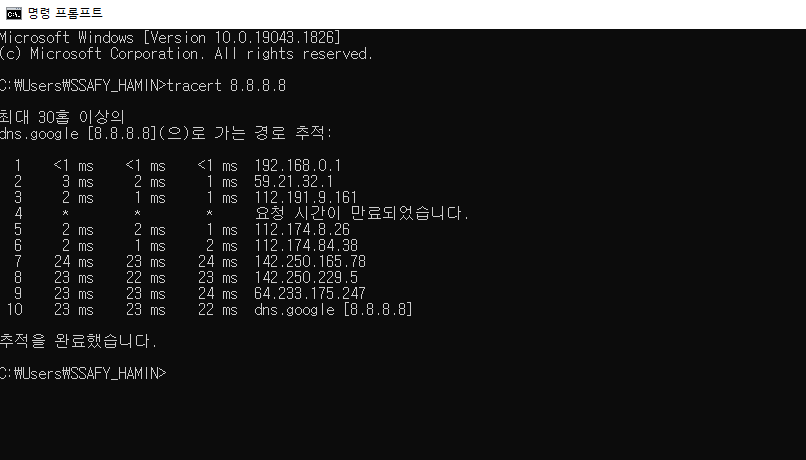
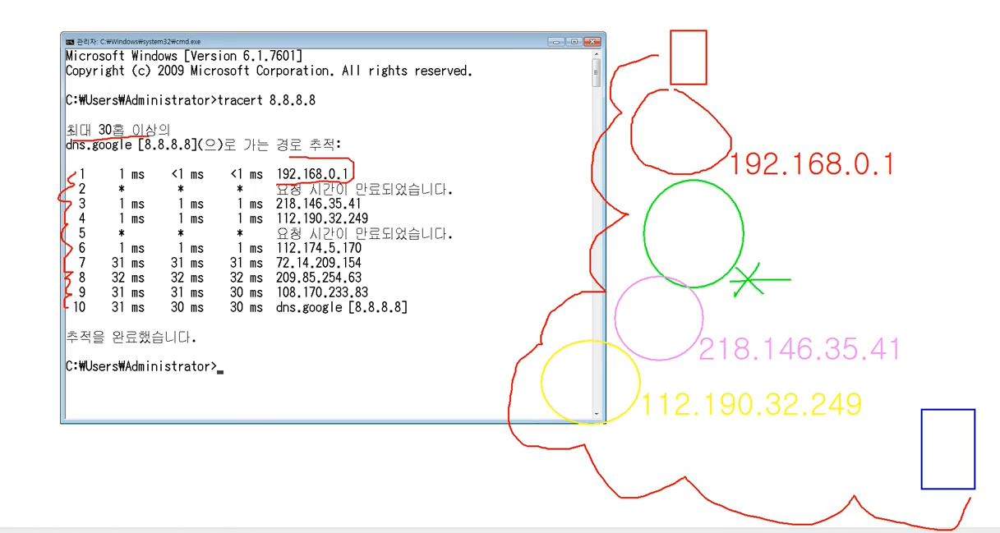
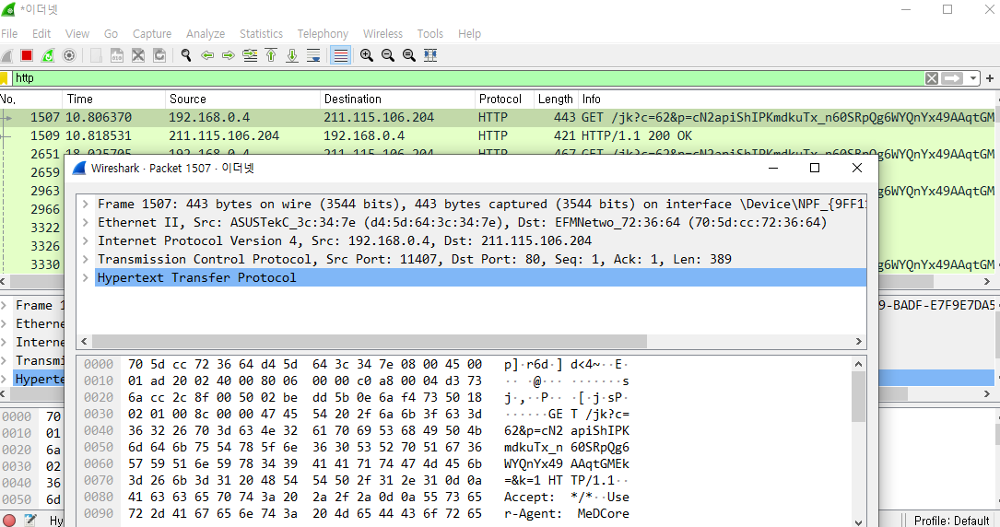

### 1. 구글과 나는 어떻게 연결되어 있는지 확인하기

8.8.8.8 => 구글 dns 서버의 IP주소

구글까지 10개의 네트워크 대역을 넘어갔다는 뜻

### 2. wireshark를 사용해서 프로토콜 확인

교보문고 홈페이지 접속 후 프로토콜 확인

IPv4 -> 멀리 떨어진 주소(홈페이지 서버)

이더넷 -> 가까운 주소(특정 컴퓨터 찾음)

TCP -> 엄청 먼 주소(크롬)

