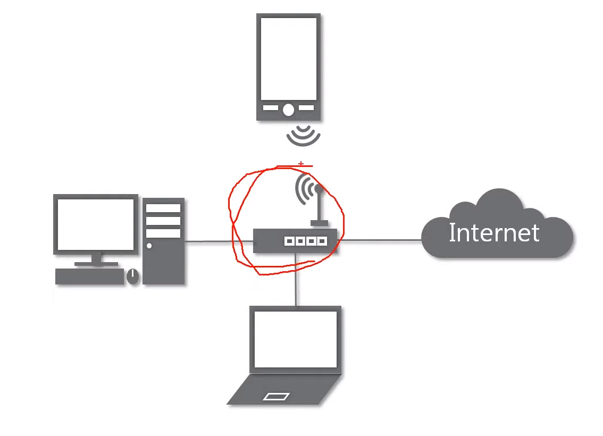
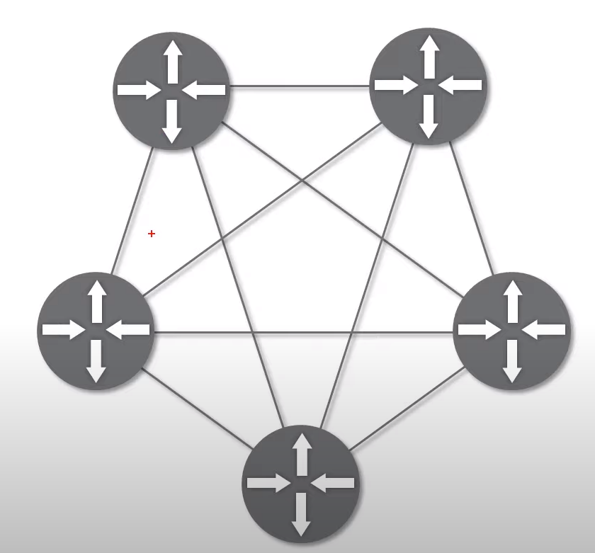
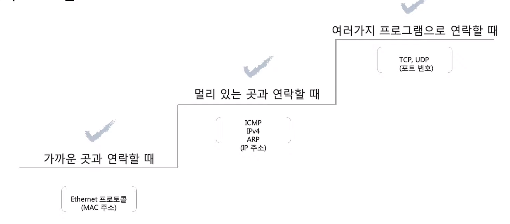

# 01. 네트워크란 무엇인가?

**네트워크**: 노드(네트워크에 속한 컴퓨터 또는 통신 장비를 뜻함)들이 데이터를 공유할 수 있게 하는 디지털 전기통신망의 하나. -> 분산되어 있는 컴퓨터를 통신망으로 연결한 것.

**인터넷**: 문서, 그림, 영상과 같은 여러 데이터를 공유하도록 구성된, 전세계를 연결하는 네트워크.

**www**: 인터넷을 통해 웹과 관련된 데이터를 공유하는 것.

---

## 네트워크의 분류

(네트워크 망 같은 경우 꼭 인터넷만 존재하는 것은 아님)

1. **크기에 따른 분류**
   
   - **LAN**: Local Area Network => 가까운 지역을 하나로 묶은 네트워크
   
   - **WAN**: Wide Area Network => 멀리 있는 지역을 한데 묶은 네트워크(가까운 지역끼리 묶인 LAN과 LAN을 다시 하나로 묶은 것)

2. **연결 형태에 따른 분류**
   
   - **Star**: 중앙 장비에 모든 노드가 연결됨. ex) 공유기
     
     - 
     
     - 문제점: 가운데에 있는 네트워크 장비가 고장이 나면? -> 주변 연결 다 끊김
     
     - 특징: 가까운 지역에 있는 컴퓨터나 네트워크 장비를 연결시킬 **때, 즉 하나의 LAN대역을 만들 때 Star형 연결을 주로 사용함**
   
   - **Mesh**: 여러 노드들이 서로 그물처럼 연결된 형태. 어느 장비 하나가 고장난다 하더라도, 전체적인 통신에는 문제가 없음.
     
     a-b, a-c, b-c 이렇게 연결되어 있을 경우, a-b 연결이 끊어진다 해도 a와 b는 a-c-b의 경로를 통해 연결될 수 있는 것
     
     - 
   
   - 실제 인터넷은 여러 형태를 혼합한 형태임

---

## 네트워크의 통신 방식

- **유니 캐스트**: 내가 통신하고싶은 특정 대상과만 통신하는 것

- **멀티 캐스트**: 같은 네트워크 대역에 여러 사용자가 있을 때, 특정 다수와 통신을 하는 것

- **브로드 캐스트**: 같은 네트워크 대역에 있는 모든 사용자와 통신을 하는 것

---

## 네트워크 프로토콜

- 네트워크에서 노드와 노드가 통신할 때 **어떤 노드**가 **어느 노드**에게 **어떤 데이터**를 **어떻게** 보내는지 작성하기 위한 양식

- 여러가지 프로토콜
  
  - 

- 실제 사용되는 방식
  
  - 보내고 싶은 데이터가 있음
  
  - 그 데이터를 보내기 위해 어떤 프로그램과 통신할 지
  
  - 얼마나 멀리 떨어져있는, 어느 지역에 있는 컴퓨터인지
  
  - 그 지역의 어떤 특정한 컴퓨터를 가리키는지 등등
  
  - 위의 요소들을 모두 고려하여 프로토콜을 결정. 즉, **여러 프로토콜을 함께 사용** -> **캡슐화** 라고 함

---

