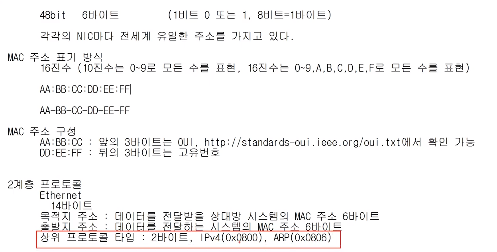

# 2계층 - 가까이 있는 컴퓨터끼리 데이터 주고받기

## 목차

### 


### 2계층에서 하는일 -  기능

- 2계층은 하나의 `네트워크 대역` , `즉 같은 네트워크 상`에 존재하는 여러 장비들 중 `어떤 장비`가 `어떤 장비`에게 보내는 데이터를 전달
- 오류제어 → 데이터 흐름에 오류는 없는지
- 흐름제어 → 누가 누구에게 데이터를 보내는지


- `하나의 네트워크 대역 LAN` 에서만 통신할 때 사용
- 다른 네트워크와 통신할 때는 항상 `3계층`이 필요함


### 2계층에서 사용하는 주소 - 물리적인 주소

- LAN에서 통신할 때 사용하는 MAC 주소

  - CMD에서 확인 가능 - 물리적 주소가 MAC 주소
  - 물리적 주소는 총 12개의 16진수로 이루어져 있음
  - 두개씩 구분하며 - 대시로 - 표시 - 함 (콜론: 을 사용할 수도 있음)

  


### `2계층 프로토콜 - Ethernet 프로토콜`


- Destination 목적지 Mac주소 : 6Byte

- Source 보내는 곳 Mac 주소 : 6Byte

- Ethernet Type : 추가 2Byte 

  - 데이터(payload) 안에는 상위 계층에서부터 인캡슐레이션해서 보내진 정보가 담겨있음
  -  ethernet 프로토콜 입장에서 봤을 땐 보낼 때 페이로드 안에 뭐가 있을지 알기 어려움
  -  Ethernet Type에서 `3계층 프로토콜(상위 프로토콜)이 어떤 유형인지 미리 알려줌` → ex. IPv4인걸 알려줄려면 ethernet프로토콜에 0 8 0 0 이 담겨서 옴)

- Ethernet 프로토콜은 총 14 Byte

- 예시

  - A가 B 한테 보낼려고 한다

    


# 실습


### 1. 내 PC의 MAC 주소 확인하기

- 1. CMD에 아래 내용 입력

  ```markdown
  ipconfig /all
  ```

  2. 물리적 주소 확인

     

     

### 2. Ethernet 프로토콜 캡처

- ICMP 의 Ethernet확인

  

  


- 총 14 Byte

  

​	강사 : 목적지 - 학생 : 보낸 사람

- ethernet type에는 08 00 이 담겨져 있음 현재 상위 프로토콜은 IPv4임을 의미



