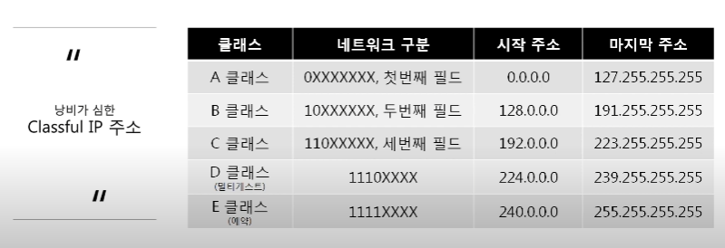
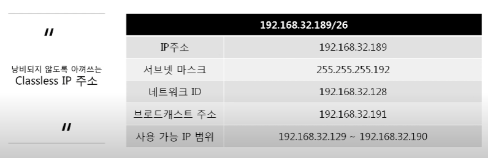
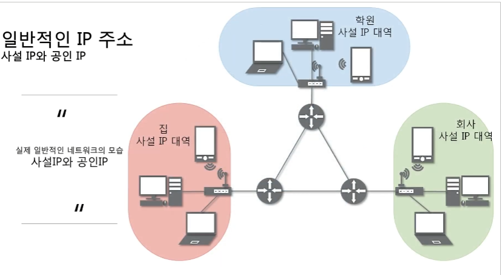
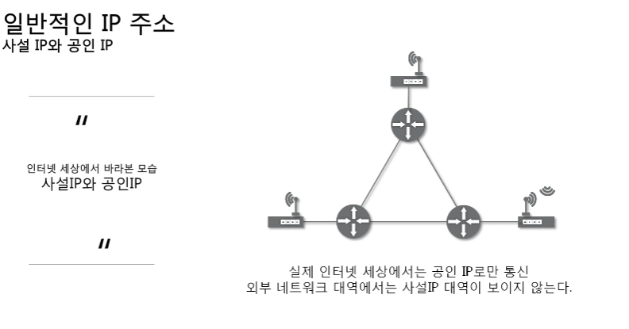

# 4강 IP주소

## 3 계층

### 3계층의 기능

> LAN과 LAN을 연결시켜주는 역할
>
> 멀리 떨어진 곳에 존재하는 네트워크까지 어떻게 데이터를 전달할 지 제어하는 일을 담당
>
> 3계층에서 쓰는 주소
>
> 대표 장비 : 라우터

- ipconfig 시 결과
  - IPv4 주소 : 현재 PC에 할당된 IP주소
  - 서브넷 마스크 : IP 주소에 대한 네트워크의 대역을 규정하는 것
  - 게이트웨이 주소 : 외부와 통신할 때 사용하는 네트워크의 출입구

### Classful IP 주소

> 초창기 IP 주소

- classful IP 클래스 구분은 2진수로 바꾸어보면 쉽게 구분할 수 있다
  - A : 0 0000000.000000000.00000000.00000000 ~ 0 1111111.11111111.11111111.11111111
  - B : 10 000000.000000000.00000000.00000000 ~ 10 111111.11111111.11111111.11111111
  - C : 110 00000.000000000.00000000.00000000 ~ 110 11111.11111111.11111111.11111111
  - D : 1110 0000.000000000.00000000.00000000 ~ 1110 1111.11111111.11111111.11111111
  - E : 나머지

### Classless IP 주소

#### 서브넷 마스크

- 네트워크 대역을 나눠주는데 사용하는 값

- 어디까지가 네트워크 대역을 구분하는데 사용되고, 어디서부터가 호스트를 구분하는데 사용하는지 지정

- 2진수로 표기했을 때 무조건 1로 시작하고, 1과 1사이에는 0이 올 수 없다는 규칙을 가지고 있다

- ex) ip : 192.168.32.189, 서브넷마스크 : 255.255.255.192 일 경우
  255.255.255.192 => 11111111.11111111.11111111.11000000

  192.168.100.68 => 11000000.10101000.00100000.10111101
  맨 마지막 8자리중 앞자리 2개까지는 네트워크 대역 구분으로 사용되니까
  10 000000부터 10 111111까지 128~191인데 128은 네트워크 ID,  191은 브로드캐스트 주소로 사용되어서
  실질 사용 가능 IP 범위는 129~190이다.

### 사설 IP와 공인 IP

> 공인IP 1개당 2^32개의 사설IP

사설IP가 무조건 공인IP로 바뀌어서 인터넷과 연결됌

- NAT : Network Address Translation
- 사설에서 공인으로 나갈때 NAT Table에 기록되고, 응답이 오면 기록을 참고하여 전달한다
- NAT Table에 기록이 없는 응답이 온다면 전달이 안된다.
- 네트워크ID IP(사설IP)는 접근이 불가능하지만, 공유기에 추가설정을 통해 접근이 가능한데 이를 포트 포워딩이라고 한다
- 포트 포워딩 : 4계층에서 쓰이는 방식

### 특수한 IP 주소

- Wildcard : 0.0.0.0
  - `나머지` 모든 IP
- 127.0.0.1
  - 나 자신을 나타내는 주소
- 게이트웨이 주소
  - 공유기의 IP 주소 == 서브넷 마스크를 통한 네트워크ID를 뜻하는 듯?

### 3계층 프로토콜

#### ARP 프로토콜

> IP주소를 이용해 MAC 주소를 알아오는 프로토콜

#### IPv4 프로토콜

> WAN에서 통신할 때 사용하는 프로토콜

 #### ICMP 프로토콜

> 서로가 통신되는지 확인할 때 사용하는 프로토콜

