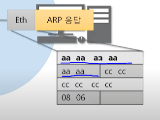

# 5. ARP 프로토콜

### 5-1. ARP 프로토콜이 하는 일

- ARP 프로토콜은 같은 네트워크 대역에서 통신을 하기 위해 필요한 MAC 주소를  IP주소를 이용해서 알아오는 프로토콜이다.
- 같은 네트워크 대역에서 통신을 한다고 하더라도 데이터를 보내기 위해서는 7계층부터 캡슐화를 통해 데이터를 보내기 때문에 IP주소와 MAC 주소가 모두 필요하다.
- 이 때 IP주소는 알고  MAC 주소는 모르더라도 ARP를 통해 통신이 가능하다.
- IP주소를 이용해 상대방의 MAC주소를 알아오고, 그것을 통해 통신을 함
- ARP 프토토콜은 보안 상에도 중요하게 여겨짐(ex> arp spoofing)

### 5-2. ARP 프로토콜의 구조

- 

  - Sender(==Source), Target(==Destination)

  - Hardware Address => mac 주소(6바이트)
  - Protocol Address => IPv4 주소(4바이트)
  - 이더넷 프로토콜은 목적지(target) 맥주소가 먼저 오고, 나머지 프로토콜은 출발지(Sender)가 맥주소가 먼저옴

- 

  - Hardware Type => 2계층에서 사용하는 프로토콜의 타입(대부분 이더넷 프로토콜)
  - Protocol type => Protocol Address Type
  - Hardware Add Length => mac주소 6바이트 => 0 6
  - Protocol Add Length => IPv4 주소 4바이트 =>  0 4
  - Opcode => 어떻게 동작하는지 나타냄 => ARP 에서는 1(Request) or 2(Reply)
    - 

### 5-3. ARP 프로토콜의 통신과정

- 
- A가 C랑 통신을 하고 싶어서 C의 MAC 주소를 알아 와야 하는 상황
- 현재 C의 IP 주소 밖에 모름
- 
- 먼저 A가 ARP 요청 프로토콜을 만들게 됨(Encapsulation해서 보내게 됨)
- ARP 프로토콜의 구조를 보면 목적지 MAC주소가 필요함 근데 지금 모른다???
- 이더넷의 경우에서 목적지 MAC 주소가 필요함
- 
- 
- 어디에 있는지 모르니까 같은 네트워크 대역의 모든 PC에게 요청을 보냄
- 스위치(2계층)가 이더넷을 까서 MAC 주소를 보고 원래 보내 주는데, 지금 broadcast니까
  모두에게 보냄
- 
-  PC가 ARP를 까봤을 때 목적지 IP주소가 자신과 일치하지 않으면 패킷을 버림
- 
- 만약 IP주소가 일치한다면 ARP 응답을 보내줌
- 

- 지금은 목적지(A)의 MAC 주소를 알고 있으므로 브로드캐스트로 보낼 필요가 없음
- 
- 스위치가 이더넷을 까보고 a한테 보내는 걸 확인(a의 mac주소 보고)하고 a에게 보내줌
- 
- a가 arp를 까보고 해당 IP를 쓰는 pc의 mac 주소가 cc:cc:cc:cc:cc:cc 인 것을 알고, ARP 캐시 테이블에 등록한다.
- 이런 식으로 최초에 해당 IP의 mac주소를 알아내는 통신을 한 번 하고, 그 다음에 원하는 통신을 수행함

### 5-4. ARP 테이블

- 통신 했던 컴퓨터들의 주소는 ARP 테이블에 남는다
- 
- 캐시 테이블이라고 부르는 이유는 일정 시간이 지나면 삭제 시키기 때문
- 일정 시간이 지나면 다시 ARP 통신을 이용해서 MAC주소 알아 와야 함
- 수동으로 등록 시 시간이 지나도 삭제되지 않음

### 5-5. 실습

- 요청

- 
- 
  - padding은 frame의 최소 크기를 맞추기 위해 붙여줌( 60byte가 최소 단위인데 ,42 byte라서 18 byte 붙여줌)
  - 패딩이 없는 경우도 있는데 없는 게 아니라, wireshark의 패킷 캡쳐 시점에 따라 다르게 보이는 것 뿐(패딩이 붙기 전에 캡쳐 해버림)
- 응답
- 

