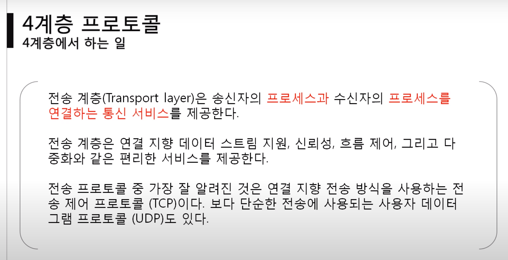
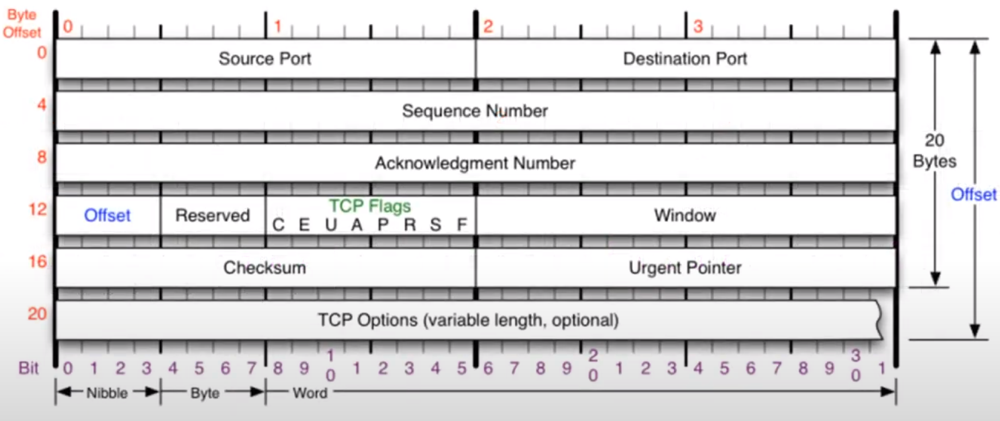
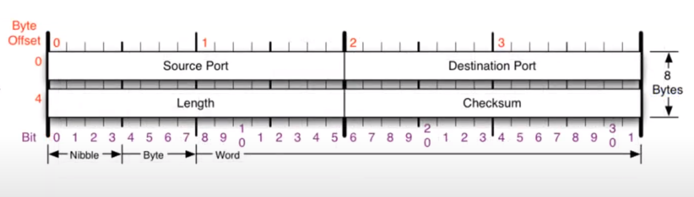
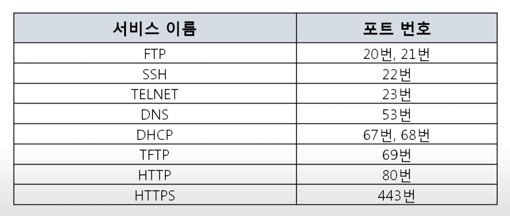
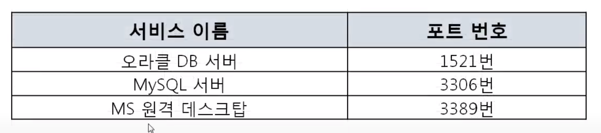
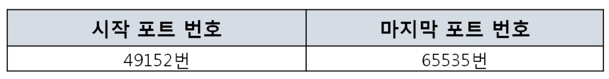
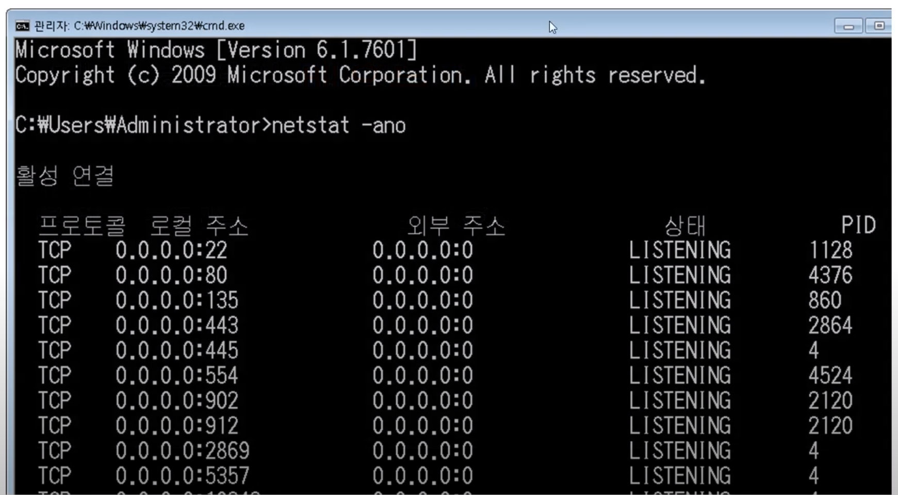
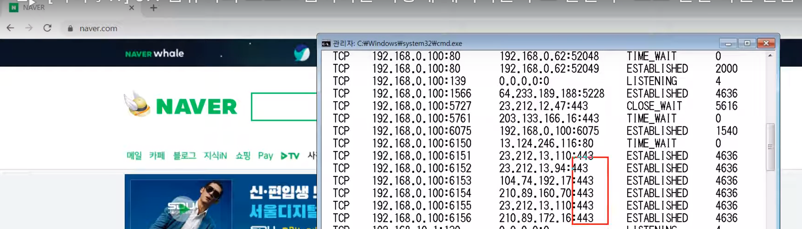
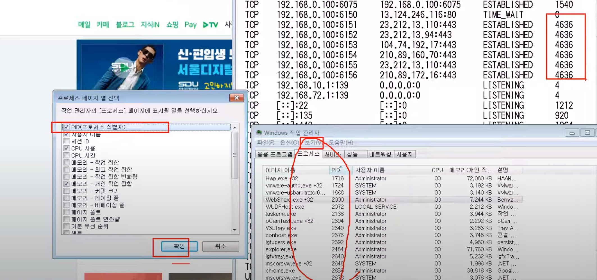
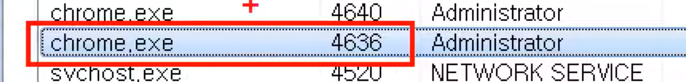

#### 학습 목표 : **원거리에 있는 컴퓨터의 특정 프로그램과, 내 컴퓨터의 특정 프로그램이 서로 어떻게 데이터를 주고받는가**를 알아보자

프로그램끼리는 어떻게 데이터를 주고 받을까? 

- 클라이언트 서버 개념이다. 
  
  - 게임서버와 내가 컴퓨터에서 실행하는 게임 클라이언트가 어떻게 데이터를 주고받는지와 같은 맥락이다. 

상대방의 컴퓨터까지 찾아가는 역할 : **4계층**에서 수행한다. 


포트 번호 : 4계층에서 사용하는 주소 체계

프로그램의 연결 정보 : 어떤 프로그램끼리 데이터를 주고받을 것인지 

-----



4계층 : 전송 계층이며, 송신자의 프로세스와 수신자의 프로세스를 연결하는  통신 서비스를 제공한다 

- **프로세스**란? : 디스크에 저장되어있는 프로그램 중 메모리에서 동작중인 프로그램

: 즉, 내 컴퓨터에서 동작중인 프로그램과, 상대방의 컴퓨터에서 동작중인 프로그램을 연결하는 통신 서비스 

----

#### 4계층 프로토콜의 종류 : TCP와 UDP

#### 

TCP : 안전한 연결을 지향하는 TCP 프로토콜 

- 친절함 -> 과정이 복잡함 

- 연결이 된 다음에 데이터를 보냄 

- 보낸 다음에도 잘 받았는지 물어보고, 새 데이터 보내줌 



UDP : 안전한 연결을 지향하지 않는 UDP 프로토콜 

- 비연결 지향형 프로토콜 (연경된 상태를 지향하지 않음)

- 연결하든 말든 데이터를 던짐 



----

### 포트번호

- 포트 번호의 특징 
  
  - 특정 프로세스와 특정 프로세스가 통신을 하기 위해 사용한다 
    
    - 내 컴퓨터의 특정 프로그램이 사용하는 것이 포트번호이다 (내 컴퓨터 X)

- 하나의 포트는 하나의 프로세스만 사용 가능하다 
  
  - 100번이 카카오톡이면, 100번은 다른 프로세스에 사용될 수 없다. 

- 하나의 프로세스가 여러개의 포트를 사용하는 것은 가능하다

- 포트 번호는 일반적으로 정해져 있지만 무조건 지켜야 하는 것은 아니다 

- 예를 들어 일반적으로 웹 서비스는 80번 포트를 사용하지만 웹 서비스가 항상 80번 포트를 사용해야하는 것은 아니다. 

---

### 포트번호 분류

![TCP/IP 쉽게, 더 쉽게] 03. 트랜스포트 계층](https://velog.velcdn.com/images/iseeu95/post/e41fbf7a-2bb8-4500-846e-d7bc47d249b9/image.jpeg)

**웰노운 포트**

- 전세계적으로 유명한 Well-Known 포트 

- 잘 알려진 유명한 프로그램들이 사용하는 포트 번호가 지정되어 있음 



**레지스터드 포트**

- 조금은 유명한 Registered 포트 

- 등록된, 예약된 포트 



**다이나믹 포트** 

- 일반 사용자들이 사용하는 Dynamic 포트 



---

### 포트번호, IP 주소, MAC 주소를 다 사용해야 통신이 된다!

프로그램의 연결 정보를 볼 수 있다 

- 현재 포트 활성 여부를 나타내는 활성 연결 테이블 



```bash
netstat -ano
```

1. 현재 연결 상태 확인하기 
   
   - netstat -ano 명령어를 이용하여 내 컴퓨터와 현재 연결된 다른 컴퓨터들을 확인해보기 

2. 특정 서비스의 포트번호 확인하기 
   
   - 웹 서비스와 같은 유명한 특정 서비스의 포트 번호 확인하기 



네이버에 접속하여 cmd창에 netstat -ano 명령어 치면 

443  포트번호를 확인할 수 있다. 



작업관리자 > 보기 > 열 선택 > PID > 확인 

우측의 4636과 일치하는 PID 찾아보기 : Chrome이다. 



#### 내컴퓨터의 chrome과 210.89.160.70 컴퓨터의 443 포트를 실행중인 프로그램이 연결되어 있다는 뜻
