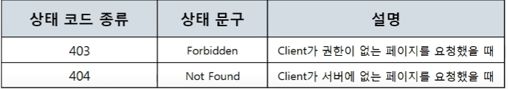
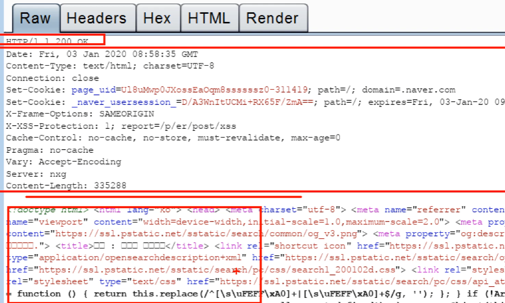

# 11. 웹을 이용할 때는 이렇게 데이터를 주고 받는다

## 7계층 프로토콜 HTTP

- 목차
- 

### HTTP 프로토콜(웹을 만드는 기술들)

- 가장 기본적인 것들만 나열함

- 
- HTML(웹 페이지를 채울 내용), JS(웹 페이지에 들어갈 기능), CSS(웹 페이지를 예쁘게 꾸밀 디자인)
- HTTP -> 웹 표준(html,js,css) 를 요청하고 받아오는 프로토콜(받아와서 client 단에서 실행)
- HTTPS -> HTTP에 보안적 요소를 추가시킴
- ASP/ASP.NET / JSP / PHP -> 서버에서 실행되는 코드, 웹 서버 페이지를 만드는 기술들

#### HTTP 프로토콜의 특징

- HyperText Transfer Protocol (하이퍼 텍스트 전송 프로토콜)
- www에서 쓰이는 핵심 프로토콜로 문서의 전송을 위해 쓰이며, 오늘날 거의 모든 웹 애플리케이션에서
  사용되고 있다. -> 음성, 화상 등 여러 종류의 데이터를 MIME로 정의하여 전송 가능
- HTTP 특징 - Request / Response (요청/응답) 동작에 기반하여 서비스 제공

- HTTP 1.0의 특징
  - "연결 수립, 동작, 연결 해제"의 단순함이 특징 -> 하나의 URL은 하나의 TCP 연결
  - HTML 문서를 전송 받은 뒤 연결을 끊고 다시 연결하여 데이터를 전송한다.
- HTTP 1.0의 문제점
  - 단순 동작 (연결 수립, 동작, 연결 해제)이 반복되어 통신 부하 문제 발생
  - 
  - 요청, 응답 한 번 하면 연결을 끊어버림 / 다음 요청을 하려면 다시 핸드쉐이크 하고 요청, 응답
  - 만약 그림 10개면 핸드쉐이크-요청-응답 10번 해야함
- HTTP 1.1의 특징
  - HTTP 1.0과 호환 가능
  - Multiple Request 처리가 가능하여 Client의 Request가 많을 경우 연속적인 응답 제공 -> Pipeline 방식의 Request / Response 진행
  - HTTP 1.0 과는 달리 Server가 갖는 하나의 IP Address와 다수의 Web Site 연결 가능
- HTTP 1.1
  - 빠른 속도와 Internet Protocol 설계에 최적화될 수 있도록 Cache 사용 Data를 압축해서 전달이 가능하도록 해서 전달하는 Data 양이 감소
  - 
  - 연속적으로 요청/응답 가능

#### HTTP 요청 프로토콜의 구조(요청하는 방식을 정의하고 클라이언트의 정보를 담고 있는)

- 
- 
- **Request Line**
  - 
  - 요청 방식
    - 
    - COPY/MOVE 같은 경우 보안 상 보통 막아둔다
- GET 요청 방식
  - 
- POST 요청 방식
  - 

- get 방식은 데이터를 주소에 포함시켜 보냄 / post는 body에 넣어서 보냄
  - 보통 get방식으로 보내는 데이터는 노출돼도 괜찮은 데이터
  - 
  - 
  - post 방식의 데이터는 노출되면 안되는 데이터를 보통 body에 숨겨서 보낸다. 그래도 보일 수 있으니 HTTPS를 쓴다

#### URI / URL

- URI의 구조(Uniform Resource Identifier)
- 

- 

- 포트는 웹 브라우저가 알아서 써줌(그래서 생략해도 됨)

#### HTTP 프로토콜 요청 작성 실습

- 
  - Server: Apache -> nate는 아파치 서버를 씀
- 

#### HTTP 프로토콜 수정 실습

- 
- 이 파일을 어떻게 다운 받아 갈 수 있을까?
- 
- 간단한 jsp 코드 작성
  - 
  - 
- 이 파일에 데이터를 어떻게 전달할까
- 
- num1 = 10, num2 = 20 전달
- 

#### HTTP 응답 프로토콜의 구조(사용자가 볼 웹 페이지를 담고있는)

- 

- 

- Status line 구조

- 

- 상태 코드 종류

  - 

  - 200(성공적인 통신)
    - 
  - 400번대(클라이언트 잘못, 실수, 오류)
    - 
    - 
  - 500번대(서버의 실수, 잘못, 오류)
    - 

#### HTTP 헤더 포맷

- 헤더 구조(수 많은 정보를 가지고 있는)
- 
- 일반 헤더(일반적인 정보를 담고 있는)
  - 
- 요청 헤더(클라이언트 정보를 담고 있는)
  - 
- 응답 헤더(서버 정보를 담고 있는)
  - 

#### HTTP 분석 실습

- burp suite 사용
- 
- burp suite로 가로채서 수정하면서 여러가지 테스트 해본다
- 
- 
- 프록시 세팅 후 프록시 실행
  - 내 컴퓨터(127.0.0.1)의 모든 브라우저 통신은 7777포트로 보내라
  - 7777포트로 오는 거를 burp suite가 받게 해야함
  - 
  - 요청이 잡힌 화면
  - 
  - forward 누르면 응답이 오고  다시 forward 누르면 화면이 뜸
  - 
  - 
  - 
  - 
  - 
  - 이런 식으로 네이버 블로그 우클릭을 뚫을 수 있는 것이다.

