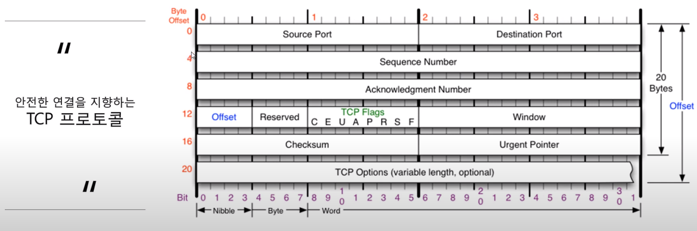

# network 09

---

## 연결지향형 TCP 프로토콜

### TCP 프로토콜

- 전송 제어 프로토콜(Transmission Control Protocol, TCP)은 인터넷에 연결된 컴퓨터에서 실행되는 프로그램 간에 통신을 **안정적으로, 순서대로, 에러없이** 교환할 수 있게 한다.
- TCP의 안정성을 필요로 하지 않는 애플리케이션의 경우, 일반적으로 TCP 대신 비접속형 사용자 데이터그램 프로토콜(User Datagram Protocol)을 사용한다.
- TCP는 UDP보다 안전하지만 느리다. 체감되는 속도는 아님.
- 일반적으로 통신을 한다 했을 때, TCP, IPv4, 이더넷 이 세종류의 프로토콜을 주로 이용한다.

### TCP 프로토콜의 구조

- **Source Port:** 출발지 포트
- **Destination Port:** 목적지 포트
- **Sequence Number:** 
- **Acknowledgment Number:**
- **Offset:** 헤더의 길이를 의미. 4로 나눠서 표기함
- **Reserved:** 예약된 필드로 사용되지 않는 필드
- **TCP Flags:** 
- **Window:** "데이터 얼마정도 보내"라고 말해주는 값 -> 내 사용 공간이 얼마나 남았는지 상대에게 알려줌
- **Checksum:** 오류확인용 값
- **Urgent Pointer:** 
- **TCP Options(variable length, optional):** 일반적으로 잘 안붙고, 붙더라도 4바이트씩 붙는다 -> 가장 일반적인 길이는 20바이트, 최대 60바이트까지 늘어날 수 있음

### TCP Flags

빨간색으로 네모친 애들만 알면 됨

Flag: TCP가 계속해서 통신하면서 상대방이랑 연결 상태를 물어본다고 했음. 어떤 플래그를 세팅해서 보내느냐에 따라 연결 종료가 목적인지, 연결상태 확인이 목적인지 등을 알 수 있음. -> TCP의 주된 기능이 Flags를 기준으로 나누어 짐

U: Urgent Flag, 긴급 비트. 지금 보내는 데이터에 우선순위 높은 애가 포함돼있음을 의미. U부분에 1 들어가있으면 Urgent Flag. Urgent Pointer와 세트인데, Urgent Pointer는 잘 알필요 없다고 하심

**A: ACK Flag,** 승인 비트. 계속해서 물어본다고 했음. 그 물음에 대한 응답을 해줄 때 사용하는 플래그임

P: Push Flag, 밀어넣기 비트. 원랜 TCP 버퍼(받을 수 있는 공간)가 일정한 크기만큼 쌓여야 하는데, 그 공간과는 상관없이 데이터를 밀어넣고 싶을 때 사용

**R: Reset**, 초기화 비트. 연결된 상태에서 추가적으로 데이터를 주고받으려 하는데 문제가 발생한 것. 그래서 연결 관계를 새로고침해야 할 때 사용

**S: Sync**, 동기화 비트. 상대방과 연결을 시작할 때 무조건 사용하는 플래그. 얘가 처음 보내지고 난 다음부터 둘 사이의 연결이 동기화되기 시작함. 서로 상태를 계속 주고받으면서 동기화 함

**F: Fin**, 종료 비트. 데이터 다 주고받은 뒤에 연결 끊을 때 사용하는 플래그.

---

### TCP를 이용한 통신과정

- **연결 수립 과정**: TCP를 이용한 데이터 통신을 할 때 프로세스와 프로세스를 연결하기 위해 **가장 먼저 수행되는 과정**

  1. 클라이언트가 서버에게 요청 패킷을 보냄
  2. 서버가 클라이언트의 요청을 받아들이는 패킷을 보냄
  3. 클라이언트가 이를 수락하는 패킷을 보냄

  위의 3개 과정을 **3Way Handshake**라고 부름

빨간 네모친 부분 -> sync flag를 의미. -> **서버로 패킷을 보냄(Flag: SYN, S: 100,  A: 0)**

-> 서버에서 디캡슐레이션을 통해 정보 확인 -> 클라이언트로 패킷을 보냄(아래 사진)

sync, ack flag가 같이 세팅되어 있음. -> **클라이언트로 패킷을 보냄(Flag: SYN + ACK, S: 2000, A: 101)**

-> 클라이언트에서 디캡슐레이션을 통해 정보 확인 -> ACK는 클라이언트가 보낸 요청에 대한 응답, 서버로 패킷을 보냄(아래 사진)

**서버로 패킷을 보냄(Flag: ACK, S: 101, A: 2001)**

추가) 보안까지 하려면 S와 A를 계산할 줄 알아야 한다

1. 가장 처음에 클라이언트가 S를 100으로, A를 0으로 세팅해서 보냄. (클라이언트 마음, 보통 S에는 랜덤한 값이 세팅, A에는 0이 세팅)
2. 받는 쪽에서 **S, A값과 동기화**를 시킴. 어떻게? **A번호**: 받는 쪽 입장에서 답장을 줄 때 **받은 S번호 +1**을 함(위의 경우 받은 S: 100, 넘겨주는 A: 101). 이 답장을 주는 시점은 서버 입장에서 최초로 S와 A를 세팅하는 순간이므로 자신만의 랜덤한 S를 생성함(위의 경우 2000). 그걸 받은 클라이언트는? **A에 받은 S번호 +1의 값을 세팅하여 보냄**(위의 경우 받은 S번호: 2000, A에 세팅된 값: 2001). **S:101, A:2001 전송의 경우 클->서가 최초로 실행된 상황이 아니기 때문에 S에는 받은 A 번호가 세팅된다.**
3. 이게 보안에 쓰이는 이유는? 누군가가 동기화된 값을 계산하여 통신에 개입이 가능할 수 있음

---

### TCP를 이용한 통신과정

- **데이터 송수신 과정**
  - TCP를 이용한 데이터 통신을 할 때 단순히 TCP 패킷만을 캡슐화해서 통신하는 것이 아닌 페이로드를 포함한 패킷을 주고 받을 때의 일정한 규칙
    1. 보낸 쪽에서 또 보낼 때는 SEQ 번호와 ACK 번호가 그대로다.
    2. 받는 쪽에서 SEQ 번호는 받은 ACK 번호가 된다.
    3. **받는 쪽에서 ACK 번호는 받은 SEQ 번호 + 데이터의 크기**

설명: 보내는 S번호의 경우 받은 A번호와 동일, 보내는 A번호의 경우 받은 S번호 + 데이터 크기

---

### TCP 상태전이도

실선: 클라이언트의 상태 변화

점선: 서버의 상태 변화

중요한 상태: LISTEN, ESTABLISHED

LISTEN: 포트번호를 프로그램이 사용하고 있는 상태(서버쪽에서). 상대방의 요청(클라이언트의 요청)을 계속 듣고있는 상태

ESTABLISHED: 연결이 서로 수립이 된 상태. 3way handshake가 끝나면 ESTABLISHED 상태가 됨.

클라이언트는 포트를 사용할 때 active open이라고 한다(능동적으로 포트를 여는애가 누굴끼? -> 클라이언트 <-> 서버의 경우 passive open). 클라이언트가 포트를 능동적으로 열면서(active open) SYN 패킷을 전송 -> SYN_SENT 상태가 됨 -> SYN를 받은 서버는 SYN_RCVD 상태가 되고 SYN, ACK 패킷을 보내게 됨

### 간단하게 정리

1. 서버는 LISTENING 상태, 클라이언트는 active open 상태에서 패킷을 만들어 보내고 SYN_SENT 상태가 됨
2. 해당 패킷을 받은 서버는 SYN_RECEIVED 상태가 됨
3. 서버에서 패킷을 만들어 보냄. 이 때 서버는 여전히 SYN_RECEIVED 상태
4. 클라이언트가 패킷을 받아 ACK 패킷을 보내게 되면 ESTABLISHED 상태가 되고, 해당 패킷을 받은 서버 또한 ESTABLISHED 상태가 됨 -> 서로 데이터를 주고받을 수 있는 상태가 된 것