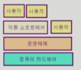
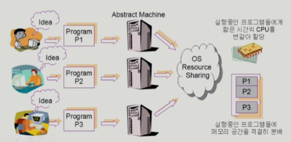
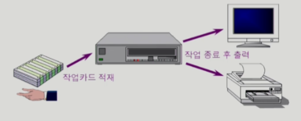
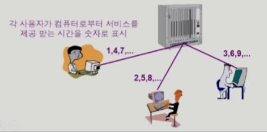
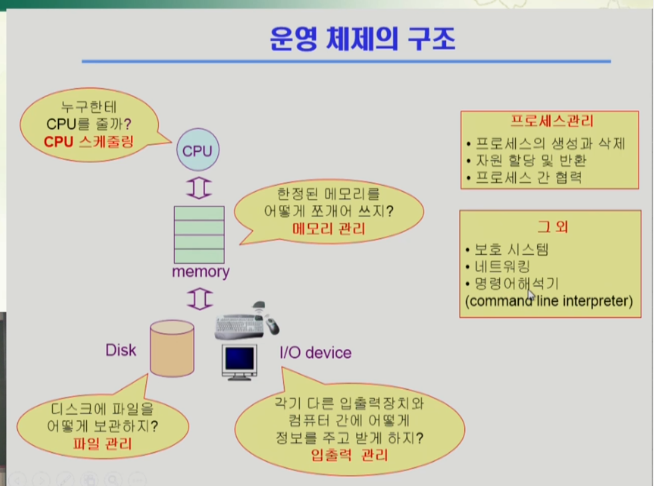

# Introduction to Operating Systems

### 운영체제란 무엇인가?

- 운영체제(Operating System, OS)란?
  - 컴퓨터 하드웨어 바로 위에 설치되어 사용자 및 다른 모든 소프트웨어와
    하드웨어를 연결하는 소프트웨어 계층
  - 
  - 협의의 운영체제(커널)
    - 운영체제의 핵심 부분으로 메모리에 상주하는 부분
    - 보통 전공자 기준 운영체제는 커널을 의미
  - 광의의 운영체제
    - 커널 뿐 아니라 각종 주변 시스템 유틸리티를 포함한 개념

### 운영 체제의 목적(자원의 효율적 관리 / 편리하게 사용할 수 있는 환경 제공)

- 컴퓨터 시스템의 자원을 효율적으로 관리
  - [프로세서, 기억장치, 입출력 장치]-**자원 등의 효율적 관리**
    - 사용자간의 형평성 있는 자원 분배
    - 주어진 자원으로 최대한의 성능을 내도록
  - 사용자 및 운영체제 자신의 보호
  - [프로세스, 파일, 메시지]-소프트웨어 자원 등을 관리
  - 
- 컴퓨터 시스템을 **편리하게 사용할 수 있는 환경을 제공**
  - 운영체제는 동시 사용자/ 프로그램들이 각각 독자적 컴퓨터에서 수행되는 것 같은 환상을 제공
  - 하드웨어를 직접 다루는 복잡한 부분을 운영체제가 대행

### 운영 체제의 분류(동시 작업 가능 여부, 사용자의 수, 처리 방식)

​	- **다중 작업, 다중 사용자, 시분할**

#### - 동시 작업 가능 여부

- 단일 작업(single tasking)
  - 한 번에 하나의 작업만 처리
  - ex) MS-DOS 프롬포트 상에서는 한 명령의 수행을 끝내기 전에 다른 명령을 수행시킬 수 없음
- **다중 작업(multi tasking)**
  - 동시에 두 개 이상의 작업 처리
  - ex) UNIX, MS Windows 등에서는 한 명령의 수행이 끝나기 전에 다른 명령이나 프로그램을 수행할 수 있음

#### - 사용자의 수

- 단일 사용자(single user)
  - MS-DOS, MS Windows
- **다중 사용자(multi user)**
  - UNIX, NT server

#### - 처리 방식

- **일괄 처리(batch processing)**
  - 작업 요청의 일정량 모아서 한꺼번에 처리
  - 작업이 완전 종료될 때까지 기다려야 함
  - ex) 초기 Punch Card 처리 시스템
  - 
- **시분할(time sharing)** - 이게 대부분
  - 여러 작업을 수행할 때 컴퓨터 처리 능력을 일정한 시간 단위로 분할하여 사용
  - 일괄 처리 시스템에 비해 짧은 응답 시간을 가짐(ex) UNIX
  - interactive한 방식
  - 
  - 짧은 응답시간을 가지는 특징이 있다.
  - 정확한 시간을 지켜주는 시스템은 아님
- **실시간(Realtime OS)**
  - 정해진 시간 안에 어떠한 일이 반드시 종료됨이 보장되어야하는 실시간 시스템을 위한 OS
    - 원자로/공장제어, 미사일 제어, 반도체 장비, 로보트 제어
  - 실시간 시스템의 개념 확장
    - Hard realtime system (경성 실시간 시스템) - 데드라인을 확실히 지켜줘야하는 경우
    - Soft realtime system (연성 실시간 시스템) - 데드라인이 존재, 안 지켜도 치명적이지 않을 경우

### 몇 가지 용어

- Multitasking
- Multiprogramming
- Time sharing
- Multiprocess
- 구분
  - 위의 용어들은 컴퓨터에서 여러 작업을 동시에 수행하는 것을 뜻한다
  - Multiprogramming은 여러 프로그램이 메모리에 올라가 있음을 강조
  - Time sharing은 CPU의 시간을 분할하여 나누어 쓴다는 의미를 강조
- Multiprocessor - 하나의 컴퓨터에 CPU(processor)가 여러 개 붙어 있음을 의미

### 운영 체제의 예

- 유닉스(UNIX)
  - 코드의 대부분을 **C언어**로 작성
  - 높은 이식성
  - 최소한의 커널 구조
  - 복잡한 시스템에 맞게 확장 용이
  - **소스 코드 공개**
  - 프로그램 개발에 용이
  - 다양한 버전
    - System V, FreeBSD, SunOS, Solaris
    - Linux
- DOS(Disk Operating System)
  - MS사에서 1981년 IBM-PC를 위해 개발
  - **단일 사용자용 운영체제**, 메모리 관리 능력의 한계(**주 기억 장치 : 640KB**)
- MS Windows
  - MS사의 다중 작업용 GUI 기반 운영 체제
  - Plug and Play, 네트워크 환경 강화
  - DOS용 응용프로그램과 호환성 제공
  - 불안정성
  - 풍부한 지원 소프트웨어
- Handheld device를 위한 OS
  - PalmOS, Pocket PC (WinCE), Tiny OS

### 운영 체제의 구조

- 

### 운영체제 과목의 수간 태도

- 본 과목은 OS 사용자 관점이 아니라 OS 개발자 관점에서 수강해야함
  - 대부분의 알고리즘은 OS 프로그램 자체의 내용
  - 인간의 신체가 뇌의 통제를 받듯 컴퓨터 하드웨어는 운영체제의 통제를 받으며 그 운영체제는 사람이
    프로그래밍하는 것이다
  - 본인을 Windows XP나 Linux 같은 운영체제라고 생각하고 본인의 할 일이 무엇인지를 생각해 보면 이번 학기 배울 내용이 무엇인지 명확히 알 수 있다.

### 