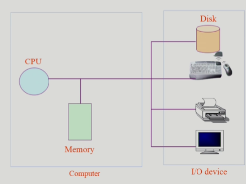
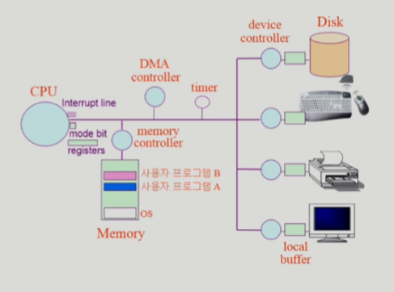
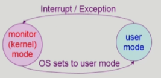
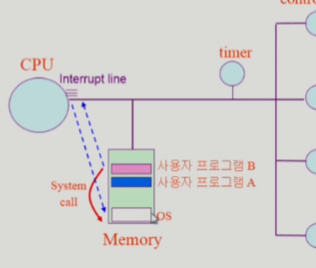
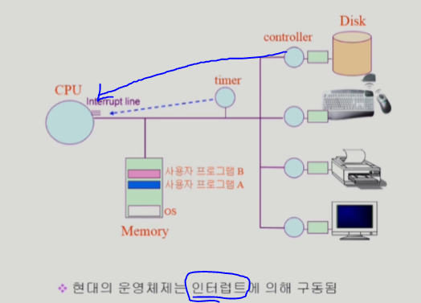

# 3-System Structure & Program Execution 1

### 컴퓨터 시스템 구조

### Mode bit

- 사용자 프로그램의 잘못된 수행으로 다른 프로그램 및 운영체제에 피해가 가지 않도록 하기 위한 보호 장치 필요
- Mode bit을 통해 하드웨어적으로 두 가지 모드의 operation 지원
  - 1 : 사용자 모드, 사용자 프로그램 수행
  - 0 : 모니터 모드(커널 모드, 시스템 모드) : OS 코드 수행
    - 보안을 해칠 수 있는 중요한 명령어는 모니터 모드에서만 수행 가능한 '특권명령'으로 규정
    - Interrupt나 Exception 발생시 하드웨어가 mode bit을 0으로 바꿈
    - 사용자 프로그램에게 CPU를 넘기기 전에 mode bit를 1로 세팅
    - 모니터모드(=커널 모드, 시스템 모드)
    - 

### Timer

- 타이머
  - 정해진 시간이 흐른 뒤 운영체제에게 제어권이 넘어가도록 인터럽트를 발생시킴
  - 타이머는 매 클럭 틱 때마다 1씩 감소
  - 타이머 값이 0이 되면 타이머 인터럽트 발생
  - CPU를 특정 프로그램이 독점하는 것으로부터 보호
- 타이머는 time sharing 을 구현하기 위해 널리 이용됨
- 타이머는 현재 시간을 계산하기 위해서도 사용

### Device Controller

- I/O device controller
  - 해당 I/O 장치유형을 관리하는 일종의 작은 CPU
  - 제어정보를 위해 control register, status register를 가짐
  - local buffer를 가짐 (일종의 data register)
- I/O는 실제 device와 local buffer 사이에서 일어남
- Device controller는 I/O가 끝났을 경우 interrupt로 CPU에 그 사실을 알림

- device driver(장치구동기)
  - OS 코드 중 각 장치별 처리루틴 -> software
- device controller(장치제어기)
  - 각 장치를 통제하는 일종의 작은 CPU -> hardware

### 입출력(I/O)의 수행

- 모든 입출력 명령은 특권 명령
- 사용자 프로그램은 어떻게 I/O를 하는가?
  - 시스템콜(system call)
    - 사용자 프로그램이 운영체제의 서비스를 받기 위해 커널 함수를 호출하는 것
    - 사용자 프로그램은 운영체제에게 I/O 요청
    - 
  - trap을 사용하여 인터럽트 벡터의 특정 위치로 이동
  - 제어권이 인터럽트 벡터가 가리키는 인터럽트 서비스 루틴으로 이동
  - 올바른 I/O 요청인지 확인 후 I/O 수행
  - I/O 완료 시 제어권을 시스템콜 다음 명령으로 옮김

### 인터럽트(Interrupt)

- 인터럽트
  - 인터럽트 당한 시점의 레지스터와 Program counter를 save한 후 CPU의 제어를 인터럽트 처리 루틴에
    넘긴다
- Interrupt (넓은 의미)
  - Interrupt (하드웨어 인터럽트): 하드웨어가 발생시킨 인터럽트
  - Trap (소프트웨어 인터럽트)
    - Exception : 프로그램이 오류를 범한 경우
    - System call : 프로그램이 커널 함수를 호출하는 경우

- 인터럽트 관련 용어
  - 인터럽트 벡터
    - 해당 인터럽트의 처리 루틴 주소를 가지고 있음
  - 인터럽트 처리 루틴
    (=Interrupt Service Routine, 인터럽트 핸들러)
    - 해당 인터럽트를 처리하는 커널 함수
- 

### 