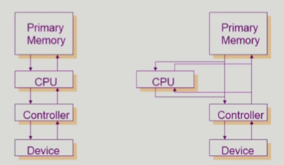

# 3-system-Structure-program-execution

### 동기식 입출력과 비동기식 입출력

- 동기식 입출력 (synchronous I/O)

  - I/O 요청 후 입출력 작업이 완료된 후에야 제어가 사용자 프로그램에 넘어감
  - 구현 방법 1
    - I/O가 끝날 때까지 CPU를 낭비시킴
    - 매시점 하나의 I/O만 일어날 수 있음
  - 구현 방법 2
    - I/O가 완료될 때까지 해당 프로그램에게서 CPU를 빼앗음
    - I/O 처리를 기다리는 줄에 그 프로그램을 줄 세움
    - 다른 프로그램에게 PCU를 줌

- 비동기식 입출력 (asynchronous I/O)

  - I/O가 시작된 후 입출력 작업이 끝나기를 기다리지 않고 제어가 사용자 프로그램에
    즉시 넘어감

- 두 경우 모두 I/O의 완료는 인터럽트로 알려줌

- 

  ```python
  ex)
  동기 -> I/O 작업 요청해놓고 끝날 때 까지 기다림
  비동기 -> I/O 작업 요청해놓고 다시 CPU 제어권 얻어서 딴 일 하고 있다가, 끝났다는 인터럽트 오면
  처리함(기다리는 동안 I/O 작업의 결과물이 필요없는 작업들을 처리한다던가..)
  I/O는 비동기가 어울리긴함
  확실하게 I/O 하고 싶을 경우에는 동기로 하는 경우도 있음
  따라서 구현 방식에 따라 다르다
  
  동기식 입출력
  구현 방식 1 - CPU 낭비, I/O도 낭비가 됨
  구현 방식 2 - 다른 프로그램에게 CPU를 넘겨줌, 또 I/O 요청을 던짐 / I/O가 끝나면 컨트롤러가 인터럽트를 건다, 그러면 해당 프로그램에게 다시 CPU를 준다
  --> 얘가 왜 동기? --> 다른 프로그램에게 CPU를 주기 때문, 기존 프로그램은 계속 기다리는 중(동기)
  
  비동기식 입출력
  I/O는 던져놓고 무관한 일을 함
  
  Process2 강의에서 더 설명하신 내용
  사용자 프로세스가 운영체제에게 I/O 요청을 함 -> 입출력 프로세스 끝날 때 까지 기다림
  --> 동기식
  사용자 프로세스가 운영체제에게 I/O 요청을 함 -> 입출력 진행되는 동안에 사용자 프로세스가 CPU를 잡아서 다른 instruction을 하면 --> 비동기식
  ```

### DMA(Direct Memory Access)

- 빠른 입출력 장치를 메모리에 가까운 속도로 처리하기 위해 사용
- CPU의 중재없이 device controller가 device의 buffer storage의 내용을 메모리에 block 단위로 직접 전송
- 바이트 단위가 아니라 block 단위로 인터럽트를 발생시킴
- 

### 서로 다른 입출력 명령어

- I/O를 수행하는 special instruction에 의해

- Memory Mapped I/O에 의해

- 

  ```python
  좌측 ) 메모리 접근 명령어, I/O 명령어 따로있음
  우측 ) I/O 장치도 메모리 주소에 연장주소를 붙여서 I/O 명령어 정의 (memory mapped i/o)
  ```

### 저장장치 계층 구조


- 윗 단은 휘발성, 용량 적음, 속도 빠름 / 아랫 단은 비휘발성, 용량 많음, 속도 느림
- secondary는 cpu 직접 접근 못함(cpu가 접근하려면 byte 단위여야한다, HDD의 경우 섹터 단위로 접근임)

### 프로그램의 실행 (메모리 load)


### 커널 주소 공간의 내용


### 사용자 프로그램이 사용하는 함수

- 함수 (function)
  - 사용자 정의 함수
    - **자신의 프로그램**에서 정의한 함수
  - 라이브러리 함수
    - **자신의 프로그램**에서 정의하지 않고 갖다 쓴 함수
    - **자신의 프로그램**의 실행 파일에 포함되어 있다.
- 커널 함수
  - **운영체제 프로그램의 함수**
  - 커널 함수의 호출 = 시스템 콜

### 프로그램의 실행

- 

