# 5. Process

### 프로세스의 개념

- "**Process is a program in execution**"
- 프로세스의 문맥(context)
  - CPU 수행 상태를 나타내는 하드웨어 문맥
    - Programe counter
    - 각종 레지스터
  - 프로세스의 주소 공간
    - code, data, stack
  - 프로세스 관련 커널 자료 구조
    - PCB(Process Control Block)
    - Kernel stack
  - 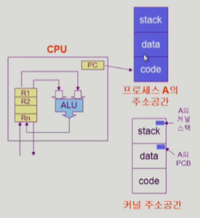

### 프로세스의 상태 (Process State)

- 프로세스는 상태(state)가 변경되며 수행된다.
  - **Running**
    - CPU를 잡고 instruction을 수행중인 상태
  - **Ready**
    - **CPU를 기다리는 상태**(메모리 등 다른 조건을 모두 만족하고)
  - **Blocked** (wait, sleep)
    - CPU를 주어도 당장 instruction을 수행할 수 없는 상태
    - Process 자신이 요청한 event(ex) I/O)가 즉시 만족되지 않아 이를 기다리는 상태
    - ex) 디스크에서 file을 읽어와야 하는 경우
  - **Suspended(stopped)**
    - 외부적인 이유로 프로세스의 수행이 정지된 상태
    - 프로세스는 통째로 디스트케 swap out된다
    - (예) 사용자가 프로그램을 일시 정지시킨 경우(break key)
      시스템이 여러 이유로 프로세스를 잠시 중단시킴
      (메모리에 너무 많은 프로세스가 올라와 있을 때)


- new: 프로세스가 생성중인 상태
- Terminated: 수행(execution)이 끝난 상태
- Blocked: 자신이 요청한 event가 만족되면 Ready
- Suspended: 외부에서 resume해 주어야 Active

### 프로세스 상태도

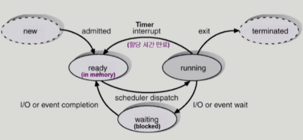

### 프로세스의 상태

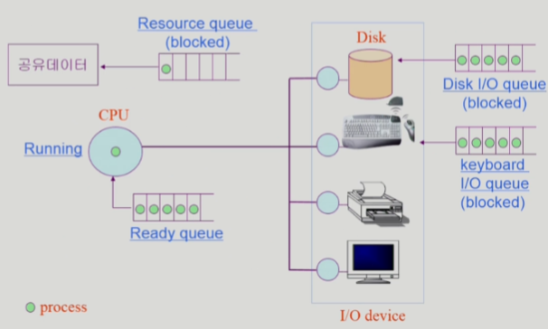

```python
# 줄 서는 개념임
# 다른 프로세스가 자원을 쓰고 있을 때 문제가 없게 하기 위해서 queue를 이용해서 block함(줄 세움)
```

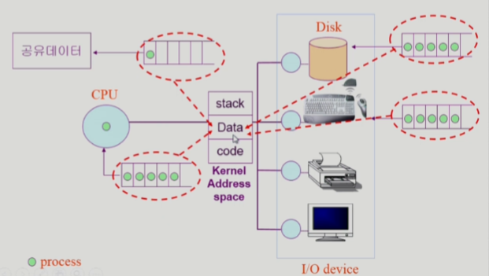

### Process Control Block (PCB)

- PCB
  - 운영체제가 각 프로세스를 관리하기 위해 프로세스당 유지하는 정보
  - 다음의 구성 요소를 가진다 (구조체로 유지)
    - (1) OS가 관리상 사용하는 정보
      - Process State, Process ID
      - scheduling information, priority
    - (2) CPU 수행 관련 하드웨어 값
      - Program counter, registers
    - (3) 메모리 관련
      - Code, data, stack의 위치 정보
    - (4) 파일 관련
      - Open file descriptors
  - 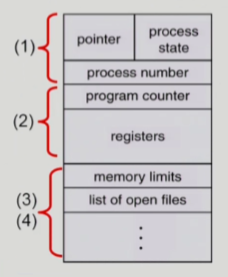

### 문맥 교환(Context Switch)

- CPU를 한 프로세스에서 다른 프로세스로 넘겨주는 과정

- CPU가 다른 프로세스에게 넘어갈 때 운영체제는 다음을 수행

  - CPU를 내어주는 **프로세스의 상태**를 그 **프로세스의 PCB에 저장**
  - CPU를 새롭게 얻는 프로세스의 상태를 PCB에서 읽어옴

- 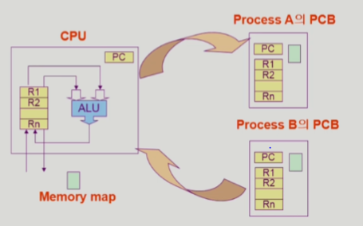

  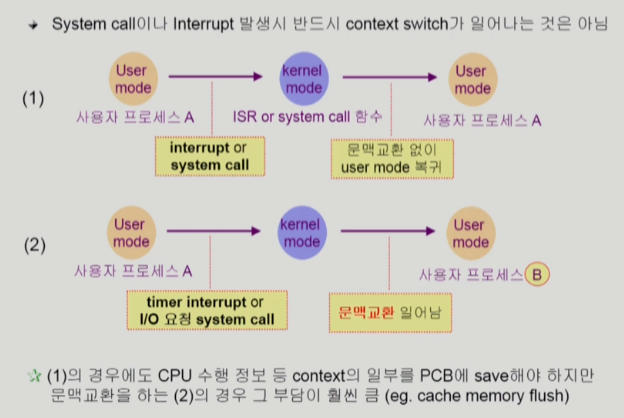

  ```markdown
  운영체제가 CPU를 다른 프로세스에 넘겨줘야 컨텍스트 스위칭임
  운영체제가 어떠한 처리하고 다시 기존 프로세스에 CPU넘겨주면 컨텍스트 스위칭 아님
  ```

### 프로세스를 스케줄링하기 위한 큐

- Job queue
  - 현재 시스템 내에 있는 모든 프로세스의 집합
- Ready queue
  - 현재 메모리 내에 있으면서 CPU를 잡아서 실행되기를 기다리는 프로세스의 집합
- Device queues
  - I/O device의 처리를 기다리는 프로세스의 집합
- 프로세스들은 각 큐들을 오가며 수행된다.

### Ready Queue와 다양한 Device Queus


### 프로세스 스케줄링 큐의 모습

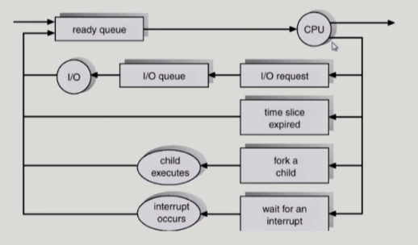

### 스케줄러 (Scheduler)

- **Long-term scheduler** (장기 스케줄러 or job scheduler)
  - **시작 프로세스 중** 어떤 것들을 ready queue로 보낼지 결정
  - 프로세스에 memory(및 각종 자원)을 주는 문제
  - degree of Multiprogramming(메모리에 올라가있는 프로그램 수)을 제어
  - **time sharing system에는 보통 장기 스케줄러가 없음(무조건 ready)**
- **Short-term scheduler**(단기 스케줄러 or CPU scheduler)
  - 어떤 프로세스를 다음번에 running시킬지 결정
  - 프로세스에 CPU를 주는 문제
  - 충분히 빨라야 함(ms단위)
- **Medium-Term Scheduler** (중기 스케줄러 or **Swapper**)
  - **여유 공간 마련을 위해** 프로세스를 통째로 **메모리에서 디스크로 쫓아냄**
  - 프로세스에게서 memory를 뺏는 문제
  - **degree of Multiprogramming**을 제어

### 프로세스 상태도

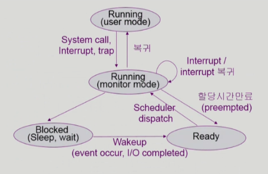

- Running(monitor mode) - 운영체제가 러닝인건 아님, 운영체제의 코드가 실행 중이다, 사용자 프로세스가 커널모드에서 실행 중이다라는 뜻이 맞음, 이 프로그램(사용자 프로그램)이 계속 러닝 중이라 간주함
- 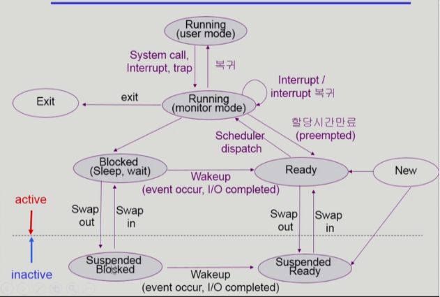

### Thread

- "A thread(or lightweight process )" is a basic unit of CPU utilization"
- Thread의 구성
  - programe counter
  - register set
  - stack queue
- Thread가 동료 thread와 공유하는 부분(=task)
  - code section
  - data section
  - OS resources
- 전통적인 개념의 heavyweight process는 하나의 thread를 가지고 있는 task로 볼 수 있다.
- 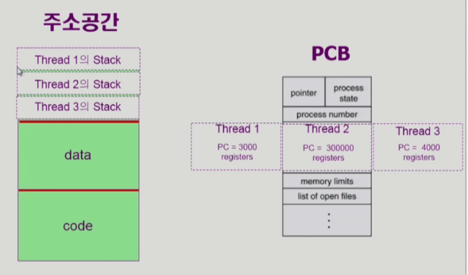

- 프로세스는 하나만 띄워놓고, 프로그램 카운터만 여러개 둔다. 실행단위를 여러개 둔다.
- 각 cpu 실행(수행)단위(thread)가 어떤 코드를 실행하고 있는지 담아둠(pc)
- 스레드는 프로세스 내에서 공유할 것은 최대한 공유하고, 다만 별도로 cpu 수행과 관련된 정보 (pc, stack, reg)을 가지고 있는다


- 다중 스레드로 구성된 태스크 구조에서는 하나의 서버 스레드가 blocked(waiting) 상태인 동안에도 동일한 태스크 내의 다른 스레드가 실행(running)되어 빠른 처리를 할 수 있다.

- 동일한 일을 수행하는 다중 스레드가 협력하여 높은 처리율(throughput)과 성능 향상을 얻을 수 있다.
- 스레드를 사용하면 병렬성을 높일 수 있다.

```python
#웹 브라우저가 다중 스레드 사용하면 이미지를 불러오는 동안에 텍스트라도 불러오든가 하면 사 용자 입장에서 답답함이 덜 할 것임(빠른 응답성 제공)
# 같은 일을 하는 프로세스를 여러개 띄우면 각각이 메모리에 올라가야해서 메모리 낭비가 심함 웹 브라우저를 여러개 띄우는 경우, 메모리에 각각 올리지말고, 하나의 프로세스 안에 스레드만 여러개 두면, 성능 향상, 자원 낭비를 줄일 수 있다.
# CPU가 여러개 달린 경우 -> 병렬성을 높일 수 있다.
# 1000 * 1000 행렬 연산 시 CPU가 하나만 있으면 순차적으로 하겠지만, 여러개 있으면 서로 다른 CPU에서 연산한 후 합쳐주면 병렬성을 높일 수 있다. / 각 스레드들이 다른 CPU에서 실행됨
```

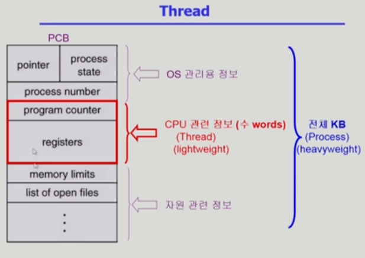

### Single and Multithreaded Processes

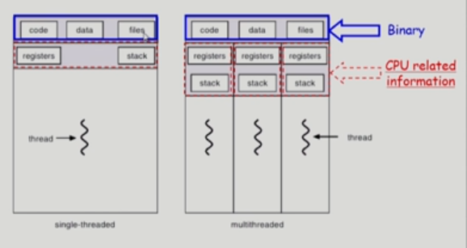

### Benefits of Threads

- Responsiveness
  - multi-threaded Web - if one thread is blocked (eg network) 
    another thread continues (eg display)
- Resource Sharing
  - n threads cna share binary code, data, resource of the process
- Economy
  - **creating** & **CPU switching** **thread** (rather than a **process**)
  - Solaris의 경우 위 두 가지 overhead가 각각 30배, 5배
- Utilization of MP Architectures(이거는 멀티코어 cpu의 경우에 한함)
  - **each thread** may be running in **parallel** on a **different processor**

### Implementation of Threads

- Some are supported by kernel -> kernel Threads

  - Windows 95/98/NT
  - Solaris
  - Digital UNIX, Mach

- Others are supported by library -> User Threads

  - POSIX Pthreads
  - Mach C-threads
  - Solaris threads

  - user threads는 커널이 알아채지 못함(조금 제한적이게 됨)

- Some are real-time threads