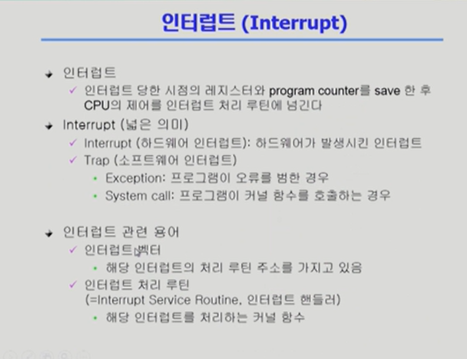
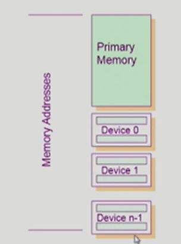

CPU 안의 메모리 카운터라는 레지스터에 저장된 위치에서 memory의 instruction을 읽어와 실행한다. 

instruction 하나는 4byte -> 다음 instruction을 실행할 주소인 program counter가 4 증가하게 됨 

그렇게 cpu는 다음 instruction을 수행하게 된다. 

그런데 프로그램이 항상 순차적으로 진행되는 것은 아니다. 제어문, if 같은걸 만족하지 않을떄는 명령을 뛰어넘어야 할 때도 있다. jump하는 instruction도 존재한다. 

컴퓨터가 켜져서 꺼질 때 까지 program counter는 instruction을 읽고, 다음 instruction을 수행하는 일을 맡는다. 

### 그렇다면 Interrupt는? 

interrupt가 발생하면 지금 cpu제어권이 누구에게 있었건간에 제어권이 운영체제에게 넘어가게 됨. 

운영체제는 interrupt 마다 어떤 식으로 제어해야할지 커널 함수 형태로 제어하고 있음. 

**인터럽트 벡터** : 몇번 라인에 인터럽트가 들어왔는지 나타냄, 그 엔트리가 들어오면 어떤 명령을 수행해야하는가를 나타내는 것이 인터럽트 벡터 ''

CPU는 매번 프로그램 카운터가 가리키는 곳을 수행하게 된다. 

mode bit : 

0일 때- cpu가 수행할 수 있는 모든 기계어 집합을 다 수행할 수 있다. 

1일 때 : 한정된 instruction만 수행할 수 있다. 

시스템 콜 

운영체제에게 서비스를 요청할 때 

바로 콜 하는 것은 불가능하기 때문에 의도적으로 인터럽트 라인을 생성 -> cpu는 하던일을 멈춤 -> cpu의 제어권이 사용자 프로그램으로부터 운영체제로 넘어가게 됨 -> I/O를 대신해달라고 요청하게됨 

인터럽트 : 일반적으로 하드웨어 인터럽트라고 부름 

그러나 방금처럼 인터럽트 라인을 생성해서 운영체제를 부르는 것은 소프트웨어 인터럽트라고 부른다. (트랩이라고도 함)

트랩의 종류 2가지 

----

인터럽트를 거는 요인 

2. 타이머 ': 

운영체제가 CPU를 가지고 있다가 사용자 프로그램에게 넘겨줄 때 mode bit을 1로 바꾼 다음에 넘겨주기 때문에 보안에 어긋나는 사용자의 움직임은 막을 수 있음 

그러나 사용자가 무한루프를 돈다거나, CPU의 사용을 안멈추게된다면? 

- 방법이 없음 
- 타이머라는 방법을 통해서 할당된 시간이 끝나면 타이머가 인터럽트를 걸어준다. 

-----

싱크로너스 : 동기식 

- 시간을 맞추다 
- I/O장치까지 직접 가서 뭐가 적혀있는지 직접 확인하고 작업하면 동기식 
- I/O요청 후 입출력 작업이 완료된 후에야 제어가 사용자 프로그램에 넘어가는 것 

I/O가 끝났음을 알려주는 것 : interrupt

----

동기식 입출력 

- CPU가 낭비됨 

- I/O장치도 동시에 실행될 수있음 

---

DMA : 메모리를 접근할 수 있는 방법 

키보드 : 1바이트 -> interrupt -> copy 

cpu의 인터럽트가 너무 심함 

그래서 dma라는 장치를 붙여놓고, 한 블럭단위가 끝나면 끝났다고 알려주는 식으로 DMA 활용 

빠른 입출력 장치 

디바이스에서 메모리에 한번 카피해놓고  CPU에 끝났다는 것을 알려줌 

----

메모리를 접근하는 인스트럭션 

memory와 device 분리 

- memory 에 접근하는건 따로 있고 
- I/O에 접근하려면 device 의 address로 따로 접근 

- memory mapped I/O라고 부름 
- 주소를 공유함 

----

위로갈수록 속도가 빠른 매체를 사용하고 있음 

그러나 위로 갈 수록 용량이 적음 

초록 : 휘발성 

핑크 : 비휘발성 

----

secondary : CPIU가 직접 접근할 수 없다 

#### 캐싱

캐시메모리 - 메인 메모리보다 용량이 작기 때문에 당장 필요한 것만 위로 올려서 사용 

빠른 매체로 정보를 읽어들여서 사용 

재사용의 목적으로 이용 

용량은 위로 갈 수록 작아짐 

----

#### 버추얼 매모리 : 가상 메모리 

- 각 프로그램마다 독자적으로 가지고 있는 메모리 공간을 의미 

프로그램을 실행시키면 그 프로그램의 메모리 주소 공간이 형성됨 

이는 0번지 부터 시작하는 독자적인 주소 공간임 

이것을 물리적인 메모리에 올려서 실행 시킴 

그러나 모든 주소 내역을 다 올려놓으면 메모리의 낭비가 되기 때문에 

물리적인 메모리의 kernel은 당장 필요한 부분만 올려놓음 

당장 필요하지 않은 부분은 disk의 swap memory 에 올려놓음.

SWAP area가 하는 일 

- 메모리 연장공간으로 이용 
- 비휘발성 용도로 이용 

---

Address Transition 

- 주소 변환 
- virtual과 physical memory의 변환을 담당 

----

운영 체제가 무슨 일을 해야할까 

---

사용자 정의함수나 라이브러리 함수는 시스템 콜이 필요하지 않다. 

커널 함수 : 영역이 달라지기 때문에 점프가 불가능하다. 

A라는 프로그램이 실행되고 종료되는 과정 

시스템 콜을 하게되면 커널 모드에서 CPU가 동작되게 됨 

