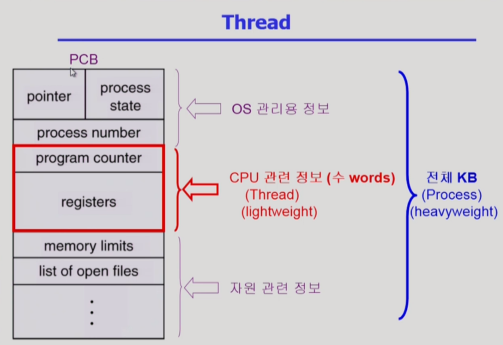
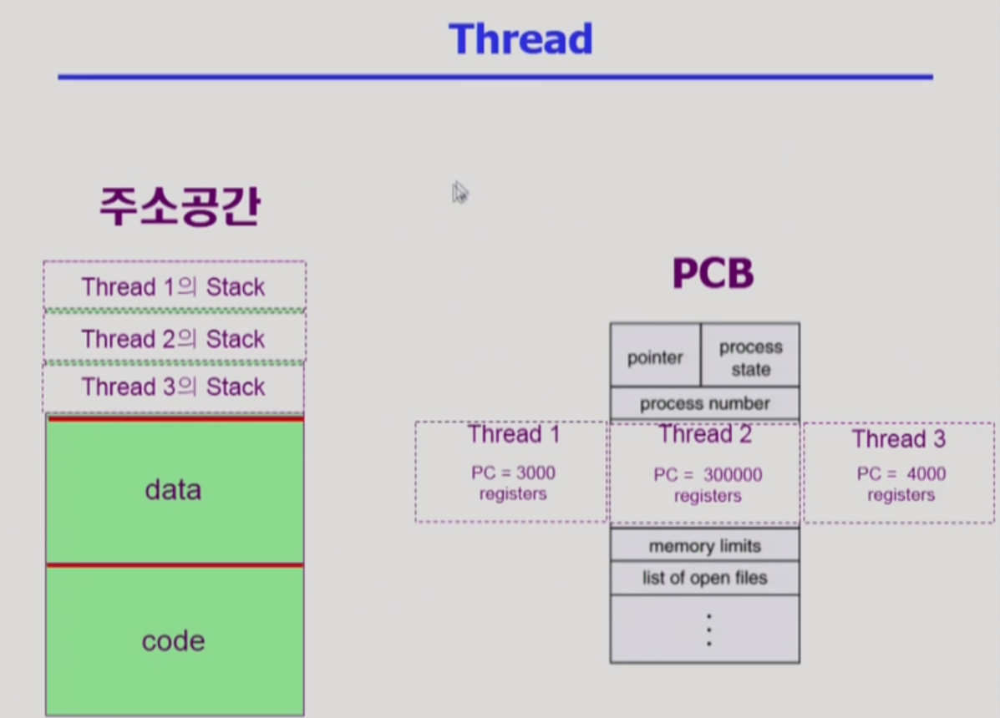
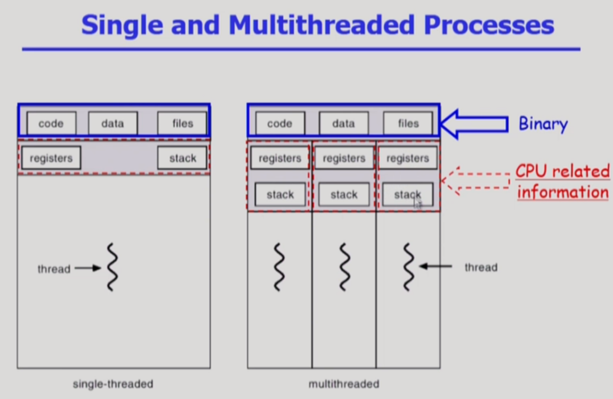
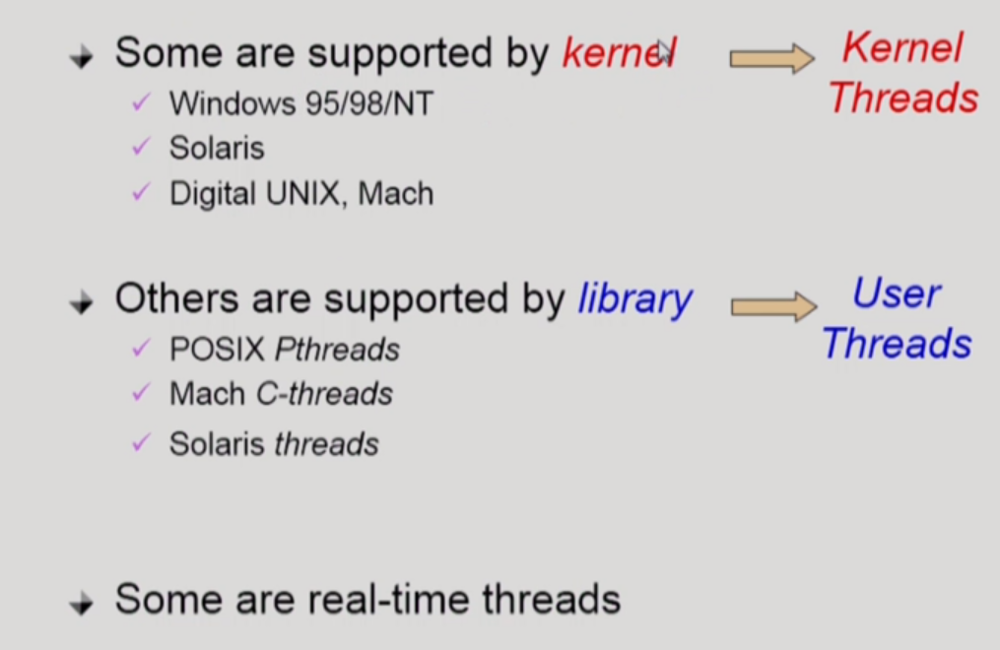

# Thread

---

**빠른 응답성, 자원 절약의 장점**

- 다중 스레드로 구성된 태스크 구조에서는 하나의 서버 스레드가 blocked 상태인 동안에도 동일한 태스크 내의 다른 스레드가 실행되어 빠른 처리를 할 수 있다.
- 동일한 일을 수행하는 다중 스레드가 협력하여 높은 처리율(throughput)과 성능 향상을 얻을 수 있다
- 스레드를 사용하면 병렬성을 높일 수 있다. ex) 1000*1000 행렬을 곱할 때, 독립적인 연산들을 서로 다른 cpu에서 실행 후 합쳐 빠른 결과를 얻을 수 있음.

프로세스는 하나이기 때문에 PCB또한 하나만 만들어진다

그런데 이 프로세스 안에 thread가 여러개 있게 되면, cpu 수행과 관련된 정보만 각각 thread마다 별도의 copy를 갖게 됨

**프로세스마다 가지고있는 정보 중 cpu수행과 관련있는 정보를 thread마다 별도로 가지고있게 됨**

---

프로세스라는건 메모리 주소 공간에 code, data, stack이 있고, 각 프로세스마다 PCB가 있게 됨

이 때 thread는 프로세스 안에서 독자적으로 가져야되는 정보만 별도로 가지고있게 됨

**주소공간에서는 code와 data는 공유, stack 부분만 thread마다 별도로 가지고있게 되는 것**

---

### thread의 이점

1. 응답성 - 사용자 입장에서 빠름. ex)  html 문서를 갖고 온 후 그 안에 있는 이미지 파일을 웹 서버로 요청하는 과정. 이 때 프로세스가 block 되는데, thread가 여러개 있으면 그 네트워크 요청을 한 thread만 block이 됨. block되지 않은 다른 thread가 이미 읽어온 html 문서라도 화면에 보여주게 되면, 사용자 입장에선 답답함이 덜할 수 있음.
2. 자원의 공유 - 여러개의 thread가 binary code, data, 프로세스의 자원 등을 공유해서 사용.
3. 경제성 - 응답성과는 살짝 다른, 빠르다는 의미. 같은 작업의 경우 프로세스를 여러개 만드는 것 보다 프로세스 안에 thread를 두는게 훨씬 효율적.
4. Utilization of MP(멀티 프로세서) Architectures - 각각의 thread가 다른 프로세서에서 병렬적으로 일을 수행할 수 있음. 결과를 더 빨리 얻을 수 있는 장점이 있음.

---

### implementation of threads

**kernel threads**: **thread가 여러개 있다는 사실을 운영체제 kernel이 알고 있음**. 하나의 thread에서 다른 thread로 cpu가 넘어가는 것도 kernel이 cpu 스케줄링을 하듯이 넘겨주게 됨.

**user threads**: 프로세서 안에 thread가 여러개 있다는 사실을 운영체제는 모름. **user 프로그램이 스스로 여러개의 thread를 관리하는 것**. 그렇기 때문에 이 user threads는 약간의 제약점이 있을 수 있음.