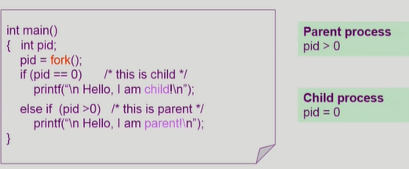
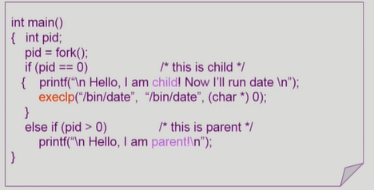
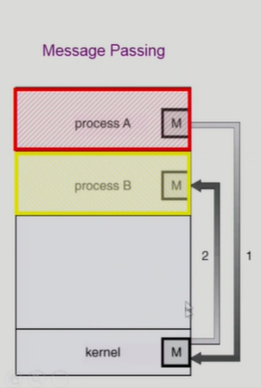
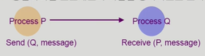
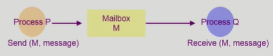
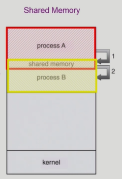
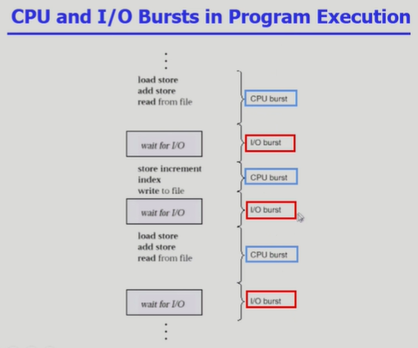
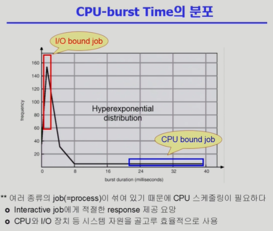

# Process Management 2 - 운영체제

## 프로세스

### 프로세스 생성

- 부모 프로세스가 자신을 복사하여 자식 프로세스를 생성
- 트리 구조 형성

#### 자원의 공유

- 부모와 자식이 모든 자원을 고융하는 모델
- 일부를 고융하는 모델
- 전혀 공유하지 않는 모델

리눅스나 효율적인 OS에서는 일단 복제하지않고 부모의 주소 공간을 공유하고 있음
중간에 달라지게 된다면 공유하던 메모리를 복제하여 따로 분리되게 됌
Copy-on-Write (COW) : 쓰기가 발생했을 때 복제하게 된다.

## 프로세스와 관련된 시스템 콜

### fork() 시스템 콜

- 프로세스가 자식 프로세스를 직접 생성하는 것이 아닌 운영체제에게 부탁하는 형태로 이루어짐
- 부모를 그대로 복사 (OS data except PID + binary)
- 필요한 경우에 새로운 프로그램을 덮어 씌우는데 이를 __exec() 시스템 콜__이라 한다

- fork는 부모 프로세스의 컨텍스트(문맥 -> 정확하게는 Program Counter)까지 모두 복사하므로, 자식 프로세스의 실행 첫 위치는 pid=fork(); 명령어 다음부터 실행되기 때문에 무한 반복 생성은 이루어지지 않는다
- 자식인지 부모인지 구분은 fork 함수의 반환값으로 알 수 있는데,
  부모일 경우 pid 값이 양수가 되고 자식일 경우 pid값이 0이 된다.

### exec() 시스템 콜

- 완전히 새로운 프로세스로 변경시켜주는 시스템 콜
- exec가 실행되면 더 이상 원래 프로세스로 돌아올 수 없음

- execlp는 exec() 시스템 콜을 호출하는 명령어
- 덮어씌울 프로그램과 전달할 값을 파라미터로 전달 가능함

### wait() 시스템 콜

- wait 시스템 콜을 호출하면
  커널은 자식 프로세스가 종료될 때까지 부모 프로세스를 Block 상태로 변경시키고
  자식 프로세스가 종료되면 커널은 다시 부모 프로세스를 Ready 상태로 만든다

### exit() 시스템 콜

- 자발적 종료
  - 마지막 statement 수행 후 exit() 시스템 콜 수행
  - 또는 명시적으로 적지 않아도 main 함수가 리턴되는 위치에 컴파일러가 자동으로 넣어줌
- 비자발적 종료
  - 부모 프로세스가 자식 프로세스를 강제 종료시킴
    - 자식 프로세스가 한계치를 넘는 자원 요청했을 경우
    - 자식에게 할당된 테스크가 더 이상 필요하지 않을 경우
  - 키보드로 kill, break 등을 친 경우
  - 부모 프로세스가 종료된 경우
    - 부모 프로세스가 종료되기 전에 자식들을 먼저 종료시킴

## 프로세스 간 협력

### 독립적 프로세스

- 프로세스는 각자의 주소 공간을 가지고 수행되므로 원칙적으로 하나의 프로세스는 다른 프로세스의 수행에 영향을 미치지 못함

### 협력 프로세스

- 프로세스 협력 메커니즘을 통해 하나의 프로세스가 다른 프로세스의 수행에 영향을 미칠 수 있음

### 프로세스 간 협력 메커니즘(IPC : Interprocess Communication)

- 메세지를 전달하는 방법
  - message passing : 커널을 통해 메세지 전달
- 주소 공간을 공유하는 방법
  - shared memory : 서로 다른 프로세스 간에도 일부 주소 공간을 공유하게 하는 메커니즘
  - thread : thread는 사실상 하나의 프로세스이므로 프로세스 간 협력으로 보기는 어렵지만 동일한 process를 구성하는 thread들 간에는 주소 공간을 공유하므로 협력이 가능

### Message Passing

- Message system : 프로세스 사이에 __공유 변수를 일체 사용하지 않고__ 통신하는 시스템

- 반드시 프로세스 사이에는 __커널을 통해서__ 전달이 된다

  

- Direct Communication : 통신하려는 프로세스의 이름을 명시적으로 표시

  

- Indirect Communication : mailbox(또는 port)를 통해 메세지를 간접 전달

  

### Shared Memory

- 서로 다른 프로세스 간에도 일부 주소 공간을 공유하게 하는 메커니즘
- 처음 공유하는 메모리는 커널을 통해 지정된다

## CPU Scheduling

- CPU burst : CPU 사용하는 부분에서 I/O 부분으로 넘어가는 것(?)
- I/O bursts : I/O 부분에서 CPU 사용 부분으로 넘어가는 것(?)

- CPU burst의 빈도 차트인데, 빈도가 높을 수록 CPU와 I/O의 전환이 자주 일어나는 것이므로 사용자와 인터렉티브한 프로세스일 것이며, 빈도가 낮을 수록 CPU가 계산해야하는게 많은 프로세스일 것이다.
- I/O bound job : 사용자와 인터렉티브한 프로세스
- CPU bound job : 연산할 값들이 많은 프로세스 

### 프로세스의 특성 분류

- I/O-bound process => many short CPU bursts
  - CPU를 잡고 계싼하는 시간보다 I/O에 많은 시간이 필요한 job
- CPU-bound process => few very long CPU bursts
  - 계산 위주의 job

### CPU Scheduler & Dispatcher

- CPU Scheduler : ready 상태의 프로세스 중에서 이번에 CPU를 줄 프로세스를 고른다
- Dispatcher : CPU의 제어권을 CPU scheduler에 의해 선택된 프로세스에게 넘긴다
                       이 과정을 __context switch(문맥 교환)__이라고 한다.

#### CPU 스케쥴링이 필요한 경우

프로세스에게 다음과 같은 상태 변화가 있는 경우이다

1. Running -> Blocked (ex : I/O 요청하는 시스템 콜)

2. Running -> Ready (ex : 할당시간만료로 timer interrupt)

3. Blocked -> Ready (ex : I/O 완료 후 인터럽트)

4. Terminate

##### Nonpreemptive : 자진 반납 (1, 4)

##### Preemptive : 강제 반납 (2, 3)