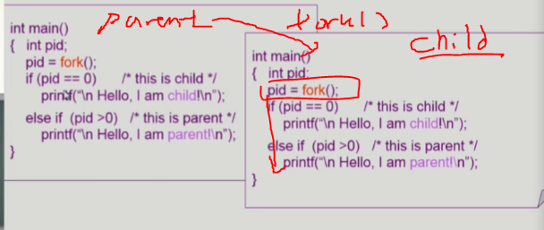
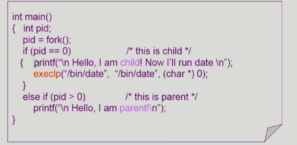
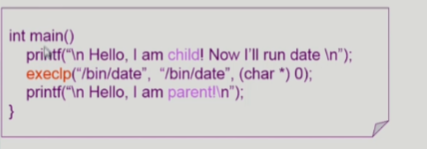
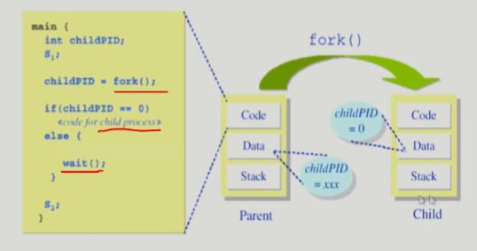
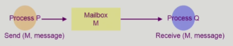
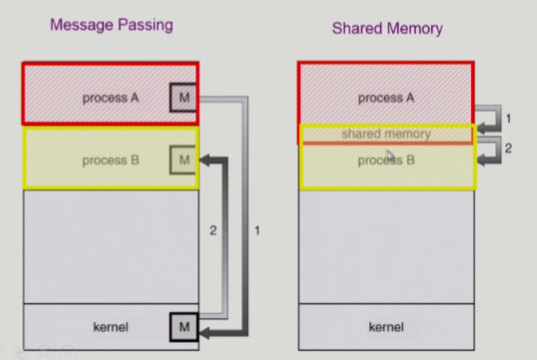

# 2. Process Management 1

### 프로세스 생성

- 부모 프로세스가 자식 프로세스를 생성
- 프로세스의 트리(계층 구조) 형성
- 프로세스는 자원을 필요로 함
  - 운영체제로부터 받는다
  - 부모와 공유한다
- 자원의 공유
  - 부모와 자식이 모든 자원을 공유하는 모델
  - 일부를 공유하는 모델
  - **전혀 공유하지  않는 모델**(일반적이다)
- 수행 (Execution)
  - 부모와 자식은 공존하며 수행되는 모델
  - 자식이 종료(terminate)될 때까지 부모가 기다리는(wait, blocked 상태) 모델
- 주소 공간 (Address space)
  - 자식은 부모의 공간을 복사함 (binary and OS data)
  - 자식은 그 공간에 새로운 프로그램을 올림
- 유닉스의 예
  - **fork()** 시스템 콜이 새로운 프로세스를 생성
    - 부모를 그대로 복사 (OS data except PID + binary)
    - 주소 공간 할당
  - fork 다음에 이어지는 **exec()** 시스템 콜을 통해 새로운 프로그램을 메모리에 올림

### 프로세스 종료

- 프로세스가 마지막 명령을 수행한 후 운영체제에게 이를 알려줌 (**exit**)
  - 자식이 부모에게 output data를 보냄 (via **wait**)
  - 프로세스의 각종 자원들이 운영체제에게 반납됨
- **부모 프로세스가 자식의 수행을 종료시킴** (**abort**)
  - **자식이 할당 자원의 한계치를 넘어**섬
  - **자식**에게 할당된 태스크가 **더 이상 필요하지 않음**
  - 부모가 종료(exit)하는 경우
    - 운영체제는 부모 프로세스가 종료하는 경우 자식이 더 이상 수행되도록 두지 않는다
    - **단계적인 종료**

```markdown
# 부모를 완전히 카피하는 것은 비효율적이라 리눅스같은 경우 공유할 꺼는 공유하고 프로그램 카운터만 카피하는 식으로 구현함.
# Copy-on-write (COW기법): write가 발생할 때 비로소 카피함, 그 이전까지는 부모꺼를 공유하고 있음

# fork(일단 복사) - exec(덮어 씌움)
```

### fork() 시스템 콜

- A process is created by the fork() system call
  - creates a new address space that is a duplicate of the caller
- 
  - 자식  프로세스는 fork한 시점부터 실행됨(부모의 컨텍스트(구체적으로는 프로그램 카운터)도 복사됨)
- 자식은 pid(fork의 리턴값) = 0을 받고 부모는 pid = 1을 받아서 자식과 부모의 실행이 구분되게 됨

### exec() 시스템 콜

- A process can execute a different program by the exec() system call
  - replaces the memory image of the caller with a new program
- 
  - 자식프로세스에 새로운 프로그램을 덮어씌우기 위해 exec함
- 한 번 exec하면 돌아올 수 없음
- 
  - fork안하고 처음부터 exec할 수 있음

### wait() 시스템콜

- 프로세스 A가 wait() 시스템 콜을 호출하면
  - 커널은 child가 종료될 때까지 프로세스 A를 sleep 시킨다(block 상태)
  - **Child process가 종료되면 커널은 프로세스 A를 깨운다**(ready 상태)
- 

- ex) 
  - Program(쉘의 자식프로세스로 생성됨)
    - program이 끝나면 다시 쉘이 커맨드를 입력받을 수 있는 상태가 됨

### exit() 시스템콜

- 프로세스의 종료
  - 자발적 종료
    - 마지막 statement 수행 후 exit() 시스템 콜을 통해
    - 프로그램에 명시적으로 적어주지 않아도 main함수가 리턴되는 위치에 컴파일러가 넣어줌
  - 비자발적 종료
    - 부모 프로세스가 자식 프로세스를 강제 종료시킴
      - 자식 프로세스가 한계치를 넘어서는 자원 요청
      - 자식에게 할당된 태스크가 더 이상 필요하지 않음
    - 키보드로 kill, break 등을 친 경우
    - 부모가 종료하는 경우
      - 부모 프로세스가 종료하기 전에 자식들이 먼저 종료됨

### 프로세스와 관련한 시스템 콜

- fork() - create a child
- exec() - overlay new image
- wait() - sleep until child is done
- exit() - frees all the resources, notify parent

### 프로세스 간 협력

- 독립적 프로세스(Independent process)
  - 프로세스는 각자의 주소 공간을 가지고 수행되므로 원칙적으로 하나의 프로세스는 다른 프로세스의 수행에 영향을 미치지 못합
- 협력 프로세스(Cooperating process)
  - 프로세스 협력 메커니즘을 통해 하나의 프로세스가 다른 프로세스의 수행에 영향을 미칠 수 있음
- 프로세스 간 협력 메커니즘(**IPC**: Interprocess Communication)
  - 메시지를 전달하는 방법
    - **message passing**: 커널을 통해 메시지 전달
  - 주소 공간을 공유하는 방법
    - **shared memory** : 서로 다른 프로세스 간에도 일부 주소 공간을 공유하게 하는 shared memory 메커니즘이 있음
    - thread: thread는 사실상 하나의 프로세스이므로 프로세스 간 협력으로 보기는 어렵지만 동일한 process를 구성하는 thread를 간에는 주소 공간을 공유하므로 협력이 가능

### Message Passing

- Message system
  - 프로세스 사이에 공유 변수(shared variable)를 일체 사용하지 않고 통신하는 시스템
- Direct Communication
  - 통신하려는 프로세스의 이름을 명시적으로 표시
    - 다이렉트라 하더라도 커널을 통해 전달됨
  - 
- Indirect Communication
  - mailbox (또는 port)를 통해 메시지를 간접 전달
  - 

### Interprocess Communication

​	


