# CPU Scheduling

### CPU and I/O Bursts in Program Execution

- 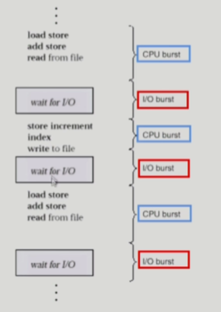
- CPU를 쓰는 단계와 I/O를 쓰는 단계가 반복하면서 실행됨

### CPU-burst Time의 분포

- 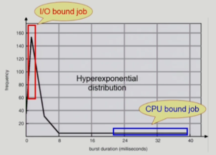
- 여러 종류의 job(=process)이 섞여 있기 때문에 CPU 스케줄링이 필요하다.
  - **Interactive job에게 적절한 response 제공 요망**
  - CPU와 I/O 장치 등 시스템 자원을 골고루 효율적으로 사용

### 프로세스의 특성 분류

- 프로세스는 그 특성에 따라 다음 두 가지로 나눔
  - I/O - bound process
    - CPU를 잡고 계산하는 시간보다 I/O에 많은 시간이 필요한 job
    - (many short CPU bursts)
  - CPU-bound process
    - 계산 위주의 job
    - (few very long CPU bursts)

### CPU Scheduler & Dispatcher

- CPU Scheduler
  - Ready 상태의 프로세스 중에서 이번에 CPU를 줄 프로세스를 고른다
- Dispatcher
  - CPU의 제어권을 CPU Scheduler에 의해 선택된 프로세스에게 넘긴다
  - 이 과정을 context switch(문맥 교환)라고 한다
- CPU 스케줄링이 필요한 경우는 프로세스에게 다음과 같은 상태 변화가 있는 경우이다.
  - 1. Running -> Blocked(예: I/O 요청하는 시스템 콜)
    2. Running -> Ready (예: 할당시간만료로 timer Interrupt)
    3. Blocked -> Ready (예: I/O 완료 후 인터럽트)
    4. Terminate
  - 1, 4 에서 스케줄링은 nonpreemptive (=강제로 빼앗지 않고 자진 반납, 비선점형)
  - All other scheduling is preemptive (=강제로 빼앗음, 선점형)

### Scheduling Criteria (Performance Index =Performance Measure, 성능척도)

- CPU utilization (이용률)
  - keep the CPU as busy as possible
- Throughput (처리량)
  - `#` of processes that complete their execution per time unit
- Turnaround time (소요시간, 반환시간)
  - amount of time to execute a particular process
- Waiting time (대기시간)
  - amount of time a process has been waiting in the ready queue
- Response Time (응답시간)
  - amount of time it takes from when a request was submitted **until the first response** is produced, not output
    (for time-sharing environment)

## Scheduling Algorithm

### FCFS(First-Come First-Served, nonpreemptive)

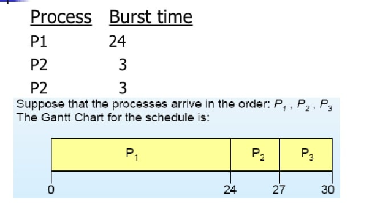

- 프로세스의 도착 순서 P1, P2, P3
- 스케줄 순서를 Gantt Chart로 나타내면 다음과 같다

- Waiting time for P1 = 0; P2 = 24, P3 = 27
- Average waiting time: (0 + 24 + 27) / 3 = 17
- 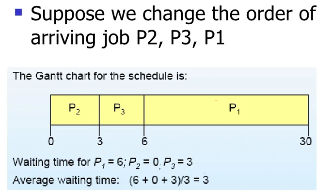
- Much better than previous case
- **Convoy effect**: short process behind long process(긴 프로세스가 앞에 있으면 뒤에 짧은 프로세스들이 너무 오래 기다려야함)

### SJF (Shortest-Job-First)

- 각 프로세스의 다음번 CPU burst time을 가지고 스케줄링에 활용
- CPU burst time이 가장 짧은 프로세스를 제일 먼저 스케줄
- Two Schemes:
  - Nonpreemptive
    - 일단 CPU를 잡으면 이번 CPU burst가 완료될 때까지 CPU를 선점하지않음
  - Preemptive
    - 현재 수행중인 프로세스의 남은 burst time보다 더 짧은 CPU burst time을 가지는 새로운 프로세스가 도착하면 CPU를 뺴앗김
    - 이 방법을 Shortest-Remaining-Time-first(SRTF) 라고도 부름
- SJF is optimal
  - 주어진 프로세스들에 대해 minimum average waiting time을 보장
- 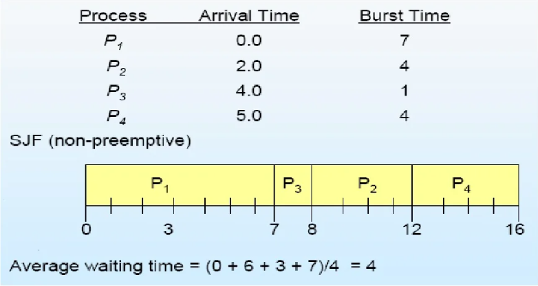
  - 7초 시점에서 burst time이 작은 순서대로 진행 (p3, p2, p4)
- 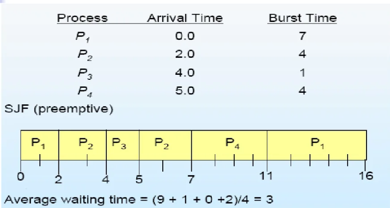
  - 더 짧은 애가 오면 뺏어버림
- 수행시간이 긴 애들이 계속밀려서 기아 현상이 발생할 수 있다.

### 다음 CPU burst time의 예측

- 추정(estimate)만 가능
- 과거의 CPU burst time을 이용해서 추정 (exponential averaging)
  - 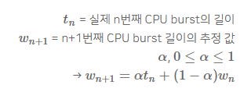

### Priority Scheduling

- A priority number(Integer) is associated with each process
- highest priority를 가진 프로세스에게 CPU 할당
  - (smallest integer = highest priority)
  - Preemptive
  - Nonpreemptive
- SJF는 일종의 priority scheduling이다.
  - priority = predicted next CPU burst time
- Problem
  - starvation(기아 현상) : low priority processes may never execute.
- Solution
  - Aging : as time progresses **increase the priority of the process**

### Round Robin (RR)

- 각 프로세스는 동일한 크기의 할당 시간(time quantum)을 가짐
  (일반적으로 10-100 ms)

- 할당 시간이 지나면 프로세스는 선점(preempted)당하고 ready queue의 제일 뒤에 가서 다시 줄을 선다
- n 개의 프로세스가 ready queue에 있고 할당 시간이 q time unit인 경우 **각 프로세스는 최대 q time unit 단위로 CPU 시간의 1/n을 얻느다.**
  - 어떤 프로세스도 (n-1)q time unit 이상 기다리지 않는다.
- Performance
  - q large => FCFS
  - q small => Context switch 오버헤드가 커진다.
- 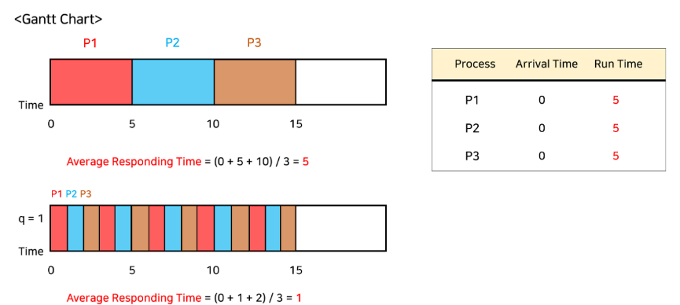

- 평균 소요 시간은 할당 시간이 커진다고 해서 반드시 증가하는 것은 아니다. 할당 시간 q가 클수록 FCFS의 방식과 유사하고, q가 작을수록 Context switch의 오버헤드가 커지기 때문에 적절한 할당 시간을 배정하는 것이 중요하다. 
- 일반적으로 SJF보다 average turnaround time이 길지만 response time은 더 짧다
- 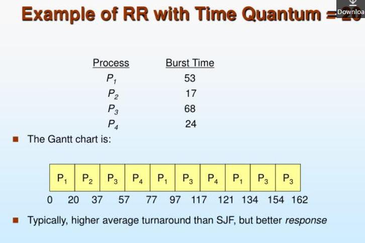
- 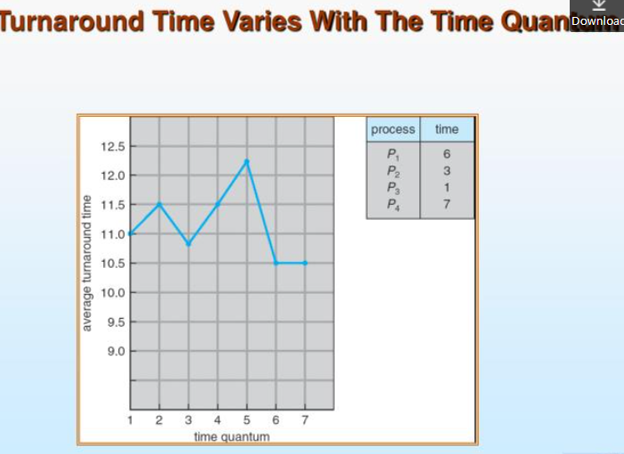
- 라운드 로빈의 장점은 turnaround time이 아니라 response time임

### Multilevel Queue

- 특징
  - Ready Queue를 여러 개로 분할
    - foreground(interactive)
    - background(batch- no human interaction)
  - 각 큐는 독립적인 스케줄링 알고리즘을 가짐
    - foreground - RR
    - background - FCFS
  - 큐에 대한 스케줄링이 필요
    - Fixed priority scheduling
      - serve all from foreground then from background
      - Possibility of starvation
    - Time slice
      - 각 큐에 CPU time을 적절한 비율로 할당
      - Eg. 80% to foreground in RR, 20% to background in FCFS

- 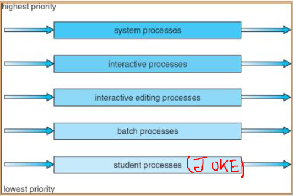

### Multilevel Feedback Queue

- 특징
  - 위에서 프로세스가 큐들 사이에서 이동할 수 있는 성질이 추가된 것
  - 우선순위를 부여하고 에이징 기법을 통해 구현할 수 있음

- 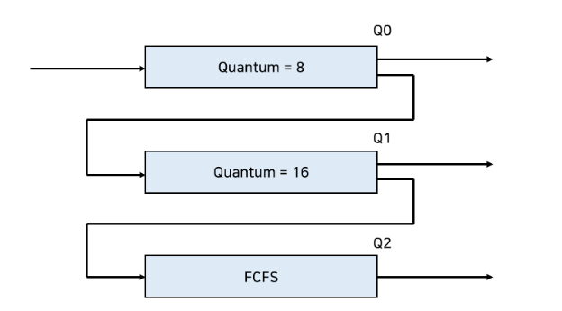
  - 할당 시간이 8ms, 16ms인 RR 방식의 두 Queue와 FCFS 방식의 한 Queue가 있는 예를 들어보자
    - new job이 queue Q_0로 들어감
    - CPU를 잡아서 할당 시간 동안 수행됨
    - 8ms동안 다 끝내지 못했으면 queue Q1으로 내려감
    - Q1에 줄서서 기다렸다가 CPU를 잡아서 16ms  동안 수행됨
    - 16ms에 끝내지 못한 경우 Q2(FCFS)로 쫓겨남

### Multiple-Processor Scheduling

- CPU가 여러 개인 경우 스케줄링은 더욱 복잡해짐
- **Homogeneous processor인 경우**
  - Queue에 한줄로 세워서 각 프로세서가 알아서 꺼내가게 할 수 있다.
  - 반드시 특정 프로세서에서 수행되어야 하는 프로세스가 있는 경우에는 문제가 더 복잡해짐
- **Load sharing**
  - 일부 프로세서에 job이 몰리지 않도록 부하를 적절히 공유하는 메커니즘 필요
  - 별개의 큐를 두는 방법 vs 공동 큐를 사용하는 방법
- **Symmetric Multiprocessing (SMP)**
  - 각 프로세서가 각자 알아서 스케줄링 결정
- **Asymmetric multiprocessing**
  - 하나의 프로세서가 시스템 데이터의 접근과 공유를 책임지고 나머지 프로세서는 거기에 따름

### Real-time Scheduling

- Hard real-time systems
  - Hard real-time task는 정해진 시간 안에 반드시 끝내도록 스케줄링해야 함
- Soft real-time computing
  - Soft real-time task는 일반 프로세스에 비해 높은 priority를 갖도록 해야 함

### Thread Scheduling

- Local Scheduling
  - User level thread의 경우 사용자 수준의 thread library에 의해 어떤 thread를 스케줄할지 결정
- Global Scheduling
  - Kernel level Thread의 경우 일반 프로세스와 마찬 가지로 커널의 단기 스케줄러가 어떤 thread를 스케줄할지 결정

### Algorithm evaluation

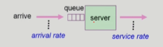

- Queueing models
  - 확률 분포로 주어지는 arrival rate와 service rate등을 통해 각종 performance index 값을 계산
- Implementation (구현) & Measurement (성능 측정)
  - 실제 시스템에 알고리즘을 구현하여 실제 작업(workload)에 대해서 성능을 측정 비교
- Simulation (모의 실험)
  - 알고리즘을 모의 프로그램으로 작성후 trace를 입력으로 하여 결과 비교

### 

