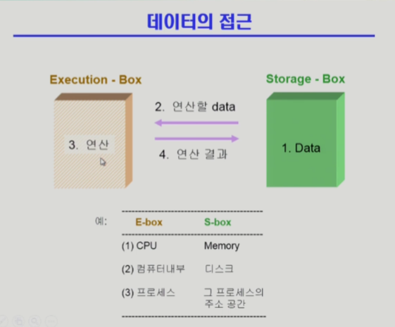
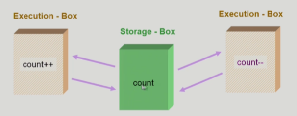
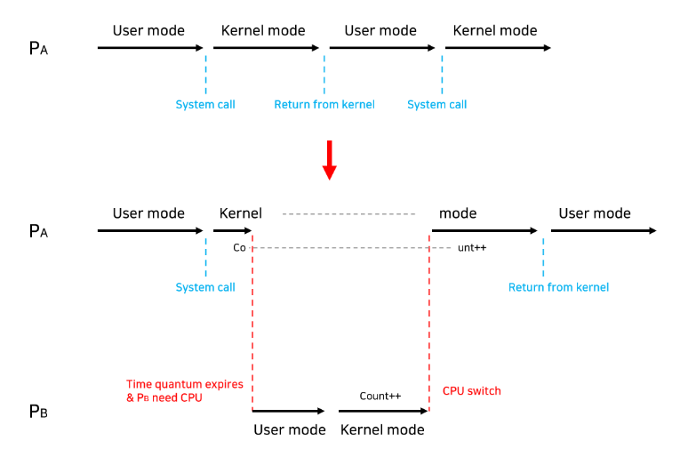
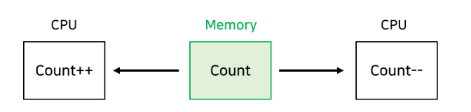
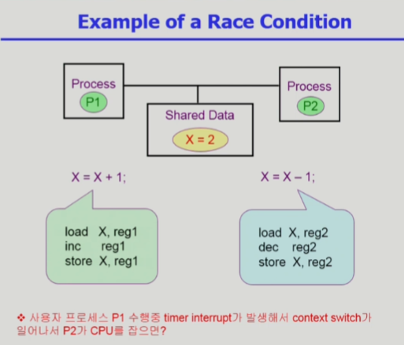
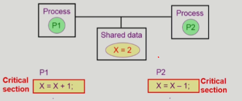

# 6. process synchronization

### 데이터의 접근

- 

### Race Condition

- S-box를 공유하는 E-box가 여럿 있는 경우 Race Condition의 가능성이 있음
- 여러 프로세스들이 동시에 데이터에 접근하는 상황에서, 어떤 순서로 데이터에 접근하느냐에 따라 결과 값이 달라질 수 있는 상황을 말한다.
- 공유 데이터 접근은 데이터의 불일치 문제를 발생시킬 수 있다. 따라서, Race Condition을 막고 일관성을 유지하기 위해서는 협력 프로세스 간의 실행 순서를 정해주는 메커니즘인 동기화(Synchronization)가 필요하다.

### OS에서 race condition은 언제 발생하는가?

- **커널 모드로 수행 중 인터럽트가 발생하는 경우**

  - 
  - 커널모드 running 중 interrupt가 발생하여 인터럽트 처리루틴이 수행
    - 양쪽 다 커널 코드이므로 kernal address space 공유
  - 해결 방법 - 커널 모드의 수행이 끝나기 전에는 인터럽트를 받지 않도록 하는 방법(disable/enable)으로 문제를 해결할 수 있다.

- **프로세스가 시스템 콜을 호출해서 커널 모드로 수행 중인데 Context switch가 발생하는 경우**

  - 
  - 두 프로세스의 주소 공간에서는 데이터를 공유하지 않지만, 시스템 콜을 수행하는 동안에는 둘 다 커널 주소 공간의 데이터를 접근한다. 따라서 커널 주소 공간에서 작업을 수행하는 도중에 CPU를 빼았으면 Race Condition이 발생
  - 해결 방법 - 커널 모드를 수행 중일땐 CPU preempt 되지 않도록 하고, 커널모드에서 유저 모드로 돌아갈 때 preempt 되도록 함으로써 해결할 수 있다.

- **멀티 프로세서에서 공유 메모리 내의 커널 데이터에 접근하는 경우**

  - 

  - 어떤 CPU가 마지막으로 Count를 저장했는지에 따라 결과값이 달라짐
  - 싱글 프로세서인 경우 1번에서와 같이 인터럽트 disable/enable 방법으로는 해결할 수 있지만 멀티 프로세서인 경우 인터럽트 제어로는 해결할 수 없다
  - 한 번에 하나의 CPU만 커널에 들어갈 수 있도록 하는 방법이 있으나 이는 비효율적이다. 만약 두 프로세서가 서로 다른 데이터에 접근하여 Race Condition의 가능성이 없음에도 불구하고 한 번에 한 CPU만 커널에 들어갈 수 있기 때문이다.
  - 해결 방법 - 커널 내부에 있는 각 공유 데이터에 접근할 때마다 그 데이터에 대해서만 lock/unlock을 하는 방식으로 해결할 수 있다.

### Process Synchronization 문제

- 공유 데이터의 동시 접근은 데이터의 불일치를 발생시킬 수 있다.
- 일관성유지를 위해서는 협력 프로세스 간의 실행순서를 정해주는 메커니즘 필요
- Race condition
  - 여러 프로세스들이 동시에 공유 데이터를 접근하는 상황
  - 데이터의 최종 연산 결과는 마지막에 그 데이터를 다룬 프로세스에 따라 달라짐
- Race condition을 막기 위해서는 concurrent process는 동기화되어야 한다.
- 

### The Critical-Section Problem

- n 개의 프로세스가 공유 데이터를 동시에 사용하기를 원하는 경우

- 각 프로세스의 code segement에는 공유 데이터를 접근하는 코드인 critical section이 존재

- Problem

  - 하나의 프로세스가 **critical section**에 있을 때 다른 모든 프로세스는 **critical section**에 들어갈 수 없어야 한다.

  - 

