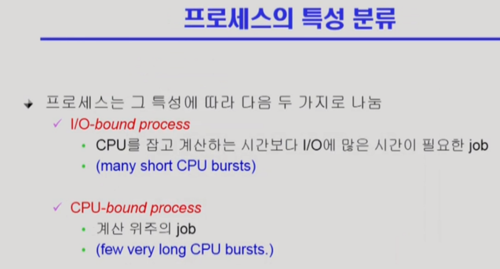
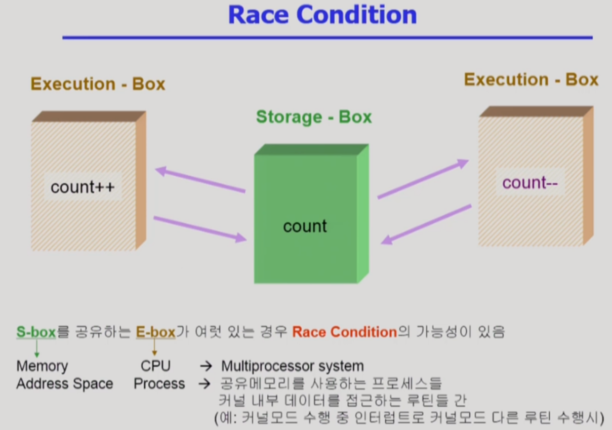

## cpu scheduling 2

---

**복습**

cpu scheduling이 필요한 이유 -> 여러 종류의 job이 섞여있기 때문에 cpu scheduling이 필요하다.

interactive job에게 적절한 response 제공 요망

cpu와 i/o장치 등 시스템 자원을 골고루 효율적으로 사용

---

## Multilevel Queue

제일 윗줄 -> 우선순위 가장 높은 줄

우선순위 높은애가 대기중이다? -> 걔한테 cpu 할당

---

## Multilevel Feedback Queue

- **프로세스가 다른 큐로 이동 가능**
- 에이징(aging)을 이와 같은 방식으로 구현할 수 있다
- Multilevel feedback queue scheduler를 정의하는 파라미터
  - **queue의 수**
  - **각 큐의 schedule algorithm**
  - **process를 상위 큐로 보내는 기준**
  - **process를 하위 큐로 보내는 기준**
  - **프로세스가 cpu 서비스를 받으려 할 때 들어갈 큐를 결정하는 기준**

- **처음 들어오는 프로세스 -> 우선순위 가장 높은 큐에 집어넣음**
- 우선순위 가장 높은 큐는 RR에서 타임 퀀텀을 아주 짧게 준다
- 아래로 갈수록 할당시간 많이 줌
- **가장 아래는 FCFS**
- 윗쪽 큐에서 할당 시간이 동나면 아래큐로 강등

정리 -> 먼저 들어온애가 우선순위 높은 큐에 들어가 짧은 할당시간을 가지고 수행 -> 수행중 시간 다 끝남 -> 우선순위 낮은 큐로 강등되어 대기 -> 우선순위 높은 큐가 비었으니 다음 프로세스 들어가서 수행

cpu 사용시간이 짧은 프로세스에게 우선순위를 더 많이 주고, 긴 프로세스는 점점 밑으로 쫓겨나게 됨

---

## Multiple Processor Scheduling

cpu가 여러개인 경우 스케줄링은 더욱 복잡해진다.

---

## Real Time Scheduling

---

## Thread Scheduling

user level thread -> 운영체제는 해당 thread를 모름

그냥 그 프로세스에게 cpu를 줄지 말지 결정하는 것. 그 프로세스에게 cpu가 갔을 때, 프로세스 내부에서 어떤 thread에게 cpu를 줄지 결정함 (local scheduling. 사용자 프로세스가 직접 함)

kernel level thread -> 운영체제가 해당 thread를 알고 있음

프로세스 스케줄링 하듯이 운영체제가 어떤 알고리즘에 근거해서 어떤 thread에게 cpu를 줄지 결정함

---

## Algorithm Evaluation

평가 방법 3가지.

**queueing models** -> 큐에 job이 도착 -> 도착한 프로세스들을 cpu 능력에 따라 처리 후 빠져나가는 service rate 등을 통해 performance index 값을 계산. 요즘 실제로는 많이 쓰지 않음

**Implementation & Measurement** -> 실제로 구현해서 돌려본 후 성능 측정

**Simulation** -> 알고리즘을 모의 프로그램으로 작성 후 trace를 입력으로 하여 결과 비교. trace? 시뮬레이션 프로그램에 input으로 들어갈 데이터

---

## Process synchronization

**데이터의 접근**

데이터 저장 위치를 읽어와 연산해서 그 결과를 원래 위치에 저장.

이 때 어떤 데이터를 어떤 순으로 읽는지에 따라 결과가 바뀔 수 있고, 이 때의 문제를 sync문제라고 함

위의 사진처럼 여러 주체가 하나의 데이터에 접근하려 할 때를 **race condition**이라고 부름

race condition이 발생하는 경우 -> **kernal 수행 중 인터럽트 발생 시, process가 system call을 하여 kernal mode로 수행 중인데 context switch가 일어나는 경우, multiprocessor에서 shared memory 내의 kernal data**

---

**critical section**: 임계구역, 공유 데이터를 접근하는 코드