# Memory Management

```markdown
메모리는 주소를 통해서 접근하는 매체
```

- 주소는 Logical / Physical로 나눌 수 있다.

##### Logical address(=virtual address)

- 프로세스마다 독립적으로 가지는 주소 공간
- 각 프로세스마다 0번지부터 시작
- **CPU가 보는 주소는 logical address임**

##### Physical address

- 메모리에 실제 올라가는 위치


##### 주소 바인딩 : 주소를 결정하는 것

- Symbolic Address -> Logical Address -> Physical Address
  - Symbolic Address - 프로그래머는 숫자로 이루어진 주소를 사용하지 않고 Symbol로 된 주소를
    사용함

<span style="color:blue">**논리적인 주소가 물리적인 주소로 언제 결정이 되는가?**</span>

- 결정하는 방법이 3가지 있음
- 시점에 따라 구분됨
- Compile time binding / Load time binding / Execution time binding(=Run time binding)

##### Compile time binding

- 물리적 메모리 주소가 **컴파일 시 알려짐**
- 시작 위치 변경시 재컴파일
- 컴파일러는 절대 코드(absolute code)생성
- 항상 0번지부터 올려지게됨(logical이 거의 그대로 물리적메모리됨) 
  -> 다른 곳 많이 비어있더라도 -> 비효율 적임

##### Load time binding

- Loader의 책임하에 물리적 메모리 주소 부여
- 컴파일러가 재배치가능코드(relocatable code)를 생성한 경우 가능
- 500번부터 비었다 -> 500번 부터 올리기 시작함

##### Execution(=Run) time binding

- 수행이 시작된 이후에도 프로세스의 메모리 상 위치를 옮길 수 있음
- CPU가 주소를 참조할 때마다 binding을 점검 (address mapping table)
- 하드웨어적인 지원이 필요(base and limit registers, MMU)
- 로드 할 때도 바인딩이 되고, 실행 중에도 메모리 상 위치가 이동할 수 있다

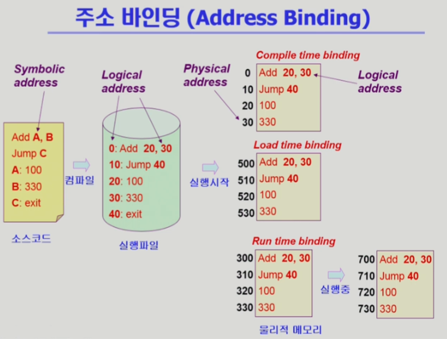

<span style="color:blue">**Cpu는 왜 logical address를 보는가**</span>

- 예를 들어 위의 그림에서 Add 20, 30 instruction을 CPU가 수행하려면 20번지와 30번지의 데이터를
  가져와야하는데 20번지, 30번지는 logical Address이다. 
- 인스트럭션 안의 코드가 logical Address로 되어있기 때문에 CPU는 논리적 주소일 수 밖에 없다.
- CPU가 logical Address를 참조하면 주소변환을 해서 실제 메모리에서 데이터를 가져오는 등의 작업을 함

##### 

#### Memory-Management Unit (MMU)

##### MMU (Memory-Management Unit)

- logical address를 physical address로 매핑해 주는 Hardware device
  (logical <-> Physical)

##### MMU scheme

- 사용자 프로세스가 CPU에서 수행되며 생성해내는 모든 주소값에 대해 base register(=relocation register)의 값을 더한다.

##### user program

- logical address만을 다룬다.
- 실제 physical address를 볼 수 없으며 알 필요가 없다.

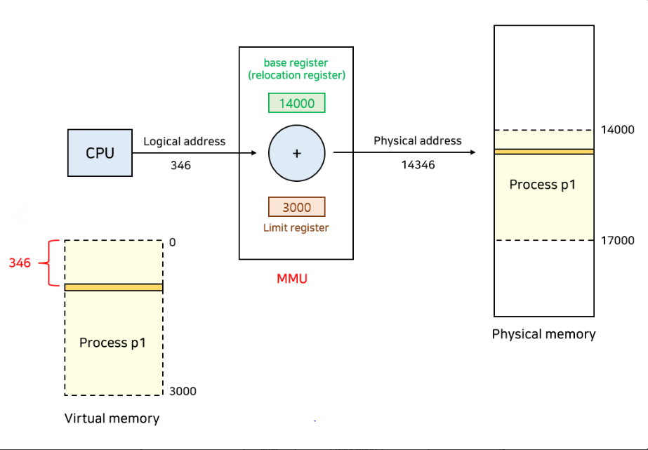

```markdown
relocation(base) register와 Limit reg. 를 이용해 주소변환을 함
346번지를 달라고하면 base + 346(logical) => 14346(physical)
limit reg. -> p1 프로그램의 크기(3000)
왜 저장하냐? 프로그램이 악의적이라서 자기 크기보다 큰 4000번지의 내용을 달라고 해서 18000번지(다른 프로그램)을 요청하는 경우를 막으려고 / 악의적인 시도를 막기 위해
```

##### hardware Support for Address Translation

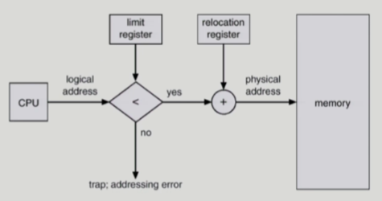

- 운영체제 및 사용자 프로세스 간의 메모리 보호를 위해 사용하는 레지스터
  - Relocation register: 접근할 수 있는 물리적 메모리 주소의 최소값
    (=base register)
  - Limit register: 논리적 주소의 범위 
    - 벗어나면 trap(addressing error)발생시킴

#### Dynamic Loading

- 프로세스 전체를 메모리에 미리 다 올리는 것이 아니라 **해당 루틴이 불려질 때 메모리에 load하는 것**
- memory utilization의 향상
- 가끔식 사용되는 많은 양의 코드의 경우 유용
  - 예: 오류 처리 루틴
- **운영체제의 특별한 지원 없이 프로그램 자체에서 구현 가능** (OS는 라이브러리를 통해 지원 가능)
- 현대의 paging기법과 Dynamic Loading은 원래 다르나, 요즘은 혼용해서 쓰기도 함

<span style="color:blue">*Loading: 메모리로 올리는 것</span>

#### Overlays

- 메모리에 프로세스의 부분 중 실제 필요한 정보만을 올림
- **프로세스의 크기가 메모리보다 클 때 유용**
- 운영체제의 지원없이 사용자에 의해 구현
- 작은 공간의 메모리를 사용하던 초창기 시스템에서 수작업으로 프로그래머가 구현
  - **Manual Overlay**
  - 프로그래밍이 매우 복잡

<span style="color:blue">다이나믹과 다른 점?</span>

- 역사적으로 다름
- Overlay는 초창기 컴퓨터 시스템에서 메모리 크기가 작아, 프로그램 하나를 올려 놓는 것도 버거웠음
  그래서 쪼개서 올렸음 / 프로그래머가 수작업으로 함 / 운영체제의 지원이 없음
- Dynamic Loading은 라이브러리를 통해 하기 때문에 Overlay만큼 자세하게 코딩할 필요가 없음

#### Swapping

##### Swapping

- 프로세스를 일시적으로 메모리에서 **backing store**로 쫓아내는 것

##### Backing store (=swap area)

- 디스크
  - 많은 사용자의 프로세스 이미지를 담을 만큼 충분히 빠르고 큰 저장 공간

##### Swap in / Swap out

- 일반적으로 **중기 스케줄러(swapper)**에 의해 swap out 시킬  **프로세스** 선정
- Priority-based CPU scheduling algorithm
  - priority가 낮은 프로세스를 swapped out 시킴
  - priority가 높은 프로세스를 메모리에 올려 놓음
- Compile time 혹은 load time binding에서는 **원래 메모리 위치로 swap in 해야함**
  - 스와핑의 효과가 미미해짐
- Execution(run) time binding에서는 추후 빈 메모리 영역 아무 곳에나 올릴 수 있음
- swap time은 대부분 transfer time (**swap되는 양에 비례하는 시간**)임
- 원칙적으로 swap out/in은 프로그램 전체(page단위가 아니라)가 쫓겨나고 들어오는 것임

 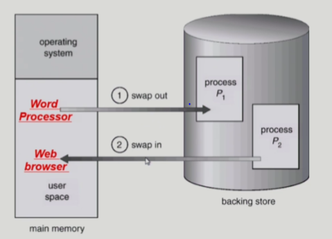

#### Dynamic Linking

- Linking을 실행 시간(execution time)까지 미루는 기법

##### Static linking

- 라이브러리가 프로그램의 실행 파일 코드에 포함됨
- 실행 파일의 크기가 커짐
- 동일한 라이브러리를 각각의 프로세스가 메모리에 올리므로 메모리 낭비 (eg. printf함수의 라이브러리 코드)

##### Dynamic linking

- 라이브러리가 실행시 연결(link)됨
- 라이브러리 호출 부분에 **라이브러리 루틴의 위치를 찾기 위한 stub**이라는 작은 코드를 둠
  - 라이브러리 자체는 프로그램에 포함시켜 놓지 않는다.
- 라이브러리가 이미 메모리에 있으면 그 루틴의 주소로 가고 없으면 디스크에서 읽어옴
- 운영체제의 도움이 필요

#### Allocation of Physical Memory

- **메모리는** 일반적으로 **두 영역**으로 나뉘어 사용
  - **OS 상주 영역**
    - interrupt vector와 함께 **낮은 주소 영역** 사용
  - **사용자 프로세스 영역**
    - **높은 주소 영역** 사용
- 사용자 **프로세스 영역의 할당 방법**
  - **Contiguous allocation**
    - 각각의 프로세스가 메모리의 연속적인 공간에 적재되도록 하는 것
    - Fixed partition allocation
    - Variable partition allocation
  - **Noncontiguous allocation**
    - 하나의 프로세스가 메모리의 여러 영역에 분산되어 올라갈 수 있음
    - Paging
    - Segmentation
    - Paged Segmentation
- 

##### Contiguous Allocation은 고정 분할 방식 / 가변 분할 방식으로 나뉜다.

- 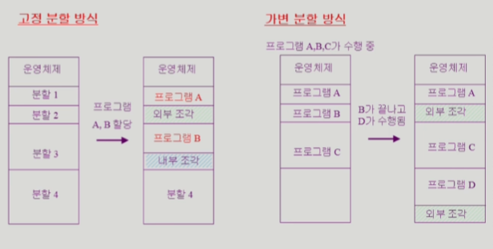
- 왼쪽에서 B가 분할 2에 들어가야하는데 자리가 없어 분할 3에 들어감 이때!
  - 외부 조각(External fragmentation)
    - 프로그램 크기보다 분할의 크기가 작은 경우
    - 아무 프로그램에도 배정되지 않은 빈 곳인데도 프로그램이 올라갈 수 없는 작은 분할
  - 내부 조각(Internal fragmentation)
    - 프로그램 크기보다 분할의 크기가 큰 경우
    - 하나의 분할 내부에서 발생하는 사용되지 않은 메모리 조각
    - 특정 프로그램에 배정되었지만 사용되지 않는 공간
- 가변 분할 방식 - 프로그램 순서에 따라 차곡차곡 올리다가, B가 끝나면 D를 넣으려는데 B 자리가 작아 
  못 들어가서 다른 자리에 들어감 / 외부조각이 생기게 됨

##### 고정분할(Fixed partition)방식

- 물리적 메모리를 몇 개의 영구적 분할(partition)로 나눔
- 분할의 크기가 모두 동일한 방식과 서로 다른 방식이 존재
- **분할당 하나의 프로그램 적재**
- **융통성이 없음**
  - 동시에 메모리에 load되는 프로그램의 수가 고정됨
  - 최대 수행 가능 프로그램 크기 제한
- **Internal fragmentation 발생 (external fragmentation도 발생)**

##### 가변분할(Variable partition) 방식

- 프로그램의 크기를 고려해서 할당
- **분할의 크기, 개수가 동적으로 변함**
- 기술적 관리 기법 필요
- **External fragmentation 발생**


##### Hole

- 가용 메모리 공간
- 다양한 크기의 hole들이 메모리 여러 곳에 흩어져 있음
- 프로세스가 도착하면 수용가능한 hole을 할당
- 운영체제는 다음의 정보를 유지
  - a) 할당 공간 b) 가용 공간 (hole)
- 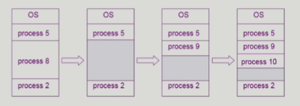

#### Dynamic Storage-Allocation Problem

<span style="color:green">:가변 분할 방식에서 size n인 요청을 만족하는 가장 적절한 hole을 찾는 문제</span>

##### First-fit

- Size가 **n 이상인 것 중 최초로 찾아지는 hole에 할당**

##### Best-fit

- Size가 **n이상인 가장 작은 hole을 찾아서 할당**
- Hole들의 리스트가 크기순으로 정렬되지 않은 경우 모든 hole의 리스트를 탐색해야함
- 많은 수의 아주 작은 hole들이 생성됨

##### Worst-fit

- **가장 큰 hole에 할당**
- 역시 모든 리스트를 탐색해야 함
- 상대적으로 **아주 큰 hole들이 생성됨**


- **First-fit과 best-fit이** worst-fit보다 **속도와 공간 이용률 측면에서 효과적인 것으로 알려짐**(**실험적**인 결과)


##### Compaction

- external fragmentation 문제를 해결하는 한 가지 방법
- **사용 중인 메모리 영역을 한군데로 몰고 hole들을 다른 한 곳으로 몰아 큰  block을 만드는 것**
- **매우 비용이 많이 드는 방법임**
- 최소한의 메모리 이동으로 compaction하는 방법 (매우 복잡한 문제)
- Compaction은 프로세스의 주소가 실행 시간에 동적으로 재배치 가능한 경우에만 수행될 수 있다.


#### Paging

- example
- 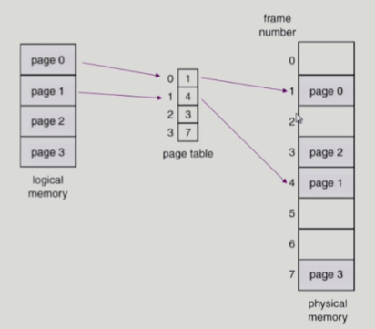

##### Address Translation Architecture

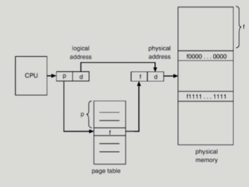

- 논리적인 page 번호를 -> 물리적인 frame 번호로 변환

##### Implementation of Page Table

- Page table은 main memory에 상주
- Page-table base register(PTBR)가 page table을 가리킴
- Page-table length register(PTLR)가 테이블 크기를 보관
- **모든 메모리 접근 연산에는 2번의 memory access 필요**
- page table 접근 1번, 실제 data/instruction 접근 1번
- 속도 향상을 위해 **associative reg**. 혹은 **translation look-aside buffer**(TLB)라 불리는 
  고속의 lookup hardware **cache** 사용

##### Paging Hardware with TLB	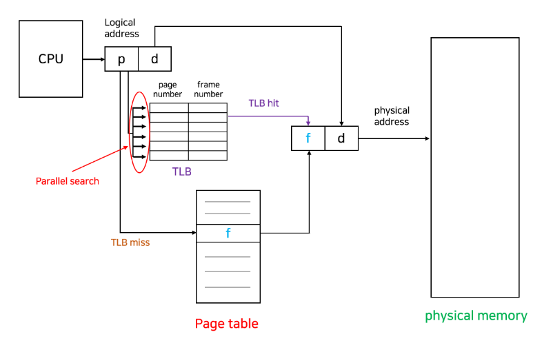

```markdown
page table에 접근하기 전에 TLB에 저장되어있는지 확인함
있으면 한 번만 접근하면 됨
없으면 page table 접근해야하니까 2번 접근해야함
```

##### Associative REG.

- Associative registers (TLB): parallel search가 가능
  - TLB에는 page table 중 일부만 존재
- Address translation
  - page table 중 일부가 associative register에 보관되어 있음
  - 만약 해당 page #가 associative register에 있는 경우 곧바로 frame#를 얻음**(TLB hit)**
  - 그렇지 않은 경우 main memory에 있는 page table로 부터 frame#을 얻음**(TLB miss)**
  - TLB는 context switch 때 flush (remove old entries)

##### Effective Access Time

- Associative register lookup time = t

- memory cycle time = 1

- Hit ratio = a

  - associative register에서 찾아지는 비율

- Effective Access Time (EAT)

  - <span style="color:red">(1 + t)a</span> - TLB hit
  - <span style="color:blue">(2+t)(1-a)</span> - TLB miss

  - EAT = <span style="color:red">(1 + t)a</span> + <span style="color:blue">(2+t)(1-a)</span> = 2 + t - a

##### Two-Level Page Table

- 현대의 컴퓨터는 address space가 매우 큰 프로그램 지원

  - 32 bit address 사용시: 2^32 B(4GB)의 주소 공간
    - page size가 4K시 1M개의 page table entry 필요
    - 각 page entry가 4Byte시 프로세스당 4MB의 page table 필요
    - 그러나, 대부분의 프로그램은 4G의 주소 공간 중 지극히 일부만 사용하므로
      page table 공간이 심하게 낭비됨

  -> page table 자체를 page로 구성

  -> **사용되지 않는 주소 공간에 대한 outer page table의 엔트리 값은 NULL**
  **(대응하는 inner page table이 없음)**

  -> page 테이블의 공간을 줄일 수 있음(2단계 페이지테이블을 쓰는 이유)

  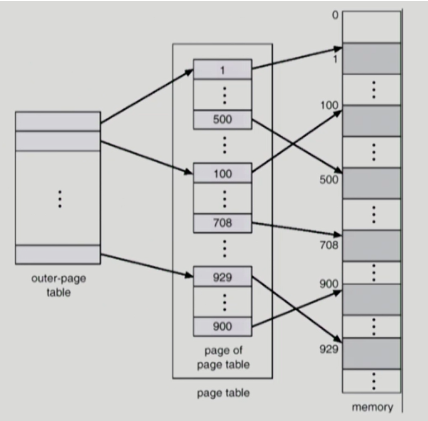

##### Two-Level Paging Example

- logical address (on **32-bit** machine with **4K page** size)의 구성
  - **20 bit**의 **page number**
  - **12 bit**의 **page offset **(4k page 사이즈와 대응)
- page table 자체가 page로 구성되기 때문에 page number는 다음과 같이 나뉜다.
  (각 page table entry가 4B)
  - 1k개의 entry를 구별해야함
  - **10-bit**의 **page number.**
  - **10-bit**의 **page offset**
- 따라서, logical address는 다음과 같다
  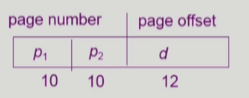
- P_1은 outer page table의 index이고
- P_2는 outer page table의 page에서의 변위(displacement)
  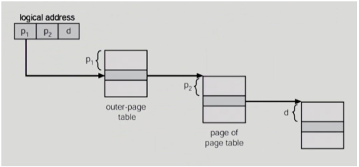

