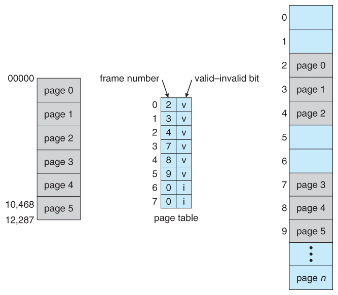
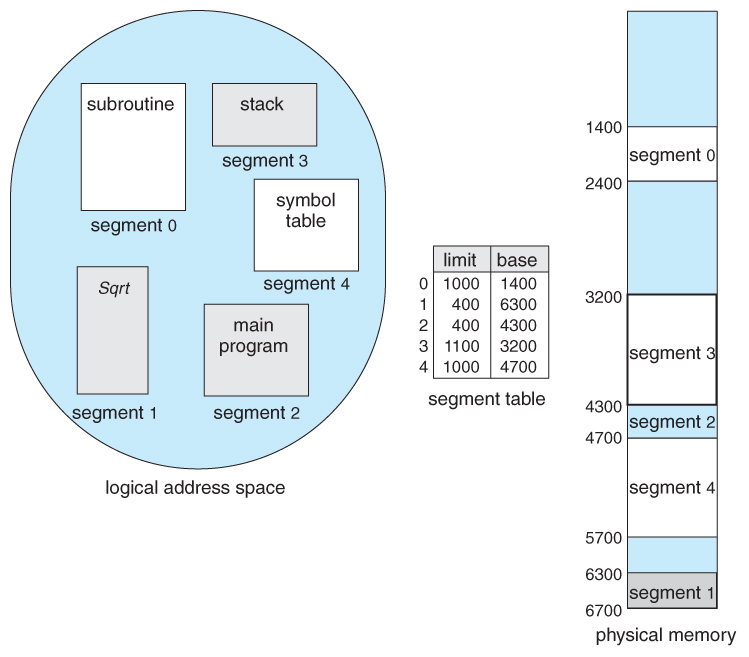

#### Multilevel Paging and Performance

- Address space가 더 커지면 다단계 페이지 테이블 필요
- 각 단계의 페이지 테이블이 메모리에 존재하므로 logical address의 physical address 변환에 더 많은
  메모리 접근 필요
- **TLB를 통해 메모리 접근 시간을 줄일 수 있음**
- 4단계 페이지 테이블을 사용하는 경우
  - 메모리 접근 시간이 100ns, TLB 접근 시간이 20ns이고
  - TLB hit ratio가 98%인 경우
    - effective memory access time = 0.98 * 120 + 0.02 * 520 = 128 ns
  - 결과적으로 주소변환을 위해 28ns만 소요

##### Valid (v) / Invalid (i) bit in a Page Table

##### Memory protection

- Page table의 각 entry 마다 아래의 bit를 둔다.
  - Protection bit
    - page에 대한 접근 권한 (read/write/read-only)
  - Valid-invalid bit
    - "valid"는 해당 주소의 frame에 그 프로세스를 구성하는 유효한 내용이 있음을 뜻함 (접근 허용)
    - "invalid"는 해당 주소의 frame에 **유효한 내용이 없음**을 뜻함(접근 불허)
      - 유효한 내용이 없음
        1. 프로세스가 그 주소 부분을 사용하지 않는 경우
        2. 해당 페이지가 메모리에 올라와 있지 않고 swap area에 있는 경우

##### Inverted Page Table

- page table이 매우 큰 이유
  - 모든 process 별로 그 logical address에 대응하는 모든 page에 대해 page table entry가 존재
  - 대응하는 page가 메모리에 있든 아니든 간에 page table에는 entry로 존재
- Inverted page table
  - Page frame 하나당 page table에 하나의 entry를 둔 것 (system-wide)
  - 각 page table entry는 각각의 물리적 메모리의 page frame이 담고 있는 내용 표시
    (process-id, process의 logical address)
  - 단점
    - 테이블 전체를 탐색해야 함
  - 조치
    - associative register 사용 (expensive)
- 

- 목적 : page table의 공간을 줄이기 위해 / 오버헤드로 인해 시간이 조금 걸림

##### Shared Page

- Re-entrant Code (=pure code)
- **read-only**로 하여 프로세스 간에 하나의 code만 메모리에 올림
  (eg, text editors, compilers, window systems)
- **Shared code는 모든 프로세스의 logical address space에서 동일한 위치에 있어야함**

##### Private code and data

- 각 프로세스들은 독자적으로 메모리에 올림
- Private data는 logical address space의 아무 곳에 와도 무방

Editor is shared
Editor consists of 3 pages -- ed1, ed2, ed3

#### Segmentation 기법

- 프로그램은 의미 단위인 여러 개의 segment로 구성
  - 작게는 프로그램을 구성하는 함수 하나하나를 세그먼트로 정의
  - 크게는 프로그램 전체를 하나의 세그먼트로 정의 가능
  - 일반적으로는 code, data, stack 부분이 하나씩 세그먼트로 정의됨
- Segment는 다음과 같은 logical unit 들임 
  - main()
  - function,
  - global variables,
  - stack,
  - symbol table, arrays

##### Segmentation Architecture

- logical address는 다음의 두 가지로 구성
  - < segment-number, offset>
- Segment table
  - each table entry has:
    - base - starting physical address of the segment
    - limit - length of the segment
- Segment-table base register (STBR)
  - 물리적 메모리에서의 segment table의 위치
- Segment-table length register (STLR)
  - 프로그램이 사용하는 segment의 수
    - segment number s is legal if s < STLR.

##### Segmentation Hardware

##### Segmentation Architecture (Cont.)

Protection

- 각 세그먼트 별로 protection bit가 있음
- Each entry:
  - Valid bit = 0 => illegal segment
  - Read/Write/Execution 권한 bit

Sharing

- shared segment
- same segment number

***segment는 의미 단위이기 때문에 공유(sharing)와 보안(protection)에 있어 paging보다 훨씬 효과적이다.***

Allocation

- first fit / best fit
- external fragmentation 발생
- segment의 길이가 동일하지 않으므로 가변분할 방식에서와 동일한 문제점들이 발생

##### example of Segmentation

##### Sharing of Segments

#### Segmentation with paging

- pure segmentation과의 차이점
  - segment-table entry가 segment의 base addresss를 가지고 있는 것이 아니라 segment를 구성하는
    page table의 base address를 가지고 있음
- 
