# Virtual Memory

##### Demand paging

- 실제로 필요할 때 page를 메모리에 올리는 것
  - I/O 양의 감소
  - Memory 사용량 감소
  - 빠른 응답 시간
  - 더 많은 사용자 수용
- Valid / Invalid bit의 사용
  - Invalid의 의미
    - 사용되지 않는 주소 영역인 경우
    - 페이지가 물리적 메모리에 없는 경우
  - 처음에는 모든 page entry가 invalid로 초기화
  - address translation 시에 invalid bit이 set되어 있으면
    - => **"page fault"**

##### 

##### Page Fault

- invalid page를 접근하면 MMU가 trap을 발생시킴 (page fault trap)
- Kernal mode로 들어가서 page fault handler가 invoke됨
- 다음과 같은 순서로 page fault를 처리함
  1. Invalid reference? (eg. bad address, protection violation) => abort process
  2. Get an empty page frame, (없으면 뺏어온다: replace)
  3. 해당 페이지를 disk에서 memory로 읽어온다.
     1. disk I/O가 끝나기까지 이 프로세스는 CPU를 preempt 당함 (block)
     2. Disk read가 끝나면 page tables entry 기록, valid/invalid bit = "valid"
     3. ready queue에 process를 insert -> dispatch later
  4. 이 프로세스가 CPU를 잡고 다시 running
  5. 아까 중단되었던 instruction을 재개


##### Steps in Handling a Page Fault 

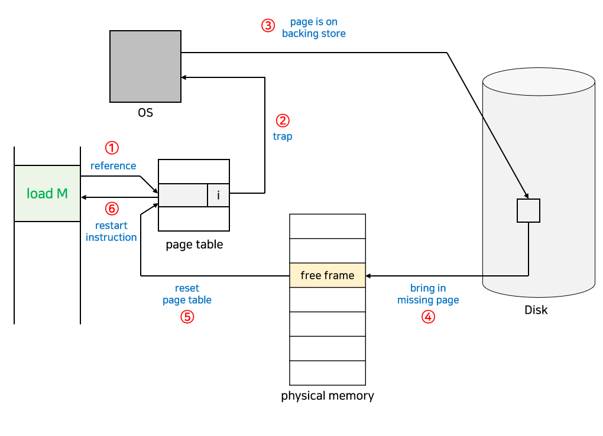

##### Performance of Demand Paging

- Page Fault Rate 0 <= p < 1.0

  - if p = 0 no page faults
  - if p = 1, every reference is a fault

- Effective Access Time

  = (1-p) * memory access + p **× (OS&HW page fault overhead + [swap page out if needed] + swap 	page in + OS&HW restart overhead)**

##### Free frame 없는 경우

- **Page replacement**
  - 어떤 frame을 빼앗아올지 결정해야 함
  - **곧바로 사용되지 않을 page를 쫓아내는 것이 좋음**
  - 동일한 페이지가 여러 번 메모리에서 쫓겨났다가 다시 들어올 수 있음
- Replacement **Algorithm**
  - **page-fault rate을 최소화하는 것이 목표**
  - 알고리즘의 평가
    - 주어진 page reference string에 대해 page fault를 얼마나 내는지 조사
  - reference string의 예
    - 1, 2, 3, 4, 1, 2, 5, 1, 2, 3, 4, 5


##### Page Replacement

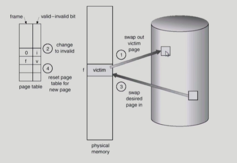

##### 

##### 1. Optimal Algorithm

- MIN (OPT): 가장 먼 미래에 참조되는 page를 replace
- 4 frames example

1,    2,   3,  4,   1,   2,   5,   1,   2,   3,   4,   5
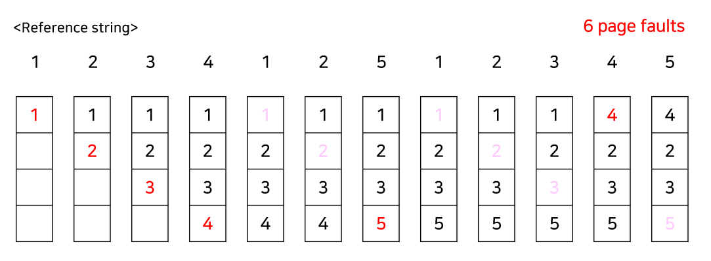

- 미래의 참조를 어떻게 아는가?
  - Offline algorithm
- 다른 알고리즘의 성능에 대한 upper bound 제공
  - Belady's optimal algorithm, MIN, OPT 등으로 불림
- 보통은 미래를 알 수 없으니 적용하기 힘들다

##### 2.  FIFO(First IN First Out) Algorithm

- 먼저 들어온 것을 먼저 내쫓음

- 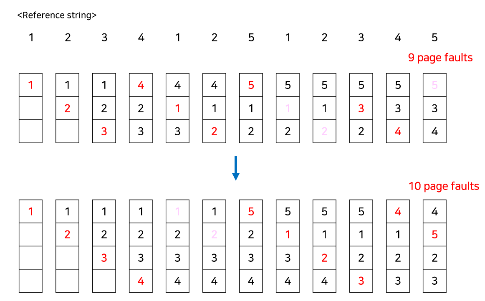

- FIFO Anomaly (Belady's Anomaly)
  - more frames => less page faults

##### 3. LRU(Least Recently Used) Algo.

- LRU : 가장 오래 전에 참조된 것을 지움
- 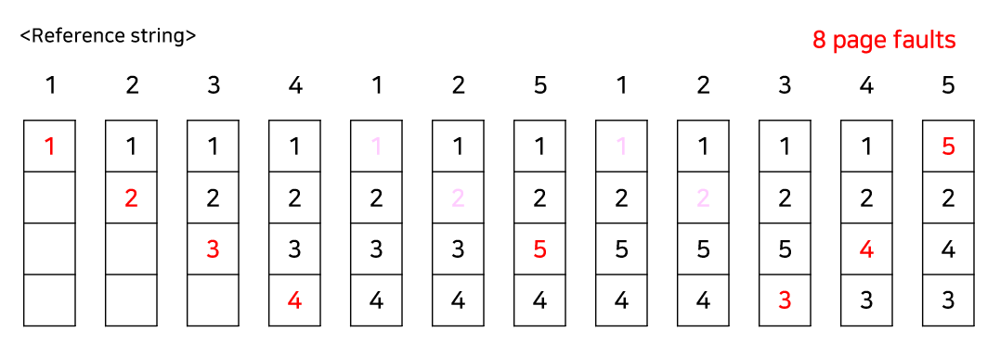

##### 4. LFU(Least Frequently Used) Algo.

- LFU: 참조 횟수(reference count)가 가장 적은 페이지를 지움
  - 최저 참조 횟수인 page가 여럿 있는 경우
    - LFU 알고리즘 자체에서는 여러 page 중 임의로 선정한다
    - 성능 향상을 위해 가장 오래 전에 참조된 page를  지우게 구현할 수 도 있다
  - 장단점
    - LRU처럼 직전 참조 시점만 보는 것이 아니라 장기적인 시간 규모를 보기 때문에 
      page의 인기도를 좀 더 정확히 반영할 수 있음
    - 참조 시점의 최근성을 반영하지 못함
    - LRU보다 구현이 복잡함

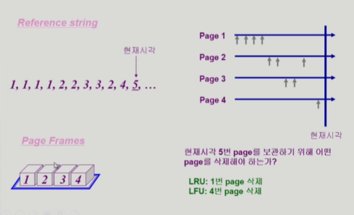


##### LRU와 LFU 알고리즘의 구현

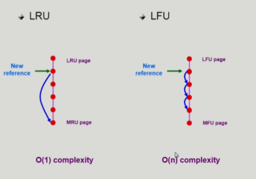

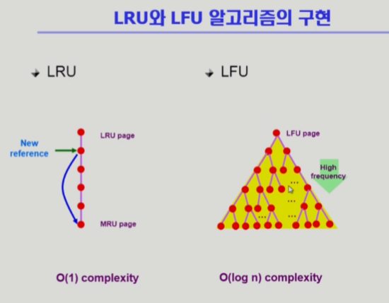

##### 다양한 캐슁 환경

- 캐슁 기법
  - 한정된 빠른 공간(=캐쉬)에 요청된 데이터를 저장해 두었다가 후속요청시 캐쉬로부터 직접 서비스하는 방식
  - paging system 외에도 cache memory, buffer caching, Web caching 등 다양한 분야에서 사용
- 캐쉬 운영의 시간 제약
  - 교체 알고리즘에서 삭제할 항목을 결정하는 일에 지나치게 많은 시간이 걸리는 경우 실제 시스템에서
    사용할 수 없음
  - Buffer caching이나 Web caching의 경우
    - O(1)에서 O(log n) 정도까지 허용
  - Paging system인 경우
    - page fault인 경우에만 OS가 관여함
    - 페이지가 이미 메모리에 존재하는 경우 참조시각 등의 정보를 OS가 알 수 없음
    - O(1)인 LRU의 list 조작조차 불가능

##### Paging  System에서 LRU, LFU 가능한가?

```mark
주소변환은 하드웨어적으로 일어남 
page fault가 일어나면 CPU의 제어권이 운영체제로 넘어감 backing disk 읽고, replace함
이 때 LRU를 쓴다면, 운영체제가 가장 오래된 page를 알 수 있는가?
이 때 LFU를 쓴다면, 운영체제가 가장 적게 참조된 page를 알 수 있는가?
모른다! => 메모리에 페이지가 있으면 하드웨어적으로 처리됨으로 운영체제가 알 수 있는 정보가 없다
page fault일 때는 알 수 있음 => 반쪽밖에 모르는 것

=> 그래서 LRU, LFU가 사용할 수 없음 / 하지만 LRU, LFU가 버퍼 캐싱이나 웹 캐싱에서 사용될 수 있다
```

##### 

##### Clock Algorithm

- LRU의 근사 알고리즘
- 여러 명칭으로 불림 
  - Second chance algorithm
  - NUR (Not  Used Recently) 또는 LRU (Not Recently Used)
- Reference bit을 사용해서 교체 대상 페이지 선정 (circular list)
- reference bit가 0인 것을 찾을 때까지 포인터를 하나씩 앞으로 이동
- 포인터 이동하는 중에 reference bit 1은 모두 0으로 바꿈
- Reference bit이 0인 것을 찾으면 그 페이지를 교체
- 한 바퀴 되돌아와서도(=seconde chance) 0이면 그때에는 replace 당함
- 자주 사용되는 페이지라면 second chance가 올 때 1

##### Clock algorithm의 개선

- reference bit과 modified bit (dirty bit)을 함께 사용
- reference bit = 1 : 최근에 참조된 페이지
- modified bit = 1 : 최근에 변경된 페이지 (I/O를 동반하는 페이지)

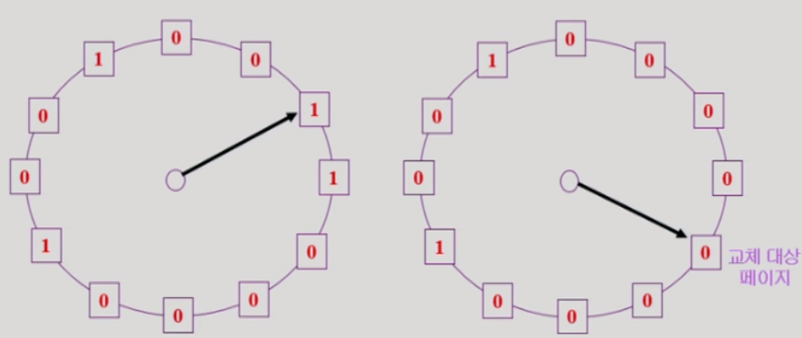

##### 

##### Page Frame의 Allocation

- Allocation problem: 각 process에 얼마만큼의 page frame을 할당할 것인가?
- Allocation의 필요성
  - 메모리 참조 명령어 수행시 명령어, 데이터 등 여러 페이지 동시 참조
    - 명령어 수행을 위해 최소한 할당되어야 하는 frame의 수가 있음
  - Loop를 구성하는 page들을 한꺼번에 allocate 되는 것이 유리함
    - 최소한의 allocation이 없으면 매 loop 마다 page fault
- Allocation Scheme
  - Equal allocation: 모든 프로세스에 똑같은 갯수 할당
  - Proportional allocation: 프로세스 크기에 비례하여 할당
  - Priority allocation: 프로세스의 prioirty에 따라 다르게 할당

##### Global vs. Local Replacement

- Global
  - Replace시 다른 process에 할당된 frame을 빼앗아 올 수 있다
  - Process별 할당량을 조절하는 또 다른 방법임
  - FIFO, LRU, LFU 등의 알고리즘을 global replacement로 사용시에 할당
  - Working set, PFF 알고리즘 사용
- Local
  - 자신에게 할당된 frame 내에서만 replacement
  - FIFO, LRU, LFU 등의 알고리즘을 process 별로 운영시


##### Thrashing

- 프로세스의 원할한 수행에 필요한 최소한의 page frame 수를 할당 받지 못한 경우 발생
- Page fault rate이 매우 높아짐
- CPU utilization이 낮아짐
- OS는 MPD (Multiprogramming degree)를 높여야 한다고 판단
- 또 다른 프로세스가 시스템에 추가됨 (higher MPD)
- 프로세스 당 할당된 frame의 수가 더욱 감소
- 프로세스는 page의 swap in / swap out으로 매우 바쁨
- 대부분의 시간에 CPU를 한가함
- low throughput

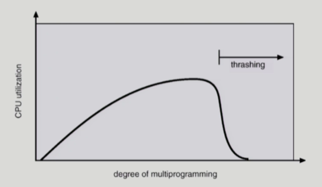

##### Working-Set Model

- Locality of reference
  - 프로세스는 특정 시간 동안 일정 장소만을 집중적으로 참조한다
  - 집중적으로 참조되는 해당 page들의 집합을 locality set이라 함
- Working-set Model
  - locality에 기반하여 프로세스가 일정 시간 동안 원할하게 수행되기 위해 한꺼번에 메모리에 올라와
    있어야 하는 page들의 집합을 Working Set이라 정의함
  - Working Set 모델에서는 process의 working set 전체가 메모리에 올라와있어야 수행되고 그렇지
    않을 경우 모든 frame을 반납한 후 swap out(suspend)
  - Thrashing을 방지함
  - Multiprogramming degree를 결정함

- Working set의 결정
  - Working set window를 통해 알아냄
  - window size가 d인 경우
    - 시각 t_i 에서의 working set WS(t_i)
      - Time Interval [t_i - d, t_i] 사이에 참조된 서로 다른 페이지들의 집합
    - Working set에 속한 page는 메모리에 유지, 속하지 않은 것들은 버림
      (즉, 참조된 후 d 시간 동안 해당 page를 메모리에 유지한 후 버림)
- 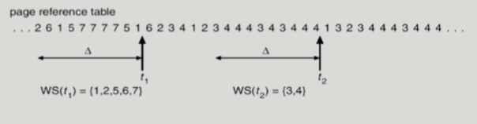


##### PFF (Page-Fault Frequency) Scheme

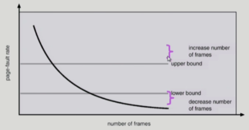

- page-fault rate의 상한값과 하한값을 둔다
  - Page fault rate이 상한값을 넘으면 frame을 더 할당한다
  - Page fault rate이 하한값 이하이면 할당 frame 수를 줄인다
- 빈 frame이 없으면 일부 프로세스를 swap out


##### Page Size의 결정

- Page size를 감소시키면
  - 페이지 수 증가
  - 페이지 테이블 크기 증가
  - Internal fragmentation 감소
  - Disk transfer의 효율성 감소
    - Seek/rotation vs. transfer
  - 필요한 정보만 메모리에 올라와 메모리 이용이 효율적
    - Locality의 활용 측면에서는 좋지 않음

- Trend
  - Larger page size
