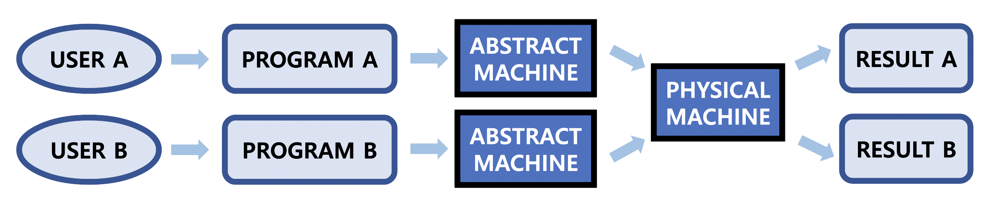

# Intro

### 운영체제 (OS)

- 개념 : 컴퓨터 하드웨어 바로 위에 설치되어 ==사용자== 및 다른 모든 소프트웨어==와 하드웨어를 연결하는 소프트웨어 계층==

- 목적

  1. 컴퓨터 시스템을 편리하게 사용할 수 있는 환경 제공

  2. ==컴퓨터 시스템의 자원을 효율적으로 관리== (효율성 + 형평성)

     *cf) 자원 : 프로세서, 기억장치, 입출력 장치 등 (하드웨어), 프로세스, 파일, 메시지 등 (소프트웨어)*

