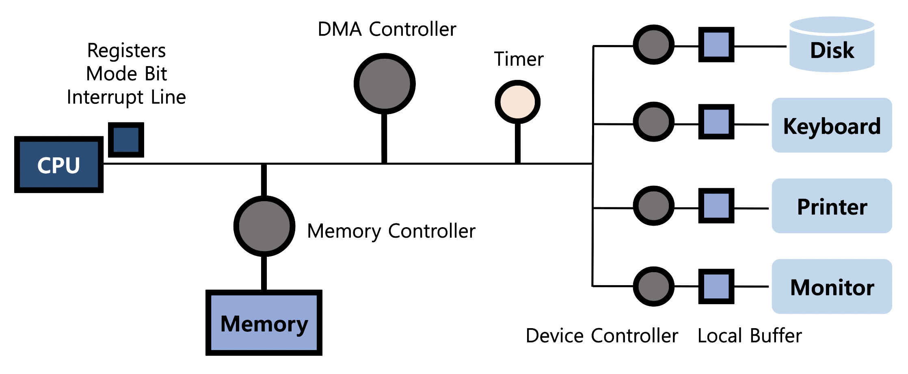

# System Structure & Program Execution 1

- CPU는 매 클럭 사이클마다 메모리에서 instruction (기계어) 을 하나씩 읽어서 실행
- Mode Bit : 실행 중인 게 운영체제인지 사용자 프로그램인지 구분 (사용자 프로그램의 잘못된 수행으로 인한 피해를 막기 위함)
  - 운영체제 실행 : 커널 모드 혹은 모니터 모드 (0)
  - 사용자 프로그램 실행 : 사용자 모드 (1)
- Registers : 메모리보다 더 빠른 정보 저장 공간
- Interrupt Line : CPU가 I/O에 대한 instruction을 Device Controller에게 전달 후 해당 instruction이 종료되었을 때 Interrupt의 발생을 감지
- Timer : 특정 프로그램이 CPU를 독점하는 것을 막기 위한 하드웨어, 특정 시간이 지나면 CPU에 interrupt를 걸고 CPU를 OS에게 할당
- DMA (Direct Memory Access) Controller
  - I/O 장치의 잦은 Interrupt를 방지
  - 메모리에 CPU도 DMA도 접근 가능
  - Local Buffer 내용을 Memory에 복사
- Device Driver (장치구동기) : OS 코드 중 각 장치별 처리 루틴 (software)
- Device Controller (장치제어기) : I/O 장치 유형을 관리하는 일종의 작은 CPU (hardware)

### 사용자 프로그램은 어떻게 I/O를 하는가

1. 사용자 프로그램이 CPU에 직접 Interrupt (소프트웨어 인터럽트, 즉 Trap) 를 걸어 OS 호출 (==System Call==)

   *cf) Trap : Exception(프로그램이 오류를 범한 경우)과 System Call(프로그램이 커널 함수를 호출하는 경우)*
2. 올바른 요청인지 확인 후 I/O 수행 (이 때, CPU는 다른 동작 중)
3. I/O 완료 시 Device Controller가 ==Interrupt==(하드웨어 인터럽트)를 걸어 제어권을 시스템 콜 다음 명령으로 옮김

​	   *cf) Interrupt 거는 순서 : 인터럽트 벡터의 특정 위치로 이동 > 인터럽트 서비스 루틴으로 이동*

* 인터럽트 벡터 : 해당 인터럽트의 처리 루틴 주소를 가지고 있음
* 인터럽트 처리 루틴 : 해당 인터럽트를 처리하는 커널 함수