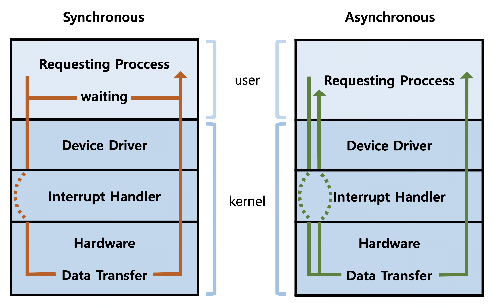
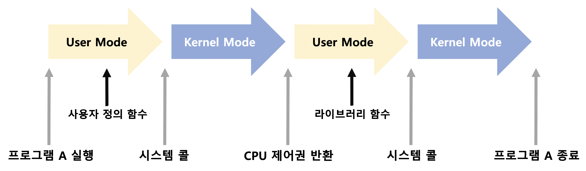

# System Structure & Program Execution 2

### 동기식 vs 비동기식

- 동기식 입출력 (Synchronous I/O)
  - I/O 요청 후 입출력 작업이 완료된 후에야 제어가 사용자 프로그램에 넘어감
  - 구현 방법 1
    - I/O가 끝날 때까지 CPU 낭비
    - 매 시점 단 하나의 I/O
  - 구현 방법 2
    - I/O가 완료될 때까지 해당 프로그램에게서 CPU를 빼앗음
    - I/O 처리를 기다리는 줄에 그 프로그램을 줄 세움
    - 다른 프로그램에게 CPU를 줌
- 비동기식 입출력 (Asynchronous I/O)
  - I/O가 시작된 후 입출력 작업이 끝나기를 기다리지 않고 제어가 사용자 프로그램에 넘어감

### DMA

 : 빠른 입출력 장치를 메모리에 가까운 속도로 처리하기 위해 사용

   CPU의 중재 없이 Device Controller가 디바이스의 Buffer Storage의 내용을 메모리에 Block 단위로 Interrupt를 발생시킴

### 서로 다른 입출력 명령어

1. I/O를 수행하는 Special Instruction에 의해 (일반적)

   Primary Memory는 Memory Address에, 이외 Device들은 Device Address에

2. Memory Mapped I/O에 의해

   모두 Memory Address에

### 저장장치 계층 구조

Register > Cache Memory > Main Memory > Magnetic Disk > Optical Disk > Magnetic Tape

왼쪽으로 갈수록 빠른 속도 / 높은 비용 / 적은 용량 / 휘발성

Main Memory까지가 Primary (Executable), 즉 CPU가 직접 접근 가능

그 오른쪽이 모두 Secondary

*cf) 캐싱 : 더 빠른 매체를 이용해 정보를 읽어 재사용하는 것* 

### 프로그램의 실행

실행 파일 A 실행 > 가상 메모리 프로세스 A의 주소공간 생성 > 주소 변환 (하드웨어) > 필요한 부분만 물리 메모리에 올려 실행 (사용되지 않지만 보관이 필요한 경우 Swap Area로 이동, Swap Area의 경우는 휘발성)

*cf) 주소공간에는 Stack, Data, Code가 있으며 프로그램 종료 시 소멸*

### 사용자 프로그램이 사용하는 함수

- 사용자 정의 함수 (프로세스 A의 주소공간의 Code)
- 라이브러리 함수 (프로세스 A의 주소공간의 Code)
- 커널 함수 (커널 주소공간의 Code)

​        *cf) 커널함수의 호출 = System Call* 

