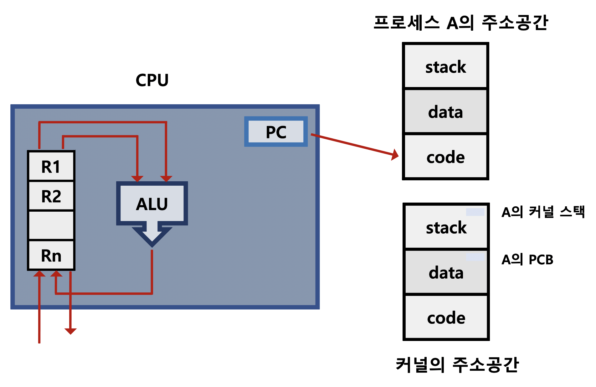
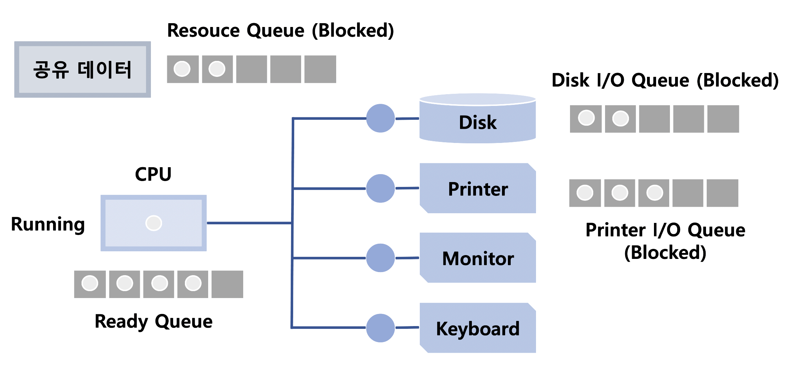
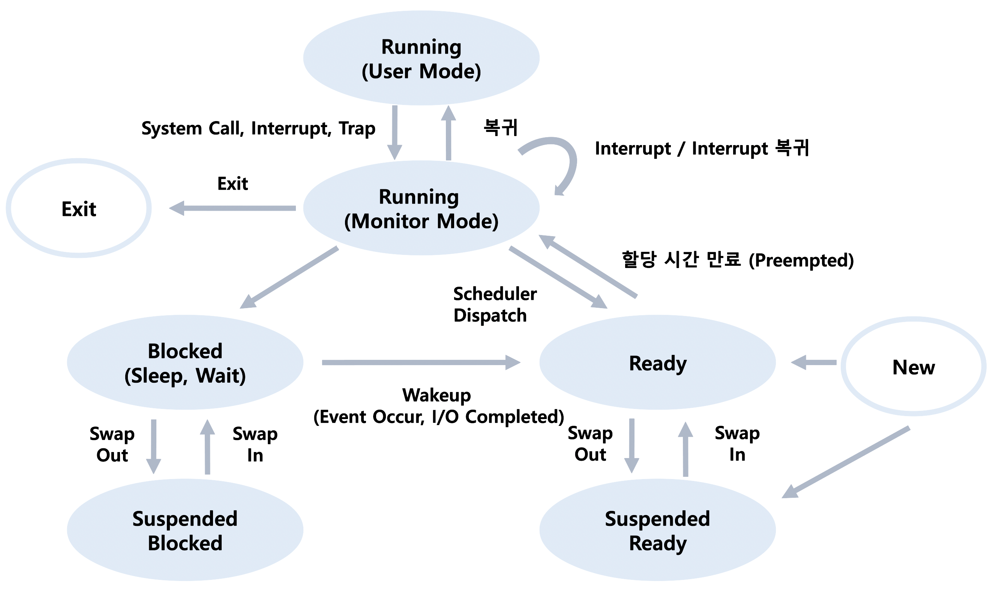
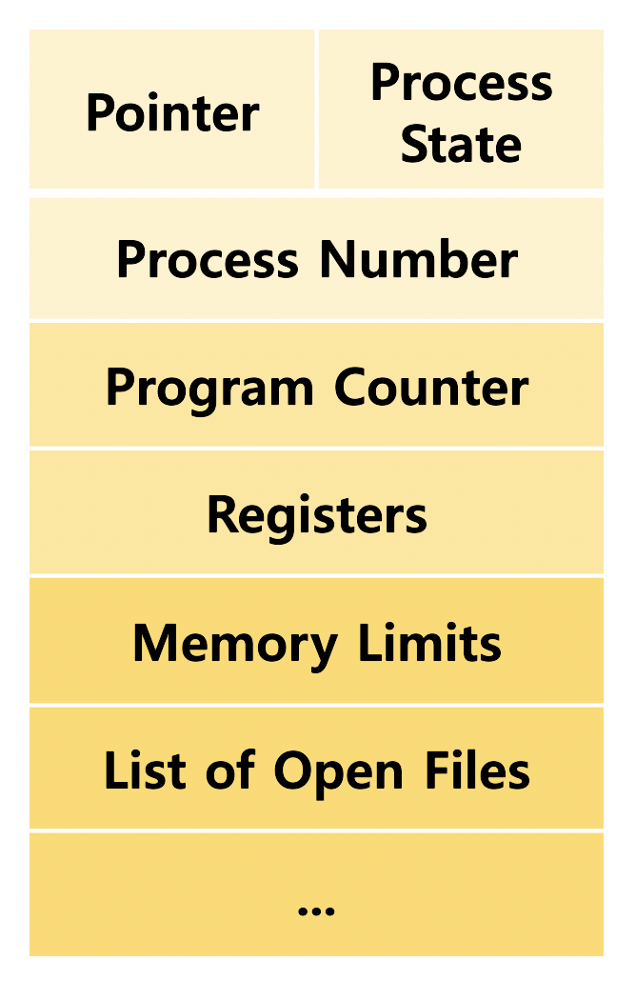

# Process 1

### 프로세스의 개념

"Process is a program in execution"

* 프로세스의 문맥

  : 어느 시점의 프로세스 진행 상황을 규명할 때 필요한 요소

  * CPU 수행 상태를 나타내는 하드웨어 문맥
    * Program Counter (Code 실행 지점)
    * 각종 Register (레지스터에 담긴 내용)
  * 프로세스의 주소 공간
    * Code, Data, Stack
  * 프로세스 관련 커널 자료 구조
    * PCB (Process Control Block) : 커널의 Data에 위치, CPU 및 메모리 할당량 등 관리 역할
    * Kernel Stack : 커널을 호출한 프로세스별로 별도의 스택을 가짐

### 프로세스의 상태 (Process State)

- Running : CPU를 잡고 Instruction을 수행 중인 상태 

  *cf) 커널 모드일 때 운영체제가 Running (X) 해당 프로세스가 Running (O)*

  ​     *System Call, Interrupt, Trap 모두 **해당 프로세스가** Running하는 것으로 간주*

- Ready : CPU를 기다리는 상태 (메모리 등 다른 조건 모두 만족)

- Blocked (wait, sleep)

  - CPU가 주어져도 당장 Instruction을 수행할 수 없는 상태
  - Process 자신이 요청한 Event (예를 들면 I/O) 가 즉시 만족되지 않아 기다리는 상태

  *cf) Event가 만족되면 Ready*

- Suspended (stopped)

  - 외부적인 이유 (사용자가 정지, 중기 스케줄러 등) 로 프로세스 수행이 정지된 상태
  - 프로세스는 통째로 Swap Out

  *cf) 외부에서 Resume해줘야 Active*

- New : 프로세스가 생성 중인 상태

- Terminated : 수행이 끝난 상태

모든 큐는 커널 주소 공간의 Data 영역에 존재

### PCB

: 운영체제가 각 프로세스를 관리하기 위해 프로세스당 유지하는 정보

- OS가 관리상 사용하는 정보
  - Process State, Process ID
  - Scheduling Information, Priority : Process에게 CPU를 할당하기 위한 정보
- CPU 수행 관련 하드웨어 값
  - Program Counter, Registers
- 메모리 관련
  - Code, Data, Stack의 위치 정보
- 파일 관련
  - Open file descriptors ...

### 문맥 교환 (Context Switch)

: ==CPU를 한 프로세스에서 다른 프로세스로 넘겨주는 과정==

1. 현재 Register에 저장되어 있던 값, PC값, Memory Map을 프로세스 A의 PCB에 저장
2. 프로세스 B의 PCB에 있던 문맥을 CPU에 복원

System Call이나 Interrupt가 발생했지만 사용자 프로세스 간의 이동이 발생하지 않았다면 문맥 교환은 일어나지 않음

- 사용자 프로세스 A > Interrupt or System Call > 커널 모드 > 사용자 프로세스 A (문맥 교환 X)

  *cf)문맥 교환은 없지만 문맥의 일부를 PCB에 저장 (부담 적음)*

- 사용자 프로세스 A > Timer Interrupt or I/O 요청 System Call > 커널 모드 > 사용자 프로세스 B (문맥 교환 O)

  *cf) cache memory flush와 같은 overhead 발생*

### 프로세스를 스케줄링하기 위한 큐

- Job Queue

  : 현재 시스템 내에 있는 모든 프로세스의 집합

- Ready Queue

  : 현재 메모리 내에 있으면서 CPU를 잡아서 실행되기를 기다리는 프로세스의 집합

- Device Queues

  : I/O 디바이스 처리를 기다리는 프로세스의 집합

### 스케줄러

: 각각의 자원별로 실행 순서와 시간을 정하는 것

- Short-Term Scheduler (CPU Scheduler)
  - 프로세스에 **CPU**를 주는 문제
  - 빠른 속도 (ms 단위)
  - 다음 실행 프로세스 결정

- ~~Long-Term Scheduler (Job Scheduler)~~
  - 프로세스에 **메모리**를 주는 문제
  - 시작 프로세스 중 ready queue로 보낼 프로세스 결정 (Degree of MultiProgramming 제어)
- Medium-Term Scheduler (Swapper)
  - 프로세스에게서 **메모리를 뺏는** 문제 (여유 공간 마련을 위해 프로세스를 통째로 메모리에서 디스크로 쫓아냄, Degree of MultiProgramming 제어)

