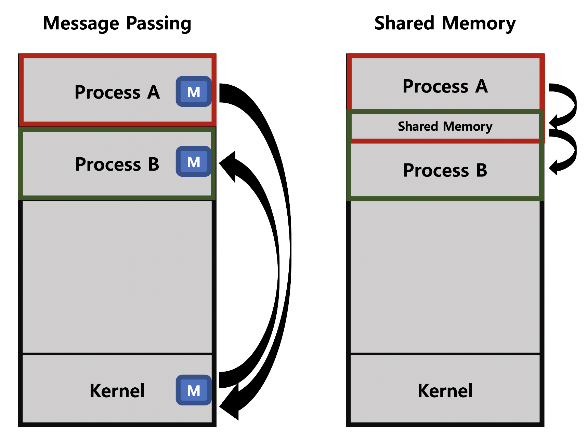

# Process Management 2


*cf) 복제 : 프로세스의 문맥 복제 (메모리 : 스택 / 데이터 / 코드,   CPU : PC, Registers 등)*

COW(Copy-On-Write) : PC만 따로 두고 다른 자원은 모두 공유하다가 부모와 달라지는 일부를 복제하여 자식 프로세스가 갖는 것 


- fork() & exec()

```c
int main()
{
  int pid;
  pid = fork();
  /*자식 프로세스는 여기서부터 실행, 부모/자식 프로세스는 fork 반환값으로 구분*/
  if (pid == 0)	{																					/*This is child*/
    printf("\n Hello, I am child!\n");
    /*프로그램 이름, 프로그램 이름, 인자값들, null pointer*/
    /*/bin/date = Linux의 현재 날짜 및 시간 출력 프로그램*/
    execlp("/bin/date", "/bin/date", (char*) 0);					/*비가역적*/
    printf("1"); 																					/*실행되지 않는 라인*/
  }
  else if (pid > 0)																				/*This is parent*/
    printf("\n Hello, I am parent!\n");
}
```

- wait()

  : 프로세스 A가 wait를 호출하면 child가 종료될 때까지 프로세스 A는 Blocked (Sleep) > child가 종료되면 Ready

```c
main {
  int childPID;
  S1;
  childPID = fork();
  if (childPID == 0)
    <code for child process>
  else {
    wait();
  }
  S2;
}
```

- exit()

  : 프로그램이 자발적으로 종료될 때

    명시적으로 적어주지 않아도 main함수가 return되는 위치에 컴파일러가 삽입

  *cf) 비자발적 종료의 경우*

  *1) 자식 프로세스가 한계치를 넘어서는 자원을 요청   2) 자식 프로세스에 할당된 태스크가 불요*

  *3) 사용자 명령   4) 부모 프로세스의 종료*


### 프로세스 간 협력

- 독립적 프로세스 (Independent Process)

  : 각자의 주소공간을 가지고 수행되므로 원칙적으로 서로 영향을 주지 않음

- 협력 프로세스 (Cooperating Process )

  : 협력 메커니즘을 통해 서로 영향을 미침

- 프로세스 간 협력 메커니즘 (IPC : InterProcess Communication)

  - 메시지 전달 (Message Passing)

    커널을 통해 메시지 전달   *(프로세스 P에서 프로세스 Q로 전달, M은 Mailbox 혹은 Port)*

    - Direct Communication : 통신하려는 프로세스의 이름을 명시적으로 표시 (Send(Q, message), Receive(P, message))
    - Indirect Communication : Mailbox 또는 Port를 통해 메시지를 간접 전달 (Send(M, message), Receive(M, message))

  - 주소공간 공유 (Shared Memory)

    일부 주소공간을 공유하는 메커니즘

    *Thread : 하나의 프로세스이므로 프로세스 간 협력은 아니지만 동일한 프로세스를 구성하는 Thread 간에는 주소공간을 공유하므로 협력 가능*

