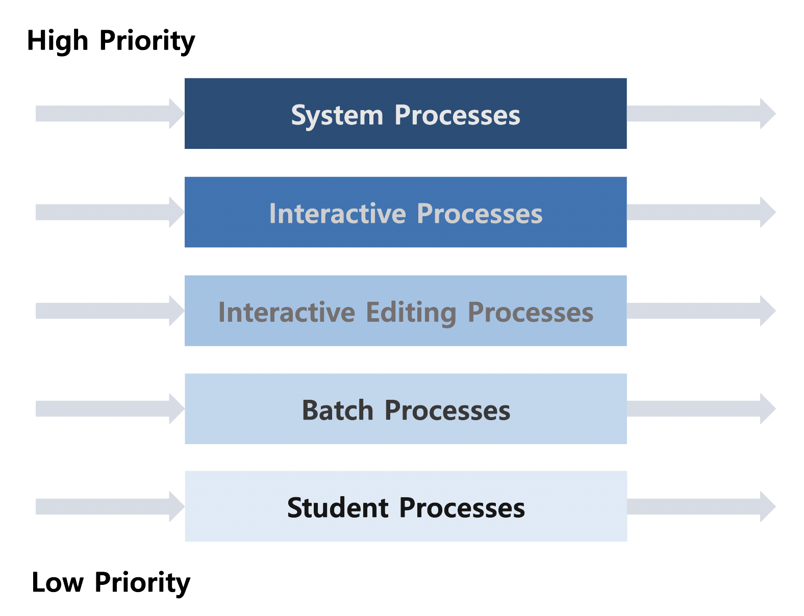
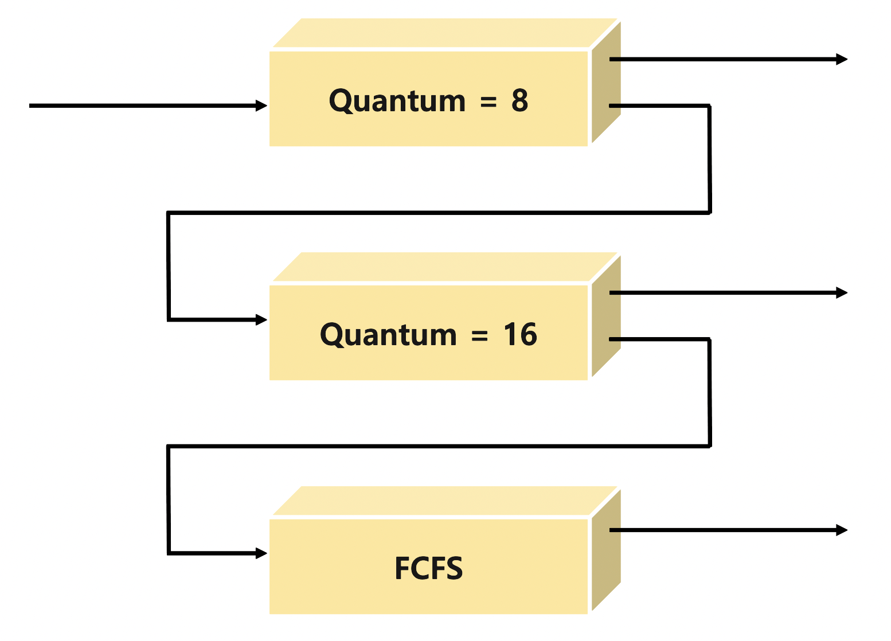

#  CPU Scheduling 2

### Scheduling Criteria (성능 척도)

1. 시스템 입장 성능 척도
   - CPU Utilization (이용률) : 전체 시간 중 CPU가 동작한 시간의 비율
   - Throughput (처리량) : 주어진 시간 동안 처리한 일의 양 
2. 프로그램 입장 성능 척도
   - Turnaround Time (소요시간 / 반환시간) : 대기 시간 + CPU 사용 시간 (I/O하러 나갈 때까지)
   - Waiting Time (대기시간) : Ready Queue에서 순수하게 기다린 총합 시간
   - Response Time (응답시간) : Ready Queue에 들어와서부터 처음으로 CPU를 얻기까지의 시간

### Scheduling Algorithms

1. FCFS (First-Come-First-Served)

   : 선착순

   *cf) Convey Effect : 오래 걸리는 프로세스가 먼저 도착하여 짧은 프로세스가 지나치게 오래 기다리는 현상*

2. SJF (Shortest Job First)

   : CPU Burst Time이 짧은 순서

   ​	**minimum average waiting time** 보장 (Preemptive 버전)

   - Nonpreemptive
     - 일단 CPU를 잡으면 CPU Burst가 완료될 때까지 CPU를 선점당하지 않음
     - 프로세스가 종료될 때 CPU Scheduling
   - Preemptive
     - 현재 수행 중인 프로세스보다 더 짧은 CPU Burst Time을 가지는 프로세스가 도착하면 해당 프로세스가 CPU를 선점 (SRTF : Shortest-Remaining-Time-First)
     - 프로세스가 도착할 때, 종료될 때, 언제든지 CPU Scheduling
     - 문제점 1. Starvation (기아 현상) : CPU Burst Time이 긴 프로세스가 영원히 실행되지 않을 수 있음
     - 문제점 2. CPU Burst Time의 예측 : 과거의 데이터를 통해 추정 (exponential averaging)
       - Tn = actual length of nth CPU Burst
       - tn+1 = predicted value for the next CPU Burst
       - 0 <= a <= 1
       - Define tn+1 = a * Tn + (1 - a) * tn
       - tn+1 = a * Tn + (1 - a) * a * Tn-1 + ... + (1 - a)j * a * Tn-j + ... + (1 - a)n+1 *t0 (직전의 CPU 사용시간이 가장 가중치가 높음)

3. Priority Scheduling

   : 우선순위가 가장 높은 순서 (보통 priority number는 정수값, smaller priority number = high priority)

      *ex) SJF*

   - Nonpreemptive

   - Preemptive
   - Aging (노화) : Starvation 해결법, 오래 기다릴수록 우선순위 상승

4. **RR (Round Robin)**

   : 각 프로세스는 동일한 크기의 할당시간 (time quantum)

   N개의 프로세스, Q time unit의 할당시간   >   최대 대기 시간 = (N - 1) * Q time unit

   프로세스의 CPU Burst Time과 대기 시간이 비례

   large Q : FCFS    <  >    small Q : Context Switch Overhead

   일반적으로 SJF보다 Average Turnaround Time은 길지만 **Response Time은 짧음**

5. Multilevel Queue

   : Ready Queue가 여러 줄 (독립적 스케줄링 알고리즘)

   - foreground (interactive) : RR
   - background (batch; no human interaction) : FCFS
   - Fixed Priority Scheduling : 극단적으로 우선순위를 강하게 적용하는 경우 Starvation 가능
   - Time Slice : 각 Queue에 CPU Time을 적절한 비율로 할당 *ex) 80% fore 20% back*

   

6. Multilevel Feedback Queue

    : Multilevel Queue와 다르게 프로세스가 다른 큐로 이동 가능   *cf) Aging*
   
    

할당시간이 짧은 큐로 먼저 배치 > 할당시간이 끝나면 그보다 우선순위가 낮지만 할당시간이 조금 더 긴 큐로 이동 > ... 

CPU 사용 시간 예측 없이 CPU Burst Time이 짧은 프로세스가 우선시 됨 

### Multiple Processor Scheduling

1. Homogeneous Processor인 경우

   : 하나의 Queue서 각 프로세서가 알아서 꺼내가는 스케줄링 방법 - 특정 프로세서에서 수행되어야 하는 프로세스가 있다면?

2. Load Sharing

   : 일부 프로세서에 Job이 몰리지 않도록 부하를 적절히 공유하는 메커니즘 필요

3. Symmetric MultiProcessing (SMP)

   : 모든 프로세서가 대등 (각 프로세서가 각자 알아서 스케줄링 결정)

4. Asymmetric MultiProcessing

   : 하나의 프로세서가 시스템 데이터 접근과 공유를 책임지고 나머지 프로세서는 거기에 따름

### Real-Time Scheduling

- Hard Real-Time Scheduling : 정해진 시간 안에 반드시 끝내도록 스케줄링
- Soft Real-Time Scheduling : 일반 프로세스에 비해 높은 우선순위를 갖도록 스케줄링

### Thread Scheduling

- Local Scheduling : User Level Thread의 경우, 사용자 수준의 Thread Library에 의해 스케줄링
- Global Scheduling : Kernel Level Thread의 경우 일반 프로세스처럼 커널의 단기 스케줄러가 스케줄링

### Algorithm Evaluation

1. Queueing Models (이론적)

   : 확률분포로 주어지는 arrival rate와 service rate 등을 통해 performance index 값을 계산

2. Implementation & Measurement (실측)

   : 실제 시스템에 알고리즘을 구현하여 실제 작업에 대하여 성능 측정 비교

3. Simulation

   : 알고리즘을 모의 프로그램으로 작성 후 trace를 입력으로 하여 결과 비교

   *cf) trace : 실제 프로그램을 통해서 추출한 input data*