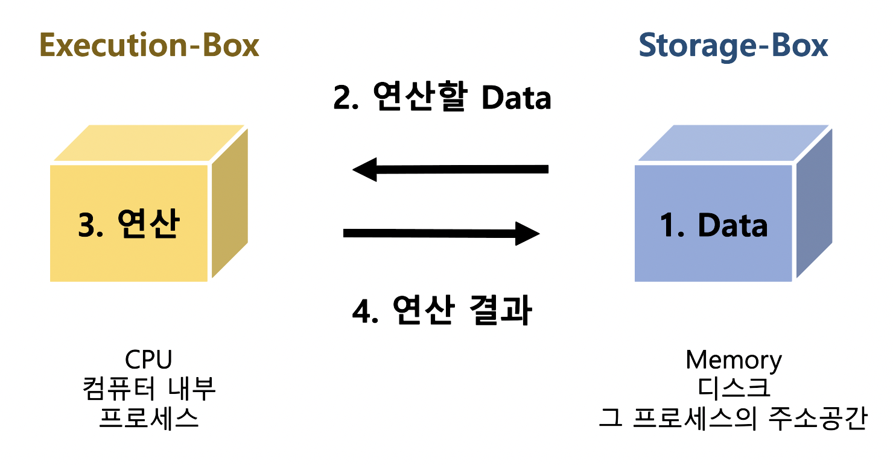
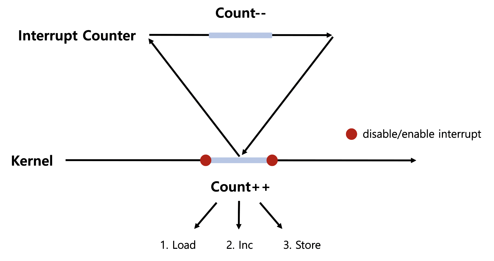
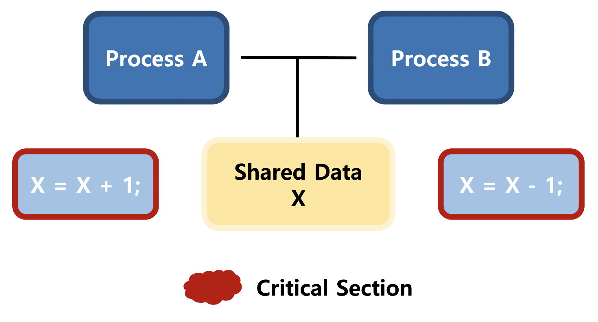

# Process Synchronization 1

= Concurrency Control (병행제어)

### 데이터의 접근

### Process Synchronization 문제

: 공유 데이터의 동시 접근은 데이터의 불일치 문제를 발생시킬 수 있음

  일관성 유지를 위해 협력 프로세스 간의 실행 순서를 정해주는 메커니즘 필요

### Race Condition

여러 프로세스가 동시에 공유 데이터에 접근하는 상황

데이터의 최종 연산 결과는 마지막에 그 데이터를 다룬 프로세스에 따라 달라짐

S-Box를 공유하는 E-Box가 여럿 있는 경우 Race Condition의 가능성이 있음

*cf) S-Box (Storage Box) : Memory, Address Space     E-Box (Execution Box) : CPU, Process*

- MultiProcessor System
- 공유 메모리를 사용하는 프로세스들
- **커널 내부 데이터를 접근하는 루틴들 간**    *ex) 커널 모드 수행 중 인터럽트로 커널 모드 다른 루틴 수행 시*

 

### OS Race Condition

- Kernel 수행 중 인터럽트 발생할 때

  >  수행을 마친  후 인터럽트 처리하는 방법으로 해결

- 프로세스가 시스템 콜을 하여 커널 모드로 수행 중 문맥 교환이 일어날 때

  > 커널 모드에서 수행 중일 때에는 CPU를 preempt하지 않고 커널 모드에서 사용자 모드로 돌아갈 때 preempt하는 방법으로 해결

- MultiProcessor에서 공유 메모리 내의 Kernel Data 

  > 1. 한 번에 하나의 CPU만이 커널에 들어갈 수 있게 하는 방법 (비효율적 )
  > 2. 커널 내부에 있는 각 공유 데이터에 접근할 때마다 그 데이터에 대한 Lock / Unlock 을 하는 방법

### Critical-Section Problem

Critical Section : 공유 데이터에 접근하는 Code

하나의 프로세스가 Critical Section에 있을 때 다른 모든 프로세스는 Critical Section에 들어갈 수 없어야 함

