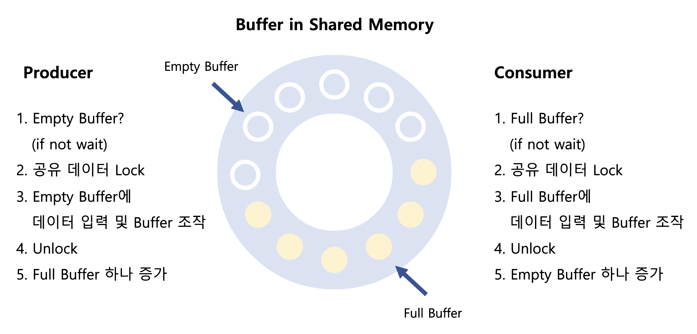
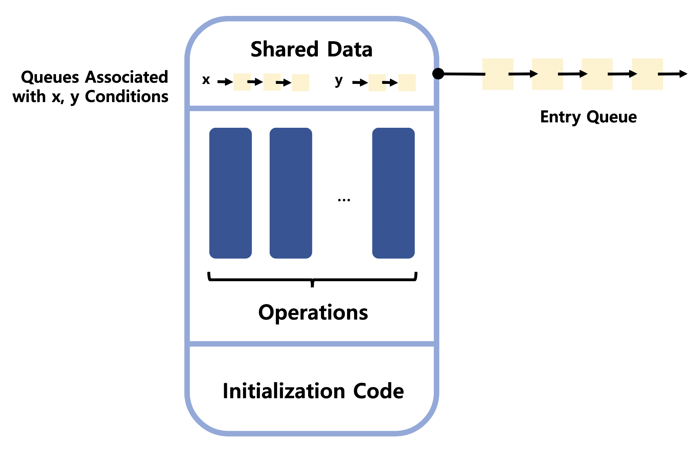

# Process Synchronization 4


### Classical Problems of Synchronization

1. Bounded-Buffer Problem (Producer-Consumer Problem)
2. Readers and Writers Problem
3. Dining-Philosophers Problem


### Bounded-Buffer Problem



문제상황 1. 하나의 Empty Buffer에 동시에 두 개 이상의 Producer가 접근 (Consumer도 마찬가지)

> Lock 필요 (2, 4)

문제상황 2. 생산자가 과잉으로 인한 자원 부족 (유한한 버퍼이기 때문에 생기는 문제) (Consumer도 마찬가지)

> 자원의 개수를 세는 Semaphore 필요 (5)


- Shared Data : Buffer 자체 및 Buffer 조작 변수 (Empty / Full Buffer 시작 위치 등)
- Synchronization Variables
  - Mutual Exclusion : Shared Data의 Mutual Exclusion 표시를 위해 Binary Semaphore 필요
  - Resource Count : 남은 Empty / Full Buffer 수 표시를 위해 Integer Semaphore 필요

```c
Synchronization Variables
  Semaphore full = 0, empty = n, mutex = 1;

/*Producer*/
do {
  ...
  produce an item in x
  ...
  P(empty);
  P(mutex);
  ...
  add x to buffer
  ...
  V(mutex);
  V(full);
} while (1);

/*Consumer*/
do {
  P(full);
  P(mutex);
  ...
  remove an item from buffer to y
  ...
  V(mutex);
  V(empty);
  ...
  consume the item in y
  ...
} while (1);
```


### Readers-Writers Problem

: 한 프로세스가 DB에 write 중일 때 다른 프로세스는 접근하면 안 됨 (**read는 여러 프로세스 동시 가능**)

1. Writer가 DB 접근 허가를 받지 못했을 때 모든 Reader들은 DB 접근 허가

			 2. Writer는 대기 중인 Reader가 없을 때 DB 접근 허가
			 2. Writer가 DB 접근 중이면 Reader는 DB 접근 불가
			 2. Writer가 DB에서 빠져나가야 Reader의 DB 접근 허가

```c
/*Writer*/
P(db);
...
writing DB is performed
...
V(db);

/*Reader*/
P(mutex);									 /*동시에 readcount를 변경하지 않도록 하는 Lock*/
readcount++;
if (readcount == 1) P(db); /*최초의 Reader만 DB에 대한 Lock을 걸고 이후의 Reader는 바로 읽기 기능 수행*/
V(mutex);
...
reading DB is performed
...
P(mutex);
readcount--;
if (readcount == 0) V(db); /*마지막으로 빠져나가는 Reader가 DB Unlock*/
V(mutex);
```

모든 Reader가 빠져나가야 Writer는 DB에 접근 가능하므로 Starvation 발생 가능 *(해결 방법 : Aging)*


### Dining-Philosophers Problem


```c
/*Philosopher i*/
do {
  P(chopstick[i]);						/*왼쪽 젓가락 점유*/
  P(chopstick[(i + 1) % 5]);  /*오른쪽 젓가락 점유*/
  ...
  eat();
  ...
  V(chopstick[i]);
  V(chopstick[(i + 1) % 5]);
  ...
  think();
  ...
} while (1);
```

문제상황 : DeadLock (모든 철학자가 동시에 왼쪽 젓가락을 집었을 때 그 누구도 오른쪽 젓가락을 집을 수 없어 무한 대기 상태)

>1. 젓가락을 들고자 하는 철학자만이 테이블에 앉으며 테이블에는 동시에 4명 이하만 앉을 수 있도록 함
>2. 양쪽 젓가락을 모두 집을 수 있을 때만 젓가락을 잡도록 함*
>3. 비대칭 (왼쪽 오른쪽 번갈아 먼저 집도록)

*2번 해결책의 코드

```c
enum {thinking, hungry, eating} state[5];
semaphore self[5] = 0;  /*초기값 0 주의*/
semaphore mutex = 1

/*Philosopher i*/
do {
  pickup(i);
  eat();
  putdown(i);
  think();
} while (1);

void test(int i) {
  if (state[(i + 4) % 5] != eating && state[i] == hungry && state[(i + 4) % 5] != eating) {
    state[i] = eating;
    V(self[i]);					/*i는 젓가락을 잡을 수 있게 됨*/
  }
}

void pickup(int i) {
  P(mutex);							/*i만 i의 상태를 바꾸기 위한 Lock*/
  state[i] = hungry;
  test(i);
  V(mutex);
  P(self[i]);
}

void putdown(int i) {
  P(mutex);
  state[i] = thinking;
  test((i + 4) % 5);   /*인접 철학자 젓가락 접근 권리 업데이트*/
  test((i + 1) % 5);
  V(mutex);
}
```


### Monitor

- Semaphore의 단점
  - 코딩이 어렵다
  - 정확성 입증이 어렵다
  - 자발적 협력이 필요
  - ==한 번의 실수가 모든 시스템에 치명적==
    - P와 V의 순서가 바뀌게 되면 Mutual Exclusion 위반
    - 둘 다 P가 되어버리면 DeadLock

동시 수행 중인 프로세스 사이에서 Abstract Data Type의 안전한 공유를 보장하기 위한 High-Level Synchronization Construct

```c
monitor monitor-name {
  shared variable declarations
  procedure body P1(...) {
    ...
  }
  procedure body P2(...) {
    ...
  }
  procedure body Pn(...) {
    ...
  }
  {
    initialization code
  }
}
```

모니터 내부에 정의된 Procedure를 통해서만 공유 데이터에 접근할 수 있도록

원천적으로 Procedure는 여러 개가 동시에 실행되지 않도록 통제 > Lock 불요

프로세스가 모니터 안에서 기다릴 수 있도록 하는 Condition Variable 필요 (프로세스를 잠들게 하고 줄 세우기 위한 변수)

Condition Variable의 연산

1. wait() : 자원이 없을 때 대기하는 연산 (x.wait() 하게 되면 해당 프로세스가 x 큐에서 대기)
2. signal() :  접근 후 빠져나가는 연산 (x.signal() 하게 되면 x를 기다리고 있는 다른 프로세스를 깨우기)




### Bounded-Buffer Problem

```c
monitor bounded_buffer {
  int buffer[N];						/*buffer가 모니터 내부에 있는 자원이므로 Lock이 불요*/
  condition full, empty;
  
  void produce(int x) {
    if there is no empty buffer
      empty.wait();
    add x to an empty buffer
    full.signal();
  }
  
  void consume(int *x) {
    if there is not full buffer
      full.wait();
    remove an item from buffer and store it to *x
    empty.signal();
  }
}
```


### Dining-Philosophers Problem

```c
monitor dining_philosopher {
  enum {thinking, hungry, eating} state[5];
	condition self[5];
  
  void init() {
    for (int i = 0; i < 5; i++) state[i] == thinking;
  }
  
  void test(int i) {
    if ((state[(i + 4) % 5] != eating) && (state[i] == hungry) && (state[(i + 1) % 5] != eating)) {
      state[i] = eating;
      self[i].signal();			/*wakeup*/
    }
  }
  
  void pickup(int i) {
    state[i] = hungry;
    test(i);
    if (state[i] != eating) self[i].wait();
  }
  
  void putdown(int i) {
    state[i] = thinking;
    test((i + 4) % 5);
    test((i + 1) % 5);
  }
}

Each Philosophers:
do {
  pickup(i);
  eat();
  putdown(i);
  think();
} while(1);
```

