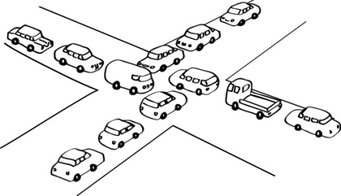

# Deadlocks

### Deadlock Problem

**Deadlock** : 일련의 프로세스들이 서로가 가진 자원을 기다리며 Block된 상태

**Resource** : 하드웨어와 소프트웨어를 모두 포함하는 개념

​					 사용 절차 - Request > Allocate > Use > Release

문제상황 1. 시스템에 두 개의 Tape Drive가 있고 프로세스 P1과 P2가 각각 하나의 Tape Drive를 보유한 채 다른 하나를 기다리고 있는 상황

문제상황 2. Binary Semaphores A, B

​							  P1     	 	  P2

​							P(A);    		P(B);

​							P(B);    		P(A);

### ==Deadlock 발생 조건==

1. Mutual Exclusion (상호 배제) : 매 순간 하나의 프로세스만이 자원을 사용할 수 있음
2. No Preemption (비선점) : 프로세스는 자원을 스스로 내어놓을 뿐 빼앗기지 않음
3. Hold and Wait (보유 대기) : 자원을 가진 프로세스가 다른 자원을 기다릴 때 보유 자원을 놓지 않고 계속 가지고 있음
4. Circular Wait (순환 대기) : 자원을 기다리는 프로세스간에 사이클이 형성되어야 함

### Resource-Allocation Graph (자원 할당 그래프)

 P1은 자원 R2를 보유하고 R1을 기다리는 상황

Cycle이 없으므로 Deadlock ❌

Cycle이 있다면, 1) 자원 당 인스턴스 (초록 동그라미) 가 하나라면 Deadlock ⭕️

​						  2) 자원 당 여러 인스턴스가 있다면 Deadlock "일 수도 있음"

자원 당 여러 인스턴스가 있지만 Deadlock인 상황

자원에 있는 모든 인스턴스가 Cycle에 있기 때문 (그렇지 않은 인스턴스가 있다면 Deadlock이 아닌 상황)

### Deadlock 처리 방법

1. Deadlock Prevention
2. Deadlock Avoidance
3. Deadlock Detection & Recovery
4. **Deadlock Ignorance** : Deadlock은 자주 발생하는 Event가 아니므로 이에 오버헤드를 감수하는 것이 *비효율적*이므로 현대 많은 OS가 Deadlock에 대해 책임을 지지 않는 방법을 채택, 사용자가 직접 프로세스를 강제 종료하는 등의 해결

*cf) 1, 2는 미연에 방지하는 방법 / 숫자가 작을 수록 강한 방법*

### Deadlock Prevention

: Deadlock의 네 가지 조건 중 어느 하나를 원천적으로 차단하는 방법

1. Mutual Exclusion : 막을 수 없음

2. Hold and Wait

   - 프로세스 시작 시 모든 필요한 자원을 할당받게 하는 방법 *(비효율적)*
   - 자원이 필요할 경우 보유 자원을 모두 놓고 다시 요청하게 하는 방법 (자진 반납)

3. No Preemptive

   CPU나 Memory와 같이 State를 쉽게 Save하고 Restore할 수 있는 자원에서 주로 사용

4. Circular Wait

   모든 자원 유형에 할당 순서를 정하여 정해진 순서대로만 자원 할당

> Utilization 저하, Throughput 감소, Starvation 문제

### Deadlock Avoidance

: 자원 요청의 부가적인 정보를 이용하여 Deadlock의 가능성이 전혀 없는 경우에만 자원 할당

  프로세스가 시작될 때 해당 프로세스가 평생 쓸 자원의 최대량을 미리 인지할 수 있다는 가정 하에 Deadlock을 회피

- Single Instance Per Resource Types : Resource Allocation Graph Algorithm 사용
- Multiple Instances Per Resource Types : Banker's Algorithm 사용

#### Resource Allocation Graph Algorithm

마지막 그래프는 Deadlock은 아니지만 Unsafe한 상태이므로 애초에 두 번째 그래프에서 P2의 자원 요청을 받아들이지 않음 (Deadlock Avoidance)

#### Banker's Algorithm (Example)

5 Processes : P0, P1, P2, P3, P4

3 Resources Type : A (10), B (5), C (7) instances

Snapshot at time T0

​		Allocation		Max		Available		Need (Max - Allocation)

​		   A  B  C		  A  B  C	    A  B  C		  A  B  C

P0	   0  1  0		  7   5   3 	  3   3   2		 7   4   3

P1	   2  0  0		  3   2   2 							1   2   2

P2	   3  0  2		  9   0   2							 6   0   0

P3	   2  1  1		  2   2   2							 0   1   1

P4	   0  0  2		  4   3   3							 4   3   1

*Allocation : 현재 가지고 있는 자원, Max : 평생 사용할 최대 자원, Available : 현재 가용 가능한 자원*

이 상태에서 P1이 (1, 0, 2)를 요청한다면 가용자원으로 해당 요청을 충족할 수 있고, Need 또한 충족되므로 허용 (Safe)

이 상태에서 P0가 (0, 2, 0)을 요청한다면 가용자원으로 해당 요청을 충족시킬 수 있지만 Need는 충족되지 않으므로 비허용 (Unsafe)

P1 > P3 > P4 > P2 > P0  Sequence가 존재하므로 시스템은 Safe State (Banker's Algorithm은 이를 확인할 필요도 없음)

### Deadlock Detection & Recovery

- Deadlock Detection

  - Resource Type당 Single Instance인 경우 : 자원 할당 그래프 이용

  

  ​	자원을 뺀 자원 할당 그래프 : Wait-For Graph (n개의 프로세스가 있을 때 시간복잡도 : O(n2))

  - Resource Type당 Multiple Instance인 경우 : Banker's Algorithm과 유사한 방법 이용

    5 Processes : P0, P1, P2, P3, P4

    3 Resources Type : A (7), B (2), C (6) instances

    Snapshot at time T0

    ​		Allocation 	 Request       Available

    ​		   A  B  C	 	  A  B  C	       A  B  C	

    P0	   0  1  0	 	  0   0   0 	     0   0   0		

    P1	   2  0  0	 	  2   0   2 							

    P2	   3  0  3	 	  0   0   0							 

    P3	   2  1  1	 	  1   0   0							 

    P4	   0  0  2	 	  0   0   2							 

    > No Deadlock : P0 > P2 > P3 > P1 > P4  Sequence

    ​		Allocation 	 Request       Available

    ​		   A  B  C	 	  A  B  C	       A  B  C	

    P0	   0  1  0	 	  0   0   0 	     0   0   0		

    P1	   2  0  0	 	  2   0   2 							

    P2	   3  0  3	 	  0   0   **1**							 

    P3	   2  1  1	 	  1   0   0							 

    P4	   0  0  2	 	  0   0   2

    > DEADLOCK

- Recovery

  - Process Termination : Deadlock에 연루된 모든 프로세스 종료 / Deadlock에 연루된 프로세스를 하나씩 종료

  - Resource Preemption : Deadlock에 연루된 프로세스로부터 자원을 뺏는 방법

    - 비용을 최소화할 Victim 선정
    - Safe State로 Rollback, Process Restart

      *cf) Starvation : 동일한 프로세스가 계속하여 Victim이 되는 경우*

    ​							*따라서 rollback횟수도 cost factor로 고려해야 함*