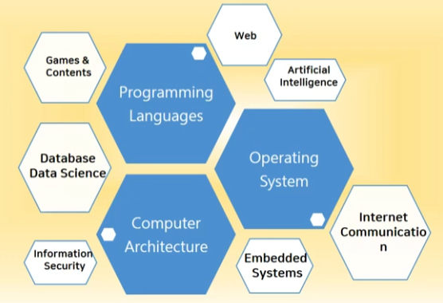
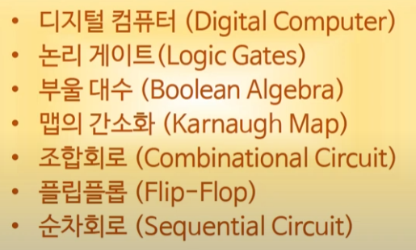
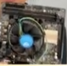
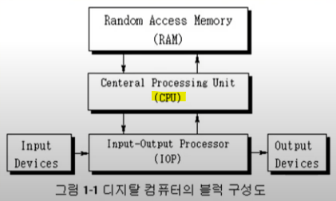
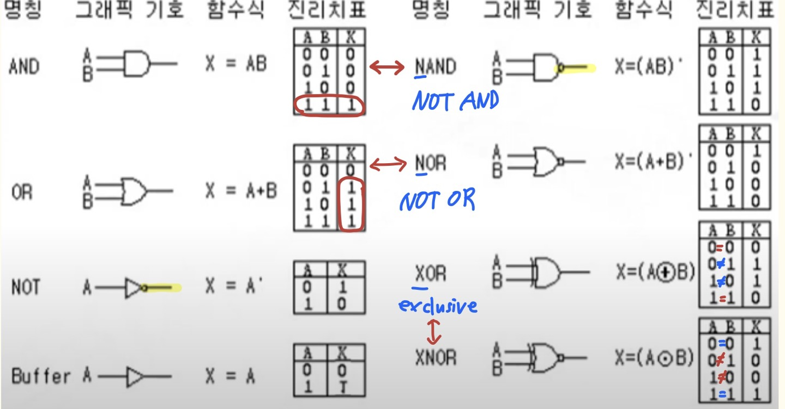
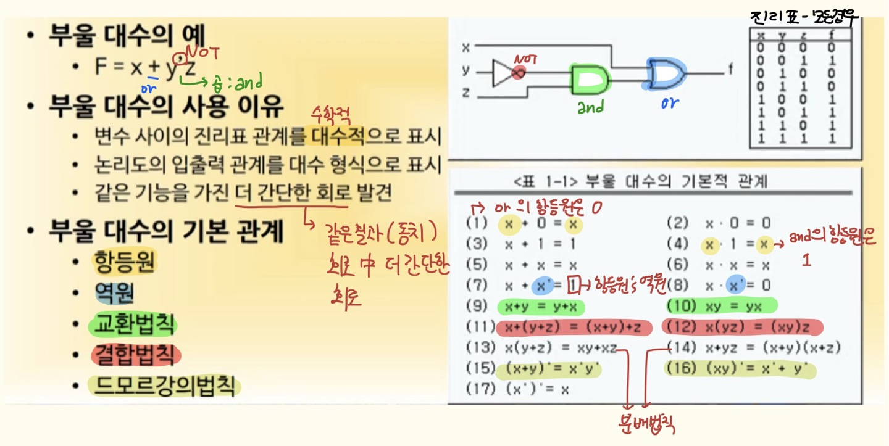
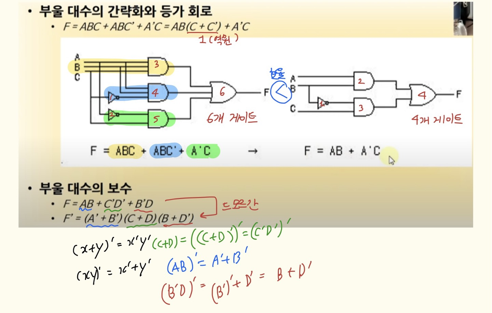
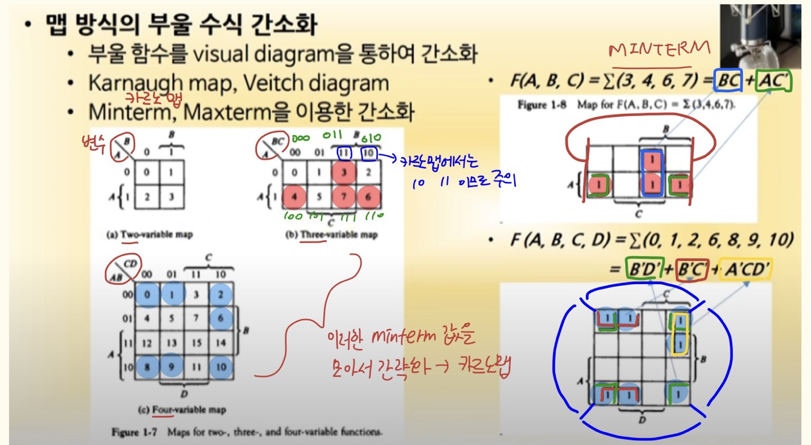
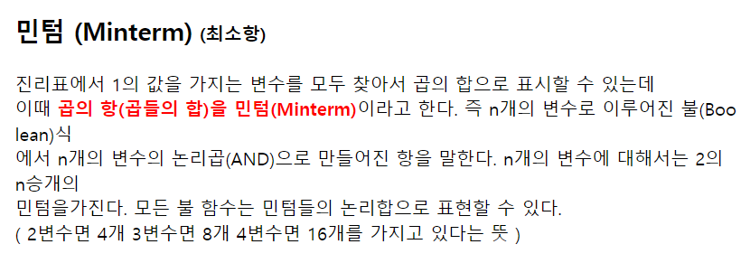
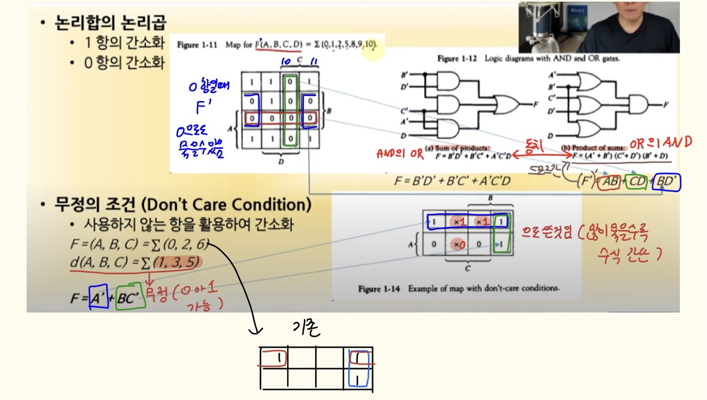

# CS

## 컴퓨터시스템구조

### 개요

### 컴퓨터시스템구조 제 1 장 디지털 논리회로 Part-1 

- 목차

### 1. 디지털 컴퓨터

- 정의
  - 이진 시스템(0과1)
  - 비트(0과1)의 그룹을 사용 → 숫자, 문자 정보 처리

- 컴퓨터 하드웨어

  

  - CPU - 중앙처리장치, **컴퓨터** **그자체** →   데이터의 저장, 제어

  - 주변장치 - 메모리(RAM/ROM), 저장 장치(Storage), 입출력 장치

  - 전공자 vs 비전공자

    - 컴퓨터가 뭐냐?
      - 비전공자 → PC
      - 전공자 → 컴퓨터는 CPU 를 얘기하는 것

  -  CPU 외에 나머지는 CPU를 보조하는 unit이라고 생각

  - 그림 1-1 디지털 컴퓨터의 블럭 구성도

    

    

- 컴퓨터 소프트웨어

  - 운영체제

    - OS - Operating System

  - 시스템프로그램

    - 유틸리티, DB, Editor

      - **질문? **MS-office, 한글도 시스템프로그램의 Editor인가요?

        **답변** ㄴㄴ window의 notepad 같은 것을 의미

    - OS에 포함 또는 연결되어 시스템 운영 보조

  - 응용프로그램

    - ex) Web, 게임

----------

### 2. 논리 게이트

- 이진 정보의 표시

  - 0(0V)과 1(5V)의 전압신호

- 논리 게이트

  - 기본 게이트

  - 진리표로 동작 정의

    

    +) Buffer 들어오는 신호가 그대로 출력신호

### 3. 부울 대수

- 이진 변수와 논리 동작을 취급하는 대수

- 기본 대수 동작 : AND, OR, NOT

  

  

**질문?**

역원은 연산 결과가 항등원일 때 인데, 부울대수에서는 항등원의 역원일때를 역원으로 보고있음 WHY?

**질문?**

A not C 회로모양 저거 맞음..? 

### 4. 맵의 간소화

- 0과 1의 조합 값을 MINTERM 값으로 표시하고 MINTERM값이 1일 때 인접한 1을 서로 묶음

  - MINTERM

    

    https://m.blog.naver.com/PostView.naver?isHttpsRedirect=true&blogId=asd7979&logNo=30107140339

- 카르노맵에서는 한번 사용한 항을 중복해서 또 쓸 수 있음

- 1항과 0항으로 묶는 것의 맵을 보고 결정해서 더 간단한 것을 선택

- 카르노맵에서는 항을 많이 묶을 수록 수식이 간단해짐
- 무정의 조건이 있으면 수식이 더 간단해지므로, 가능한 한 무정의 조건을 쓰면 좋음
- 단, 무정의 조건이 붙을 경우 완전한 동치라고는 볼 수 없음  → 그래도 통상적으로는 동치로 보기 때문에 무정의 조건이 주어지면 사용하는 것이 좋음

- 결론) 가능한 한 무정의 조건을 많이 써서 수식을 간단히 하자