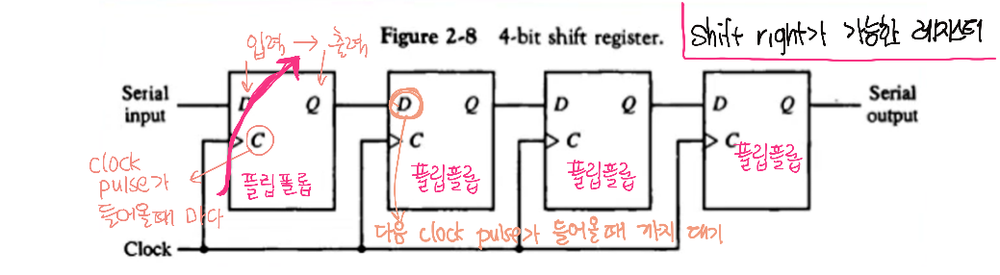
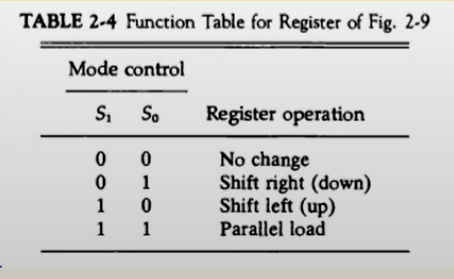
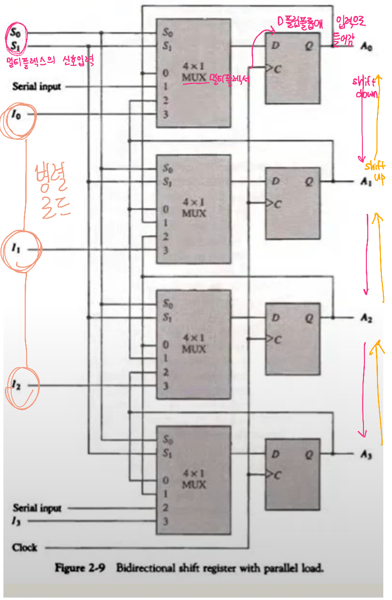
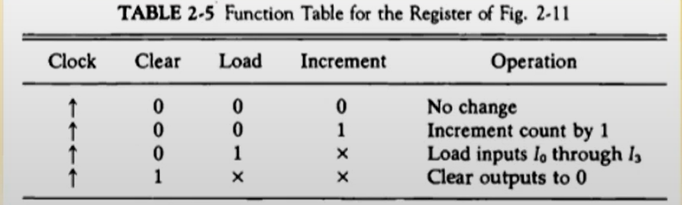
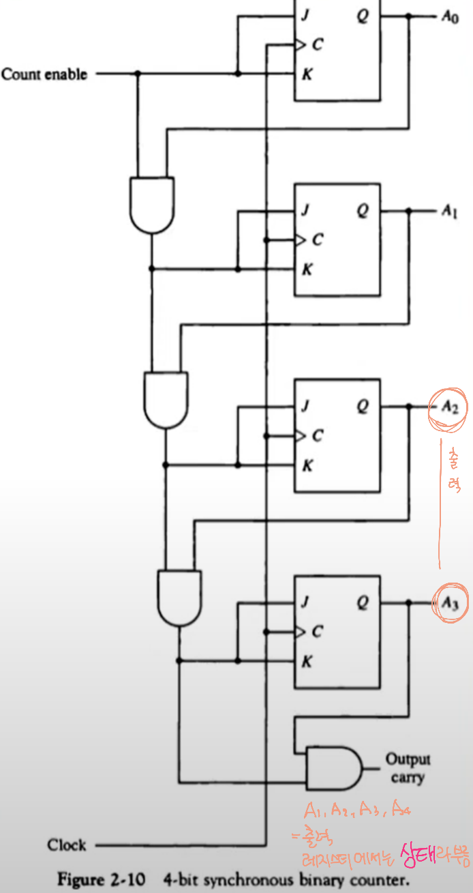
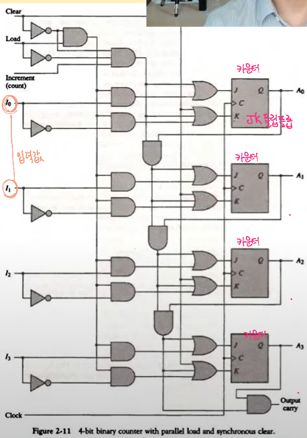
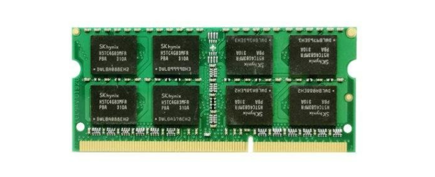
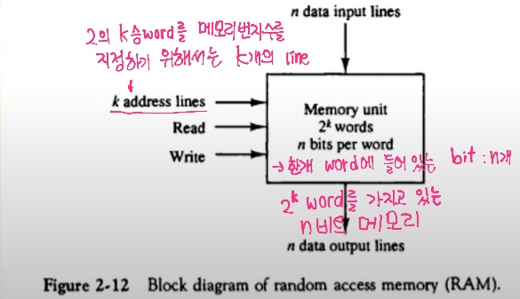
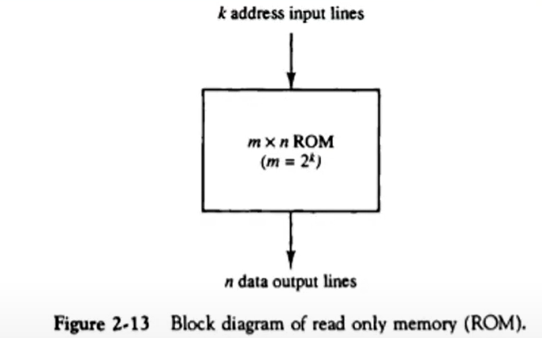

## 5. 시프트 레지스터(시프터)

#### 정의 

- 레지스터에 저장된 이진 정보를 단방향 / 양방향으로 이동 가능한 레지스터
  - shift : 밀다 
  - 레지스터에 저장된 바이너리 정보가 있을 경우에 그 정보를 clock pulse가 들어왔을 때, 단방향(오른쪽 or 왼쪽)으로 비트를 이동시키는 것 
  - 한번 clock pulse가 들어올 때 마다 한 비트씩 이동
  - 단방향 : 한쪽 방향으로밖에 이동 못함 
  - 양방향 :  left shift, right shift 중 하나를 정해 shift가능
- 각 FF들의 입력이 출력과 cascade로 연결
- 공통의 clock이 다음 상태로의 이동 제어 

- 4비트 shift register

----

#### 병렬 로드를 가지는 양방향 시프트 레지스터(General Register) 

- 범용 레지스터라 부름 = 레지스터
- 모든 레지스터는 shift left, shift right , 벙렬 로드기능이 다 있음

- 비트를 병렬로 동시에 로드할 수 있는 제어 입력을 가지고 있으면서, 동시에 이 레지스터에 들어있는 각 플립플롭들의 값을 양방향으로 (shift left  or shift right) 자율적으로 할 수 있고 출력 또한 병렬으로 가능한 레지스터

병렬 로드, 왼쪽 /오른쪽 시프트, 병렬 출력 가능 

동기화된 clock에 의하여 동작

parallel load 

- 병렬로 입력을 받아서 D 플립플롭의 값으로 저장하는 기능 
- 레지스터의 값(상태)로 저장이 된다

----

### 이진 카운터 

- 카운터 자체도 레지스터다. 단지 레지스터의 데이터(값) 자체가 정해진 순서대로 상태 변이 수행하는 레지스터다
- 롯데월드에 갈 때, 쇠 바를 밀면서 입장 -> 기계식 카운터 
- 이진카운터는 레지스터를 사용해서 만들어진 전자식 카운터
  - 바를 하나씩 밀 때 마다 clock또는 입력이 발생 -> 그로 인해 계속해서 값이 증가

- Clock, 또는 외부 입력에 따른 상태 변이 

#### 용도 

- 사건의 발생 횟수 카운트 
- 동작 순서 제어 타이밍 신호 발생에 적용 

#### 병렬 입력을 가진 이진 카운터 

- 카운터의 초기값 설정 가능 (0부터, 100부터 설정) -> **병렬 입력을 가진 이진 카운터가 수행**
- 병렬 입력을 통하여 초기값 로드 
- Load, Clear, Increment 기능 

**clock** ↑ : clock pulse가 상승 노선일 때 clock이 동작됨

- increment가 있다고 해서 counter가 올라가는 것이 아니라, clock pulse 를 기다렸다가 반영됨\

**clear**값이 1이 되면 A1, A2, A3, A4는 다 clear가 될 것이고, output은 모두 다 0이 되어버림 

**load**가 1이면 I0, I1, I2, I3이 Q값으로 들어오게 됨

**incremen**t가 1 => A0, A1, A2, A3의 상태값(바이너리 이진값)가 1씩 증가

- A0, A1, A2, A3 => 0 0 1 1 (2)이었다면 3이었다는 뜻 
- increment로 인해 4가 됨 : A0, A1, A2, A3 => 0 1 0 0 (2)

회로를 변형시키면 decrement도 가능

A0, A1, A2, A4와 같은 출력을 레지스터에서는 상태라고 부른다 

- 상태는 클럭이나 외부 입력에 따라서 값이 변하게 되는데 이 외부 입력값 또는 클럭값이 어떻게 변하느냐에 따라서 레지스터에 들어가는 값이 차례대로 증가되기도 하고, 감소되기도 함
- 어떤 일이 발생했을 때, 한번 발생 할 때마다 숫자가 올라가는 카운터(야구장 입장객 세는 기기)

### 병렬 입력을 가진 이진 카운터

I0, I1, I2, I3 -> 입력 값

- 입력값을 미리 정한 다음에 그 값을 카운터에 저장해주는 기능을 가지고 있는 카운터 

0부터 셀 필요 없이, 초기값을 원하는 숫자로 설정 가능 

load가 1이 될 때 입력 값들이 JK 플립플롭의 입력값으로 들어옴 

상태값 Q값으로 저장됨 = 출력값 = A0, A1, A2, A3 

결론 : I0, I1, I2, I3(입력값) == A0, A1, A2, A3 (출력값)

increment 혹은 clock이 들어올 때 마다 counter가 증가하게 됨 

#### 프로그램을 미리 저장해놓고, 일정한 순차에 의해 계산을 수행하는 것 : 카운터 이용

---

----

# 7. 메모리 장치 

#### 정의

정보의 입출력 기능을 가지는 저장 요소들의 집합 

- 데이터를 저장하고 필요할 때 마다 꺼내 쓸 수 있는 전자 장치
  - 메모리 : 레지스터의 집단
  - 레지스터 : 플립플롭의 집단

#### **이 집단의 단위가 무엇이냐? : word**

- Word단위로 정보를 저장 

- **Word** : 입출력에서 하나의 데이터 단위로 취급되는 비트의 그룹 

  - 16bit 컴퓨터 : 레지스터 / 메모리 버스의 크기가 16bit(2byte)

    - **한번에 전송하거나 주고받을 수 있는 비트 그룹의 크기가 16bit**

  - 64bit 컴퓨터 : 레지스터 / 메모리 버스의 크기가 64bit(8byte)

    

- **Byte** : 워드의 기본 단위 
  - MB(10`**`6 Byte), GB(10`**`9 byte), PB(10`**`12 byte)

**펜티엄 CPU**

- 32bit 컴퓨터임
- 기본 레지스터의 크기가 32bit
- 메모리를 읽고 쓰고 사용할 때 사용하는 단위 : 32bit
- 그러나 배수입출력(?)등을 이용해서 최대 64bit가 가능 : 한꺼번에 64비트가 가능 한 것은 아님 
  - 32bit가져오고 또 32bit가져와서 64비트로 연산을 하는 것 뿐 

**AMD CPU**

- 64bit이기도 하고, 아니기도 함 
- intel에서 사용하는 명령어와 같아야하기 때문에 엄격히 말하면 full 64bit는 아님

---

### RAM(Random Access Memory)

#### K개의 주소 라인으로 2 ** k개의 word중 하나를 선택하여 읽기, 쓰는 메모리

- **Random Access**  : word의 물리적인 위치에 관계 없이 데이터 접근 
  - RAM 안에서 어디에 있건 간에 동일한 접근 시간이 걸린다 
  - 모든 데이터 위치에 대하여 동일한 접근 시간 

- N비트의 입력 / 출력 (word 크기와 동일)

  

#### 

**adressing** : 어떤 주소를 줬을 때 그 주소가 메모리의 저장 장소 중 한 군데를 지정함

3개의 i입력값으로 8개의 위치를 지정할 수 있었음 

k : 10번지, read: 1 => n개의  bit로 이루어진 data output을 보냄 

k : 10번지, write: 1 => n개의  bit로 이루어진 data input에 씀 

----

----

### ROM(Read Only Memory)

- **한 번 저장된 데이터를 읽기만 가능** 
- 1 word가 N비트 이고, M워드를 저장 :  N * M ROM
- ROM에  저장된 M word를 접근할 수 있는 K개의 주소 입력(2**k = M)

- ram과는 다르게 input이 주소, output이 data

#### ROM의 종류 

- **Mask ROM** : 석판화 방식으로 구워져 나오는 ROM

  - 반도체가 만들어질 때, 0과1 의 데이터가 PN형 반도체의 값으로 구워져서 나온다
  - 지워지지 않음, 바꿀 수 없음
  - 생성시에만 데이터를 넣을 수 있음 

  

- **PROM** : Programmable ROM

  - 한번만 프로그램 가능, 지워지지 않음, 바꿀 수 없음
  - 퓨즈를 끊거나 이어서 0과 1을 만듦

  

- **EPROM** : Erasable Programmable ROM 

  - UV에 의한 데이터 삭제(ROM 초기화)및 재프로그래밍 가능
  - 자외선을 쐬어 반도체의 데이터를 초기화 시킨 후 퓨즈를 끊거나 연결 
  - 시간이 오래 걸림

  

- **EEPROM** : Electrical Erasable PROM 

  - 전기 신호에 의한 데이터 삭제, 초기화 및 재프로그래밍 
  - 일정 레벨의 전기가 들어가면 데이터가 초기화됨 -> 다시 전기신호를 줘서 재프로그래밍

  

#### ROM의 기능을 하는 RAM

**전원을 끊었는데도  데이터가 사라지지 않는 RAM**

RAM : 전원을 끊으면 데이터가 사라짐 

-  Flash-RAM : BIOS, USB memory, SD card
- NV-RAM 
  - Non-Volatile RAM(비휘발성)
    - 내장battery로 인해 data를 hole하고 있음
  - Battery Backup RAM

