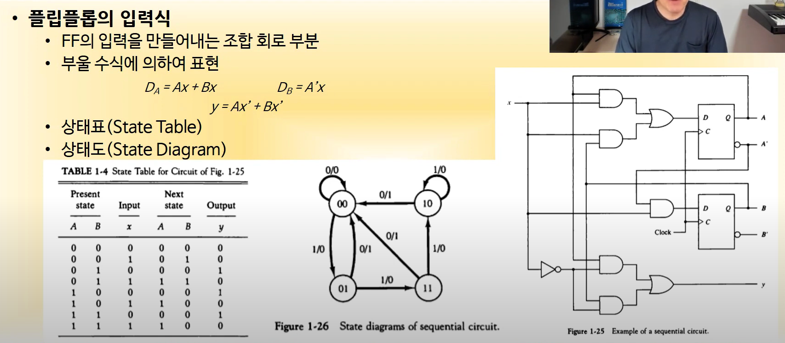

## CS_week 1

---

### 논리 게이트

**이진정보: 0과 1의 전압 신호로 표시 (보통 0은 전압 0V, 1은 전압 5V)** (0.5V와 3V로 두는 경우도 있음)

XOR: 입력이 다르면 1, 같으면 0

XNOR: 입력이 같으면 1, 다르면 0

---

## 조합회로

입출력을 갖는 논리 게이트의 집합

n개의 입력 조합이 있을 경우, 가능한 입력 조합은 2**n가지

00 -> 01 -> 11 -> 10 즉 0 1 3 2 순으로 진행됨

S의 경우 0, 1, 0, 1 의 순으로 들어가는 것(상위 4개만 봤을 때)

---

## 플립플롭

1비트의 디지털 정보를 저장하는 이진 셀(디지털 메모리)

clock이 상향일 때 D값에 따라 출력값이 바뀜 -> Upward triggered FF(플립플롭)

clock이 하향일 때 D값에 따라 출력값이 바뀜 -> Downward triggered FF(플립플롭)

**플립플롭의 입력식**

https://m.blog.naver.com/leeyunghuk1/220958708825

**참고 블로그**

---

## 디지털 부품

- 집적회로
  - 디지털 게이트를 구성하는 전자 부품을 포함하는 실리콘 반도체 칩
  - 칩 내부에 게이트들이 연결, 외부로도 연결
  - 칩의 등록 번호로 구분
  - 집적 규모에 따라 SSI, MSI, LSI, VLSI로 분류 가능 (10, 10~200, 200~1000, 수천개 이상), cpu는 보통 VLSI
  - 
  - 
- 디코더
  - N비트의 이진 정보를 서로 다른 2**N개의 원소 정보로 출력
  - 
  - 여러 부품중 하나를 활성화 시킬 때 이용
  - NAND 케이트로 만들어진 게이트를 생각해보자
  - 전력적으로 이득(0보다 1을 보여주는게 낫다?)
  - 
  - 
  - 인코더
  - 
- 멀티플렉서
  - N개의 입력에 따라서 2**N개의 출력을 하나의 출력에 선택적으로 연결
  - 
- 레지스터
  - N비트 레지스터: N비트의 이진 정보 저장
  - N개의 플립플롭과 조합 회로로 구성됨
- 시프트 레지스터
  - 레지스터에 저장된 이진 정보를 단방향/양방향으로 이동 가능한 레지스터
  - 각 FF들의 입력이 출력과 cascade로 연결
  - 공통의 clock이 다음 상태로의 이동 제어
  - 
  - 
  - 
- 이진 카운터
  - 
  - 순차를 만들어 줌
- 메모리 장치
  - 정보의 입출력 기능을 가지는 저장 요소들의 집합
  - word 단위로 정보를 저장
  - word: 입출력에서 하나의 단위로 취급되는 비트의 그룹
    - 16bit: 레지스터/메모리 버스의 크기가 16bit (2byte)
    - 64bit: 레지스터/메모리 버스의 크기가 64bit (8byte)
    - byte: 워드의 기본 단위
  - RAM (Ramdom Access Memory): word의 물리적인 위치에 관계 없이 데이터 접근 (Random Access)
    - 모든 데이터 위치에 대하여 동일한 접근 시간
    - N비트의 입력/출력(word 크기와 동일)
    - K개의 주소 라인으로 2**k개 word중 하나를 선택
    - 읽기/쓰기 지정
    - 
  - ROM (Read Only Memory)
    - 한 번 저장된 데이터를 읽기만 가능
    - 1 word가 N 비트이고, M 워드를 저장하는 N*M ROM
    - ROM에 저장된 M word를 접근할 수 있는 K개의 주소 입력
    - 
    - ROM의 종류
      - 
      - EPROM은 조금 느리고, EEPROM은 빠르다
    - ROM의 기능을 하는 RAM
      - 

