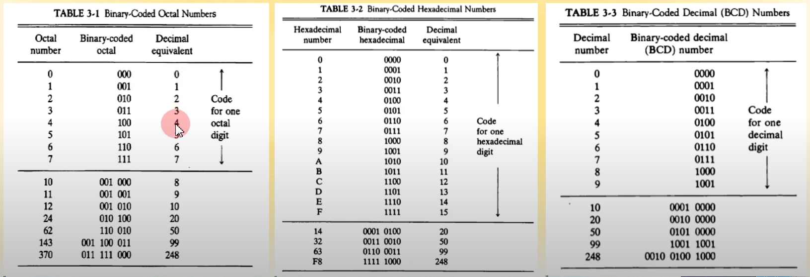

## 데이터의 표현

---

- 데이터의 종류
- 보수
- 고정 소수점 표현
- 부동 소수점 표현
- 기타 이진 코드
- 에러 검출 코드

---

***레지스터 설명**

---

1. **데이터의 종류**
   - **컴퓨터 레지스터에서 쓰이는 데이터의 종류** (컴퓨터 CPU 내의 레지스터에 저장되는 데이터의 종류)
     - 산술 연산용 숫자 (Numeric)
     - 데이터 처리용 영문자 (Alpha)
     - 특수 목적용 기호 (Special)
   - 
   - 
   - 8진수의 경우 3칸씩, 16진수의 경우 4칸씩 끊어서 보면 됨(2^3, 2^4)
   - 2진화 8진수
   - 2진화 16진수
   - 2진화 10진수 (BCD)
   - 
   - ex) 2진화 8진수
     - 3개의 칸을 기준으로 2진수 작성
     - 3개의 칸을 하나의 블럭으로 잡으면, 하나의 블럭당 0~7까지의 수를 표현 가능
     - 그 다음 숫자는? 자릿수가 증가하였으므로 새 블럭을 써줌
     - 그냥 이진수로 쭉 쓰는데 끊는 단위만 다르다고 보면 될듯?
     - octal number는 각 블럭 단위로 세서 합쳐주면 되는 것 같음 (001 000의 경우 10, 111 010의 경우 72)
   - 영숫자(AlphaNumeric)의 표시
     - **ASCII Code: 7bits (+1 parity bit)**
     - 
     - A -> 100 0001
     - 위의 표를 외우라고 한다...
     - **EBCDIC: 16bits, IBM internal code**
     - **UniCode: 16bits/32bits** (7bit의 ASCII code를 확장한 것)
     - 
       - ASCII code랑 비슷. 앞에 몇 칸 더 붙여주는게 끝임(영문, 숫자 이외의 문자를 표현하기 위해)
2. **보수**
   - 진법의 기수 r(몇진수인가?)에 대응하는 역 값
   - 뺄셈과 논리 계산에 사용
   - **(r-1)의 보수 체계**
     - 9's complement 99999 - 12389 = 87610 **(12389에 해당하는 9의 보수는? 12389 각 자릿수에 해당하는 부분의 최댓값(각 자리당 9)에서 원래의 수를 빼면 됨)** 10진수로 표현된 수에 대한 9의 보수
     - 1's complement 1111111 - 0001111 = 1110000 (0인건 1로, 1인건 0으로) 2진수로 표현된 수에 대한 1의 보수
   - **(r)의 보수 체계**
     - 10's complement 100000 - 12389 = 87911 **(앞서 구한 r-1보수(9의보수) + 1값이 됨)**
     - 2's complement 10000000 - 0001111 = 1110001 **(1의 보수에서 1 증가)**
   - **2진수의 뺄셈**
     - X - Y -> X + (Y의 2에대한 보수)
     - ex) X: 1010100, Y의 2에대한 보수: 0111101
     - ans: 1010100 + 0111101 = 10010001
     - 10010001 - 10000000 = 0010001 -> ans (자릿수 넘어가는건 무시)