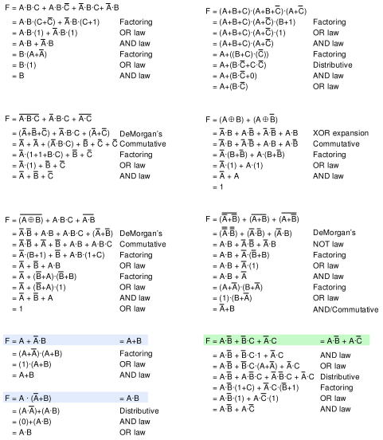
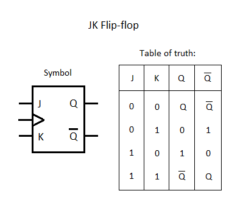

영상: [CSA2021 컴퓨터시스템구조](https://www.youtube.com/playlist?list=PLc8fQ-m7b1hCHTT7VH2oo0Ng7Et096dYc)

## 강의 소개
- 컴퓨터 공학의 3축(3개 다 잘해야함, 서로 간의 연관관계가 75퍼센트 이상)
  - 프로그래밍 랭귀지
  - OS
  - 컴퓨터 아키텍처(컴구)

- 메인보드 디자인, CPU 디자인, part 디자인, **설계 능력**에 매우 중요한 과목

## [제 1장 Part-1](https://www.youtube.com/watch?v=SG89LOgT7Vc&list=PLc8fQ-m7b1hCHTT7VH2oo0Ng7Et096dYc&index=2)

### 디지털 컴퓨터(Digitial Computer)

- 정의
  - 이진 시스템(0, 1)을 사용해 계산을 수행하는 디지털 시스템
  - 비트의 그룹을 사용해 숫자, 문자 및 기타 정보를 표시하거나 처리

- 컴퓨터 하드웨어
  - CPU - 중앙처리장치, 컴퓨터 그 자체, 산술 논리 처리와 데이터의 저장, 제어 기능 수행
  - 주변장치 - 메모리, 저장 장치, 입출력 장치

- 컴퓨터 소프트웨어
  - 운영체제(OS)
  - 시스템프로그램(유틸리티, 데이터베이스, Editor, OS에 포함되거나 연결되어 시스템 운영을 보조)
  - 응용프로그램

- 

### 논리 게이트(Logic Gates)
- 이진 정보의 표시
  - 0과 1의 전압 신호
  - 0v , 5v 시스템
  - 0.5, 3v 시스템

- 논리게이트
  - 기본 게이트
  - 진리표로 동작 정의

- 

### [부울 대수(Boolean Algebra)](/이산-수학/명제,추론,귀납,부울대수/부울-대수.md)

- 이진 변수와 논리 동작을 취급하는 대수
- 기본 대수 동작 : and, or, not
- 부울 대수의 예 F = x  + y'z
- 
- 
- 

- 사용 이유
  - 변수 사이의 진리표 관계를 대수적으로 표시
  - 논리도의 입출력 관계를 대수 형식을 표시
  - 같은 기능을 가진 더 간단한 회로 발견
- 부울 대수의 기본 관계
  - 항등원
  - 역원
  - 교환 법칙
  - 결합법칙
  - 드모르간 법칙
- 

### 맵의 간소화 (Karnaugh Map)
- [4강 동치 관계](/이산-수학/이산수학-기초/동치-관계.md)
- 맵 방식의 불 대수 간소화
  - visual diagram
  - 카르노맵
  - Minterm, Maxterm응 이용한 간소화
  - https://blastic.tistory.com/180

- 책으로 공부하기

## [제 1장 Part-2](https://www.youtube.com/watch?v=gn5z3Un_qqM&list=PLc8fQ-m7b1hCHTT7VH2oo0Ng7Et096dYc&index=3)

### 조합회로 (Combinational Circuit)
- 정의
  - 입력과 출력을 가진 논리 게이트의 집합
  - 출력의 값은 입력의 0,1의 조합에 의하여 결정되는 함수의 결과로 표시
  - n개의 입력 조합이 있을 경우 가능한 입력 조합 : 2^n가지

- 설계절차
  - 해결할 문제의 제시
  - 입력과 출력의 변수에 문자 기호 부여
  - 입력-출력 관계를 정의하는 진리표 도출
  - 각 출력에 대한 간소화된 부울 함수 도출
  - 부울 함수에 대한 논리도 작성
  - 논리도를 바탕으로 회로 구현

- 조합 회로의 예
  - 반가산기(half adder)
    - 2개의 비트값을 산술적으로 가산
    - 

  - 전가산기(Full adder)
    - 캐리값을 포함하여 3비트 가산
    - 
    - 
    - 

### 플립플롭 (Flip-Flop)
- 정의
  - 1비트의 디지털 정보를 저장하는 이진 셀(디지털 메모리)
  - 동기식 순차회로의 기본적인 요소로 사용, 조합회로와 함께 순차회로를 구성
  - 입력의 상태가 변화를 일으키키 전까지는 이전의 출력 상태를 그대로 유지

- 종류 - SR, D, JK, T
  - 
  - 
  - 
  - 
  - 모서리 변이형 플립플롭(Edge-triggered FF)
    - 입력값의 변화 모서리에서만 동작
      - Upward triggered FF
        - 입력값이 상향일 경우에만 동작(0 -> 1)
        - 

      - Downward triggered ff
        - 입력값이 하향일 경우에만 동작(1 -> 0)
        - 

    - 올바른 동작을 위해서는 최소의 신호 유지 시간 필요
      - Setup time
        - 출력 변화를 위하여 입력이 유지되어야 하는 최소 시간
        - 0.4 ms 정도

      - Hold time
        - 출력 유지를 위하여 입력이 바뀌지 않아야 하는 최소 시간
        - 출력이 바뀌고 나서도 hold time보다 적은 시간 안에 바껴버리면 안됨

### 순차회로 (Sequential Circuit)
- 정의
  - 플립플롭과 게이트 (또는 조합회로)를 서로 연결한 회로
  - 클럭펄스에 의하여 동기화된 입력 순차에 의하여 제어
  - 출력은 외부 입력과 플립플롭의 현 상태의 함수로 표시
  - 
  - 외부입력과 플립플롭의 현 상태에 따라 출력이 변한다
- 플립플롭의 입력식
  - FF의 입력을 만들어내는 조합  회로 부분
  - 부울 수식에 의하여 표현
  - 상태표(State Table)
  - 상태도(State diagram).
  - 
  - 
  - 
- 2비트 2진 카운터의 설계
  - 상태표, 상태도 작성
  - 순차회로 여기표 작성
  - 플립플롭의 선택과 입력식 도출
  - 회로도 구현
  - 
  - 
  - 
  - 

