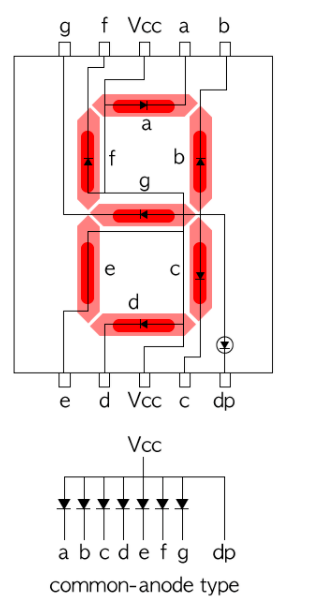
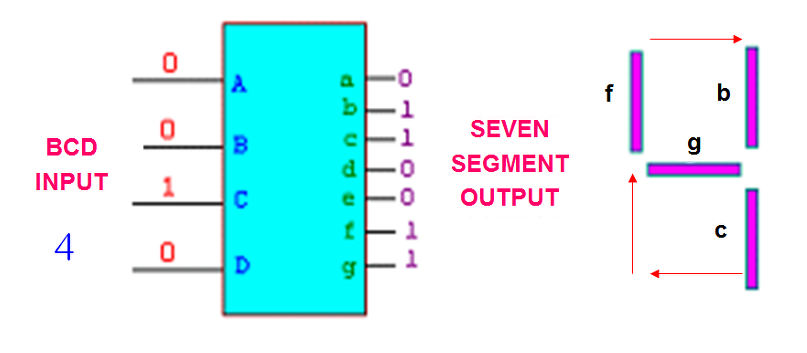
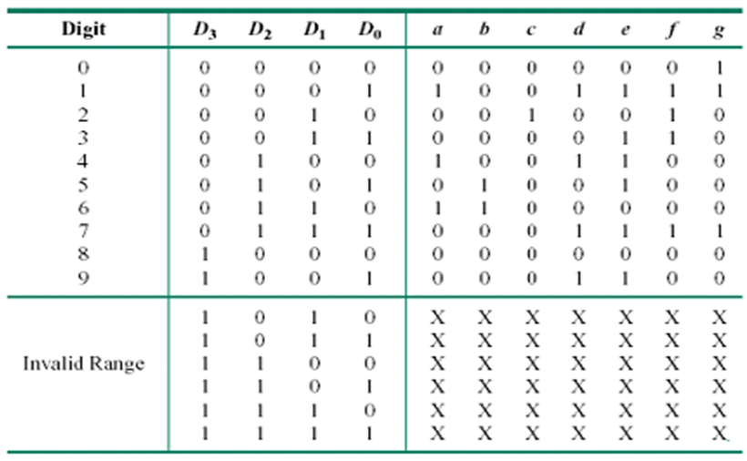
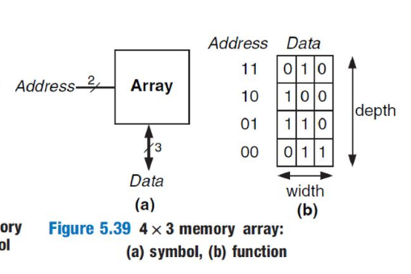
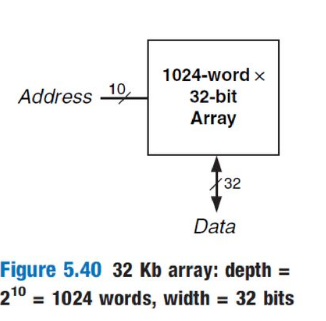
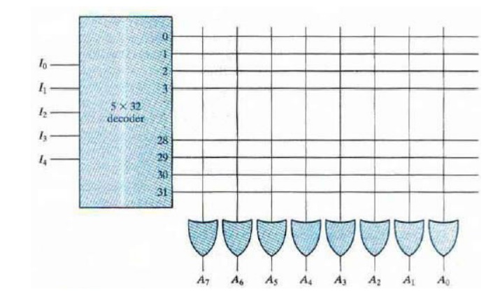

## [제 2장 Part-1](https://www.youtube.com/watch?v=aj74NlGUAk4&list=PLc8fQ-m7b1hCHTT7VH2oo0Ng7Et096dYc&index=4)

### 집적회로 (Integrated Circuits)

- 정의
  - 디지털 게이트를 구성하는 전자 부품을 포함하는 실리콘 반도체 칩(chip)
  - 칩 내부에 게이트들이 연결되고, 외부로도 연결
  - 칩의 등록 번호로 구분(dataBook을 통하여 정보 확인 가능)

- 집적 규모에 따른 분류
  - SSI(small scale intergration) 소규모, 10개 이하의 게이트들로 구성
  - MSI(Medium-scale intergration) 중규모, 10~200개의 게이트들로 디코더, 가산기, 레지스터 구현
  - LSI(Large-scale intergration) 대규모, 200~1000개의 게이트들로 프로세서나 메모리 칩과 같은 디지털 시스템 형성
  - VLSI(very-large-scale intergration), 초대규모, 수천개 이상의 게이트 집적, 대형 메모리나 마이크로컴퓨터 칩 구성

- 디지털 논리군
  - TTL: Transister-Transistor Logic, 일반 로직 회로 부품
  - ECL: Emiiter-Coupled Logic, 고속 논리 시스템용 부품(1~2ns 이하), 슈퍼컴퓨터용
  - MOS: Metal Oxide Semi. , 고밀도 집적회로용 부품
  - CMOS: Complement MOS, 고밀도 회로, 단순한 제조공정, 저전력 특성

### 디코더 (Decoders)

- N 비트의 이진 정보를 서로 다른 2^N 개의 원소 정보로 출력
- 적은 수의 입력 단자로 수많은 표현
- 
- 
- 
- 입력 포트의 최소화

- 2개의 입력 -> 4가지 출력: 2x4 decoder
- 3개의 입력 -> 8가지 출력: 3x8 decoder
- 
- 8개의 기계 중에 하나만 켠다
- NAND 게이트로 이루어진 디코더
  - 보수화된 출력이 더 경제적임
  - 대부분의 출력신호가 1로 유지
  - 내가 고른거만 0으로 되는게 좋음 -> 왜냐하면 cmos는 기본이 1이고 전압을 줘야 0이됨 -> 그래서 보수화된 출력이 좋음 (11111011), 전력 때매
  - 
  - CMOS 회로의 영향으로 저전력 회로에 유리
- 인코더
  - 디코더와 반대 동작 수행
  - ex) 컴퓨터가 읽을 수 있게 2진수로 바꿔줄 때 1번버튼은 001로 7번 버튼은 111로 읽도록
  - 2^n 입력에 대하여 N 이진 코드 출력
  - 한번에 하나의 입력만이 1의 값을 가질 수 있다.
  - 

### 멀티플렉서 (Multiplexers)

- 정의
  - N개의 선택 입력에 따라서 2^n 개의 출력을 하나의 출력에 선택적으로 연결
  - 입력을 여러개 받는데 그 중에 입력받을 내용을 선택하는 것
  - 다중 입력 중 하나를 선택하여 출력으로 연결
  - 네트워크 스위치(전화, LAN, WAN)의 기본 구조 요소
  - 
  - 

### 레지스터 (Registers)

- 구성
  - N비트 레지스터: N비트의 이진 정보 저장
  - N개의 플립플롭과 조합회로로 구성
- 추가내용
  - 한 번에 여러비트를 읽고 쓸 수 있는 능력
  - 메모리 주소방식과 비슷하게 어드레스를 사용해서 특정 레지스터를 선택할 수 있음
  - 다양한 용도의 레지스터가 있고, cpu에 레지스터는 데이터를 일시적으로 저장하는 공간이라 보면됨

- 기본 레지스터
  - 클럭펄스 타이밍에 입력값이 레지스터에 저장
  - 레지스터에 저장된 값은 항상 출력에서 참조 가능
  - Clear, Clock(wrtie) 입력 제공
  - 
- 병렬로드 가능한 4비트 레지스터
  - 4비트의 데이터를 동시에 입력 가능
  - Load, Clock 입력 제공
  - Load가 1일 때만 저장이 가능
  - clear는 생략되어있음(그림에서)
  - 

## [제 2장 Part-2](https://www.youtube.com/watch?v=7VPjQMeiHg0&list=PLc8fQ-m7b1hCHTT7VH2oo0Ng7Et096dYc&index=5)

### 시프트 레지스터 (Shift Registers)

- 정의
  - 레지스터에 저장된 이진 정보를 단방향/양방향으로 이동 가능한 레지스터
  - 각 FF들의 입력이 출력과 cascade로 연결
  - 공통의 clock이 다음 상태로의 이동 제어
  - shift right
  - 
  - 
  
- 병렬로드를 가지는 양방향 시프트 레지스터(General Register)
  - 병렬로드, 왼쪽/오른쪽 시프트, 병렬출력 기능
  - 동기화된 clock에 의하여 동작
  - 범용 레지스터를 지칭
  - 
  - 

### 이진 카운터 (Binary Counters)

- 정해진 순서대로 상태 변이 수행
- Clock, 또는 외부 입력에 따른 상태 변이
- 용도
  - 사건의 발생 횟수 카운트
  - 동작 순서 제어 타이밍 신호 발생에 적용

- 

- 병렬입력을 가진 이진 카운터
  - 카운터의 초기값 설정 가능
  - 병렬 입력을 통하여 초기값 로드
  - Load, Clear, Increment 기능
  - 
  - 

### 메모리 장치 (Memory Unit)

- 정의
  - 정보의 입출력 기능을 가지는 저장 요소들의 집합
  - Word 단위로 정보를 저장
  - Word : 입출력에서 하나의 단위로 취급되는 비트의 그룹
    - 16bit 컴퓨터: 레지스터/메모리 버스의 크기가 16bit(2byte)
    - 64bit 컴퓨터: 레지스터/메모리 버스의 크기가 64bit(8byte)
  - Byte : 워드의 기본 단위
  - MB(10^6byte), GB(10^9byte), PB(10^12byte)
- RAM(Random Access Memory)
  - Word의 물리적인 위치에 관계없이 데이터 접근
  - 모든 데이터 위치에 대하여 동일한 접근 시간
  - N 비트의 입력/ 출력(word 크기와 동일)
  - K개의 주소 라인으로 2^k개 word 중 하나를 선택
  - 읽기/쓰기 지정(R/W)
  - 
    - 2주소 비트와 3데이터 비트로 구성된 메모리 배열, 2주소 비트는 배열에서 4행 중 하나를 지시한다. 각 데이터 워드는 3비트 폭이다. 배열의 깊이(4)는 행의 수이고 폭은 열의 수로서 워드 크기라고 한다. 배열의 크기는 깊이 * 폭으로 주어진다. 따라서 위의 그림은 4워드 * 3비트 배열 또는 4 * 3 배열이라고 한다.
  - 
  - 5.40은 1024워드(10비트 Address로 1024 words 구분가능) * 32비트(워드 크기) 배열
  - 
  - **32비트와 64비트의 가장 큰 차이는 메모리 인식 용량**이다. 즉, 메모리를 인식해서 처리할 수 있는 양이 서로 다르다. 좀 더 쉽게 말하면 한번에 몇 비트를 처리할 수 있느냐이다. 물론 숫자가 더 큰 64비트가 메모리를 더 많이 처리할 수 있다. 1비트로 나타낼 수 있는 숫자는 0, 1로 두개이므로, 32비트로 나타낼 수 있는 숫자의 갯수는 2의 32승으로 4,294,967,296개다. 따라서 32비트는 주소공간으로 4,294,967,296개를 사용할 수 있는데, 주소 공간 하나당 1Byte이므로 2^32B = 4(2^30)B = 4GB의 메모리를 한번에 인식해서 처리한다. 
  - 반면 64비트로는 2의 64승은 (2^4)(2^60)B = 16EB로 4GB와는 비교할 수 없을 정도로 큰 메모리 인식 용량을 가진다. (이론상 수치와 실제적 수치는 차이가 있다고는 하지만.. ) 아무튼 32비트 운영체제보다는 64비트 운영체제가 한번에 많은 메모리를 인식하기에 좀 더 빠르게 일을 처리할 수 있는 것이다. 
- ROM(Read Only Memory)
  - 한 번 저장된 데이터를 읽기만 가능
  - 1 word가 N비트이고 M워드를 저장하는M * N ROM
  - ROM에 저장된 M word를 접근할 수 있는 K개의 주소입력 (2^k = M)
    - n개 입력변수로 가질 수 있는 주소의 수 2 ^ n
  - 
  - 
    - 인풋이 5비트 -> 32개의 워드, 출력이 8비트 -> 1워드의 크기가 8비트
    - --> 32(워드의 수) X 8(1워드의 크기) ROM
- ROM의 종류
  - Mask Rom: Lithography 방식으로 구워져 나오는 ROM
  - PROM : 한번만 프로그램 가능
  - EPROM : UV에 의한 데이터 삭제 (ROM 초기화) 및 재프로그래밍 가능
  - EEPROM : 전기 신호에 의한 데이터 삭제/초기화 및 재프로그래밍
- ROM의 기능을 하는 RAM
  - Flash-RAM : BIOS, USB memory, SD card
  - NV-RAM
    - Non-Volatile RAM
    - Battery Backup RAM

