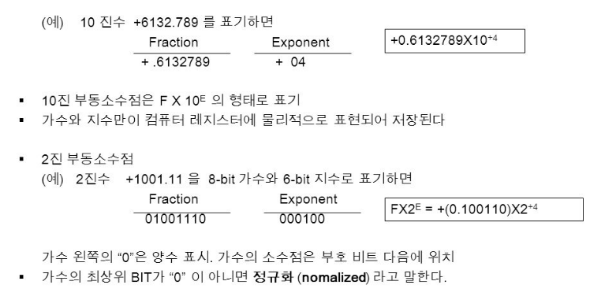

## [제 3장 Part-1](https://www.youtube.com/watch?v=aSocCv3SC2k&list=PLc8fQ-m7b1hCHTT7VH2oo0Ng7Et096dYc&index=6)

### 데이터의 종류 (Data Types)

- 컴퓨터 레지스터에서 쓰이는 데이터의 종류
  - 산술 연산용 숫자(Numeric)
  - 데이터 처리용 영문자(Alpha)
  - 특수 목적용 기호(Special)

- 진수와 진법
  - radix : 진법의 기수에 해당(10, 2, 8, 16---)
  - 10진수
    - 724.5 = 7 x 10^2 + 2 x 10^1 + 4 x 10^0 + 5 x 10^-1

  - 2진수
    - 101101 = 1 x 2^5 + 0 x 2^4 + 1 x 2^3 + 1 x 2^2 + 0 x 2^1 + 1x2^0 = 45

  - 8진수
    - 734.6 = 7 x 8^2 + 3 x 8^1 + 6 x 8^0 + 4 x 8^-1 = 478.5

  - 16진수
    - F3 = F x 16^1 + 3 x 16^0  = 243

- 
- 
- 2진화 8진수(Octal)

- 
- 2진화 16진수(Hexadecimal)
  - 
- 2진화 10진수(BCD: binary Code Decimal)
  - 
- 영숫자(AlphaNumeric)의 표시
  - ASCII Code : 7bits (+1 parity bit),
  - 'A' -> 100 0001
  - 
  - EBCDIC Code : 16bits, IBM internal code
  - UniCode: 16bits/32bits
  - 
  - 
- Special Communication Data
  - Morse Code
    - 
  - Flag signal(red/white flags)
    - 

### 보수 (Complements)

- 정의
  - 진법의 기수 r에 대응하는 역(reverse) 값
  - 뺄셈과 논리 계산에 사용

- (r-1)의 보수 체계
  - 9's complement 99999 - 12389 = 87610
  - 1's complement 1111111 - 0001111 = 1110000

- (r)의 보수 체계
  - 10's complement 100000 - 12389 = 87611
  - 2's complement 100000000 - 0001111 = 1110001

- 부호 없는 숫자의 뺄셈
  - 

## [제 3장 Part-2](https://www.youtube.com/watch?v=bysGzutpRgc&list=PLc8fQ-m7b1hCHTT7VH2oo0Ng7Et096dYc&index=7)

### 고정 소수점 표현 (Fixed Point Representation)

- 정의
  - 소수점의 위치를 결정하여 숫자 표현
  - 레지스터 비트에 소수점 위치를 표시
    - 

  - **16bit 정수의 경우** 최우측(LSB)에 소수점 자리 위치(소수자리가 없다는 뜻)
  - 보통 고정 소수점은 정수표현에 많이 쓰임
  - 부동소수점의 경우, 레지스터 비트 앞/중간에 소수점 자리 위치

- 정수의 표현(-14)
  - **MSB(Most Significant Bit)로 부호 표현**
  - **양수는 MSB -> 0, 음수는 MSB -> 1**
  - 부호 절대값 표현(Signed magnitude) 1 0001110
  - 부호화된 1의 보수(signed 1's complement) 1 1110001
  - **부호화된 2의 보수(signed 2's complement)** 1 1110010
    - 대부분의 컴퓨터, CPU에서 사용

- 산술 가산(Arithmetic add)
  - 

- 산술 감산(Arithmetic substract)
  - 

- 오버플로우(Overflow)의 발생
  - N자리의 두 수를 더하여 N+1자리의 합이 발생하였을 때
  - 가수, 피가수의 부호와 관계없이 발생
  - 정해진 레지스터의 비트수로 인한 문제
    - 종이와 연필로 연산할 경우 절대 발생되지 않을 상황
    - 정해진 비트수 내에서만 연산이 가능한 컴퓨터에서 발생

- 오버플로우 발생 상황
  - 연산 결과값이 레지스터의 비트수를 초과할 경우 발생
  - 두 수의 부호가 같을 경우에만 발생
  - 레지스터에 저장된 연산 결과값은 잘못된 값으로 저장

- 오버플로우 처리 방법
  - 오버플로우 발생을 미리 확인
    - MSB의 두 캐리 비트의 값이 서로 다르면 오버플로우
    - if C_8 xor C_7 = 1, Overflow occurs

  - 연산을 처리하지 않고 인터럽트 또는 에러 처리
  - 
  - https://stackoverflow.com/questions/23990071/sign-carry-and-overflow-flag-assembly

### 부동 소수점 표현 (Floating Point Representation)

- 부동소수점 표시방법(IEEE 754)
  - 가수와 지수로 표현
  - 가수(mantissa) : 분수(Fraction), 정수값 표시
  - 지수(Component) : 십진/이진 소수점 위치를 표시
  - 
    - 0 10000100 (1)0011100000000000000000000 (32bit FP)
    - fraction **1**001110에서 실제로 표현할때 맨 왼쪽 1은 제외한다.(왜냐면 항상 1이니까 고려할필요가 없고) 한 자리를 줄임으로써 더 많은 수를 표현할 수 있는 장점이 있다.

  - 음의 지수 표현위해 바이어스된 지수 사용
  - 

- 정규화(Normalization)
  - 부동소수점 숫자에서 최상위 비트가 0이 아닌 경우
  - 0이 있을 경우, Mantissa의 소수점 위치 이동
  - 이동한 만큼 exponent의 값 변경
  - half precision(16bit), half
  - 
  - single precision(32bit), float
  - 
  - double, double precision
  - 
  - bit수가 클수록 더 정밀하다(double이 더 정밀)
  - 소수점 아래 자리수가 적으면 double쓸 필요없다(메모리 낭비다이)

### 기타 이진 코드 (Other Binary Codes)

- Grey Code
  - 한 숫자에서 다음 숫자로 변할 때 한 비트만 변동
  - 제어 계통에 주로 사용
  - 여러 전기 신호가 동시에 바뀔 때 낮은 에러 발생률
  - 

- BCD Code
  - 10진수에 대한 2진수 표현(i.e 8421 code)
  - 4bit를 사용 0~9까지 사용(0000~1001)

- Excess-3 Code
  - BCD Code + 0011
  - 암호 교신의 기본 코드, 파생 암호 발생 방법에 사용
  - 

- 기타 영문 code
  - ASCII : 7bits + parity 1bit
  - EBCDIC : 8bits + parity 1bit

### 에러 검출 코드 (Error Detection Codes)

- Parity bit
  - 외부 잡음에 의한 에러 발생의 검출
  - 짝수(even) 패리티/홀수(odd) 패리티 사용
  - 가장 간단하고도 일반적인 방법
  - 2개의 비트 동시 에러의 경우 검출 불가능
- Parity bit의 적용
  - 송신측 : 패리티 발생기
  - 수신측 : 패리티 검사기
  - 수신측 패리티 검사 결과
    - 데이터 패리티와 일치 -> 에러 없음(0 출력)
    - 데이터 패리티와 불일치 -> 에러 발생(1출력)
- 0의 개수가 홀수개면 1, 0의 개수가 짝수개면 1(odd 기준)
- 
- 
- 