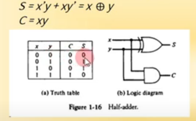
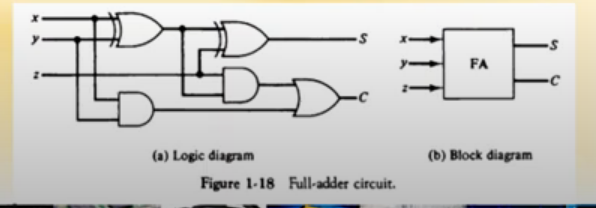
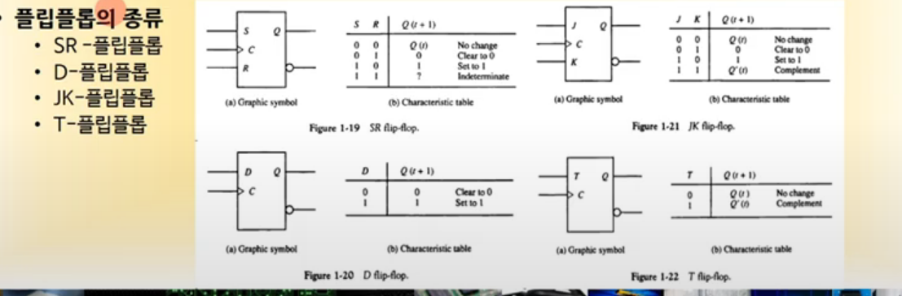
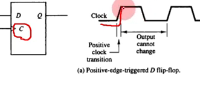
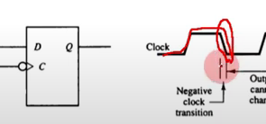
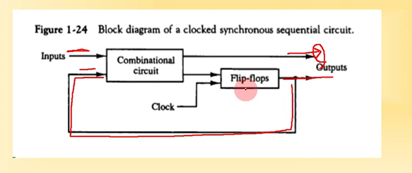
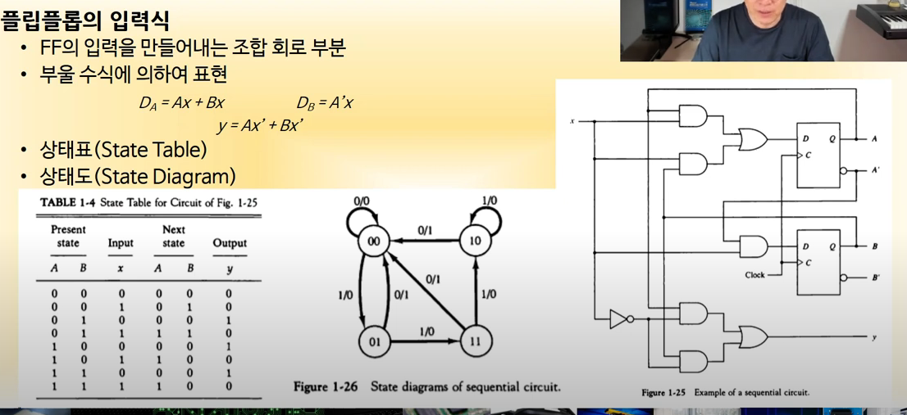
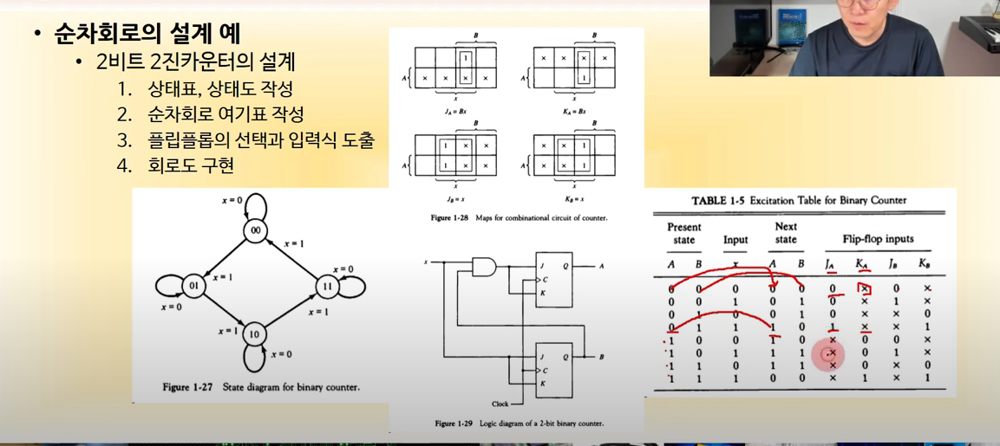

# 조합회로

- 입력과 출력을 가진 논리 게이트의 집합

## 조합 회로 설계 절차

1. 해결할 문제의 제시
2. 입력과 출력의 변수에 문자 기호 부여
3. 입력-출력 관계를 정의하는 진리표 도출
4. 각 출력에 대한 간소화된 부울 함수 도출
5. 부울 함수에 대한 논리도 작성
6. 논리도를 바탕으로 회로 구현

- 반 가산기  

- 전 가산기 

  반 가산기 두개를 합쳐 3비트 가산 가능

## 플립플롭

- 1 비트의 디지털 정보를 저장하는 이진 셀
- 입력의 상태가 변화를 일으키기 전까지는 이전 출력 상태를 그대로 유지

### 플립플롭의 종류

- 
- 클럭에 동기화(클럭에 의해 Q 값이 변함)
- SR : S, R 이 1이면 다음 랜덤박스
- D : 입력 그대로
- JK : J, K 가 1이면 Q'
- T : 1 입력시 Q'

### 플립플롭 동작 방식

- 모서리-변이형 플립플롭

  1. 상향 모서리 트리거

     

  2. 하향 모서리 트리거

     

- 올바른 동작을 위해선 최소의 신호 유지 시간 필요 (전자공학이 알아서 해줌)
  - setup time : 출력을 변화시키기 위해 D 입력이 유지되는 최소 시간
  - hold time : 출력을 유지하기 위해 D 입력이 유지되는 최소 시간

# 순차 회로

- 플립플롭과 게이트를 서로 연결한 회로

- 입력이 무엇이 들어왔나도 중요하지만 플립플롭이 있기 때문에 입력 순서 또한 중요함

  

## 플립플롭의 입력 식

- 부울 수식에 의하여 표현

## 순차 회로 설계

1. 상태표, 상태도 작성
2. 순차회로 여기표 작성
3. 플립플롭의 선택과 입력식 도출
4. 회로도 구현

2진 카운터 설계

