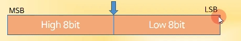
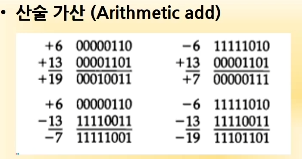
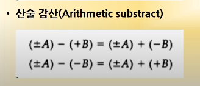
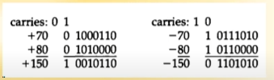
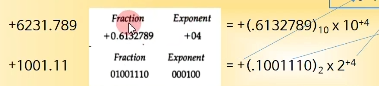
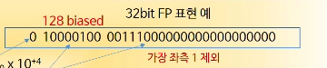
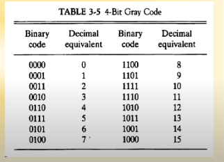
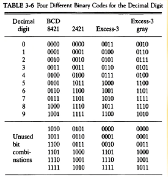
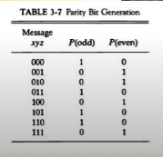

### 고정 소수점 표현

> 정수

- 소수점의 위치를 결정하여 숫자를 표현
- 레지스터 비트에 소수점 위치를 표시함
- 16bit 정수의 경우 최우측(LSB)에 소수점 자리 위치
  - LSB : Least Significant Bit
  - MSB : Most Significant Bit
- 부동 소수점의 경우, 레지스터 비트의 앞 또는 중간에 소수점 자리 위치

#### 정수의 표현 (ex:-14)

- MSB로 부호 표현
- 양수는 MSB = 0, 음수는 MSB = 1
- 표현 방식
  1. 부호 절대값 표현 => 1 0001110
  2. 부호화된 1의 보수 => 1 1110001
  3. 부호화된 2의 보수 => 1 1110010
- 대부분의 컴퓨터, CPU에서는 부호화된 2의 보수 방법을 사용한다

​	

​	

### 오버플로우(Overflow)

- N자리의 두 수를 더하여 N+1자리의 합이 발생하였을 때, 다른 값이 출력되는 것
- 표현할 수 있는 bit의 개수가 제한되어있기 때문에 발생하는 현상
- 가수, 피가수의 부호와 관계없이 발생

#### 오버플로우 발생 상황

- 연산 결과 값이 레지스터의 비트수를 초과할 경우

- 두 수의 __부호가 같을__ 경우에 발생할 수도 있음
  - 부호가 같다고 해서 무조건 발생하는건 아님

​	

#### 오버플로우 처리 방법

- 오버플로우의 발생을 미리 확인
  - MSB의 두 캐리 비트 값이 서로 다르면 오버플로우
  - If C8 XOR C7 = 1, Overflow occurs
  - C8 : 부호의 합으로 인한 캐리값
  - C7 : 수의 가장 맨 왼쪽 비트 값의 캐리값
- 오버플로우의 발생을 확인 했다면, 연산처리를 하지 않게하여 에러 처리한다

### 부동 소수점 표현

> IEEE 754

- 가수와 지수로 표현
- 가수(mantissa) : 분수(Fraction), 정수값 표시
- 지수(Component) : 십진/이진 소수점 위치를 표시
  - Exponent == Component같음

​	

#### 32Bit Floating Point 표현 예시

​	

- 가장 맨 왼쪽 비트 : +, - 부호 표시
- 8Bit : 지수 부분의 값
  - 128 biased : 2^8dms -128부터 128까지 표현 가능하지만, 0은 양수도 음수도 아니기 때문에
  - 128을 0으로 두고 값을 저장하는 것
  - 지수가 4일 경우 128이 0이므로 128 + 4된 132값을 저장해주는 방식이다
  - -1 : 127, -2 : 126, 1 : 129...
- 나머지 bit : 가수(mantissa) 부분의 값
  - 이동된 소수점의 다음 비트는 반드시 1이기 때문에 생략할 수 있고,
  - 생략된 비트 대신에 더많은 fraction을 가짐으로써 더 정밀한 값을 보유 가능하게 한다

### 정규화

- 부동 소수점 숫자에서 최상위 비트가 0이 아닌 경우
- 0이 있을 경우, Mantissa의 소수점 위치 이동
- 이동한 만큼 exponent의 값 변경
- 즉, 1234 를 0.1234*10^4로 표현하는 것

### 기타 이진 코드

- Grey Code
  - 한 숫자에서 다음 숫자로 변할 때 한 비트만 변동 ( 카르노맵에서 사용한 적 있음)
  - 제어 계통에 주로 사용
  - 여러 전기 신호가 동시에 바뀔 때 낮은 에러 발생률을 특징으로 가짐

​	

- BCD Code
  - 10진수에 대한 2진수 포현
  - 4bit를 사용하여 0~9까지 표현
  - 즉, 0을 0000, 9를 1001로 표현하여 숫자를 말한다는 뜻
- Excess-3 Code
  - BCD Code + 0011
  - 암호 교신의 기본이 되는 코드, 파생 암호 발생 방법에 사용

​	

- 기타 영문 code
  - ASCII
  - EBCDIC

### 에러 검출 코드

- Parity bit

  - 외부 잡음에 의한 에러 발생의 검출
  - 짝수(Even) 패리티 또는 홀수(Odd) 패리티 사용
  - 간단하고 일반적인 방법
  - 2개의 비트에서 동시 에러 발생의 경우 검출 불가능하다는 단점이 있다

- Parity bit의 적용

  - 송신측 : 패리티 발생기

    ​	

  - 수신측 : 패리티 검사기

  - 수신측 패리티 검사 결과

    1. 데이터 패리티와 일치 -> 에러 없음 (0 출력)
    2. 데이터 패리티와 불일치 -> 에러 발생  (1 출력)

- 보낼 당시 짝수 패리티를 쓸 것인지, 홀수 패리티를 쓸 것인지 합의 하고 사용함
- 즉 Message의 1의 개수를 구하고, 홀 짝 방식을 정한 뒤, 그 방식에 맞게 0 또는 1을 추가하여 보내는 것

