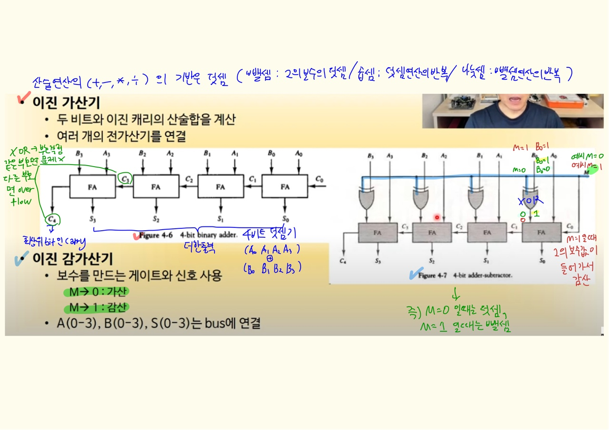

# 4장 레지스터 전송과 마이크로 연산

## 1. 레지스터 전송 언어

### 마이크로 연산

- 레지스터에 저장된 데이터를 가지고 실행
- 플립플롭을 구성하는 하나의 clock 시간 동안 실행되는 기본 동작(ex. shift, count, clear, load)

### 레지스터 전송 언어 

- 마이크로연산, 전송을 위해 사용하는 기호

### 레지스터 전송 언어 규칙

- 대문자로 표시 (MAR, MBR, AC, PC, DR...)
  - https://technote.kr/310
- 여러개의 플립플롭 → 레지스터 : 가장 왼쪽 FF 을 MSB, 가장 오른쪽 LSB
  - https://www.hackerschool.org/Sub_Html/HS_University/HardwareHacking/24.html

- 16비트 PC 레지스터 예시

  - 상위(8~15bit) : PC(H) → high register 
  - 하위(0~7bit) : PC(L) → low register

- 그림 4-1 

  

 

## 2. 레지스터 전송

## 3. 버스와 메모리 전송

<교수님 메인보드 자랑 타임>

- 메인보드에 있는 많은 선들은 대부분 bus임(회로나 부품들을 서로 데이터로 연결해주는 역할)
- 한번에 32비트나, 64비트의 데이터 수신이 이루어져서 복잡해 보이는 연결도 결국엔 하나의 BUS 라는 것

- 빨간색 표시된 칩셋 안에 (pci슬롯?) bus controller(MUX 집합)가 있음

> 좀더 간단한 버전의 버스

- 상황에 따라 3 state buffer 또는 mux를 적절하게 사용해서 컴퓨터 구조를 설계하면 됨

## 4. 산술 마이크로 연산

