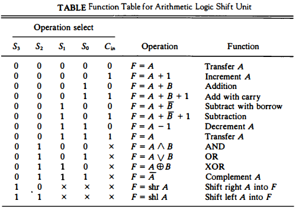

## [제 4장 Part-1](https://www.youtube.com/watch?v=LDjco5XJH1E&list=PLc8fQ-m7b1hCHTT7VH2oo0Ng7Et096dYc&index=8)

## 제 4장 - 레지스터 전송과 마이크로 연산

- 버스 - 데이터가 지나가는 통로의 집단
- https://upscfever.com/upsc-fever/en/gatecse/en-gatecse-chp153.html

### 레지스터 전송 언어 (Register Transfer Language)

- 마이크로연산(Micro-operation)
  - 레지스터에 저장된 데이터를 가지고 실행되는 동작
  - 하나의 clock 시간 동안 실행되는 기본 동작 (Shift, count, clear, load...)

- **레지스터전송언어**
  - **마이크로연산, 전송을 간단하고 명료하게 표시하기 위하여 사용하는 기호**
  - 디지털 컴퓨터의 내부 조직을 상세하게 나타내는 수단으로 사용
  - 디지털 시스템의 설계 편의성 제공

- 레지스터 전송 언어 규칙
  - 레지스터는 **대문자**로 표시 (MAR, MBR, AC, PC, DR...)
  - 레지스터 가장 왼쪽 FF -> MSB / 가장 오른쪽 FF -> LSB
  - 16비트 PC레지스터의 경우
    - 상위(8~15): PC(H), 상위 레지스터
    - 하위(0~7): PC(L), 하위 레지스터

  - 

### 레지스터 전송 (Register Transfer)

- 레지스터 정보 전송

  - 치환(replacement, 또는 전송) 연산자 사용
    - R2 <- R1

  - 제어 조건이 있을 경우,
    - if (P = 1) then (R2 <- R1)

  - 제어 함수로 표현할 경우,
    - P: R2 <- R1
      - C에서는 P? R2=0: R1=0

    - R2에는 t + 1 타이밍에 전송완료

  - 

- 레지스터 전송의 기본 기호

  - Register data **exchange**
    - T: R2 <- R1, R1 <- R2
  - MAR(Memory address Register)
  - 

### 버스와 메모리 전송 (Bus and Memory Transfers)

- 공통 버스(Common Bus)

  - 레지스터들 사이의 전송 통로

  - 여러 레지스터가 하나의 bus를 공동으로 이용함

  - 하지만, 한 동작에서 하나의 레지스터만 bus를 사용한다.

  - 한 번에 하나의 신호만 전송하도록 **제어**

  - **멀티플렉서를 사용하여 레지스터** 선택

  - (레지스터 전송문으로 표현 예)

    - BUS <- C, R1 <- BUS

      :EQ    R1 <- C

  - 
  - 
  - 메인보드에 보이는 선의 대부분이 버스다, CPU 내부에도 있고, 다른 칩셋안에도 있다

- 3-상태 버퍼(3-state buffer)

  - 멀티플렉서 대신 사용하여 버스 구성 가능
  - 3개의 상태로 종작
    - 논리 0, 논리 1 : 정상적인 버퍼로 동작
    - 고저항 상태(High-impedance) : 출력 차단
    - C가 0이면 비활성상태

  - 

- 메모리 전송

  - DR(Data register)
  - M[AR] 의미: memory[address]
  - Read: DR <- M[AR]
  - Write: M[AR] <- R1
  - 

## [제 4장 Part-2](https://www.youtube.com/watch?v=IUapFpDKhKI&list=PLc8fQ-m7b1hCHTT7VH2oo0Ng7Et096dYc&index=9)

### 산술 마이크로 연산 (Arithmetic Micro-operations)

- **마이크로 연산의 분류**
  - 레지스터 전송 마이크로 연산 : 레지스터간 이진 정보 전송
  - 산술 마이크로 연산 : 수치 데이터에 대한 산술 연산
  - 논리 마이크로 연산 : 비수치 데이터에 대한 **비트 조작** 연산
  - 시프트 마이크로 연산 : 데이터에 대한 시프트 연산
  - 

- 이진 가산기
  - 두 비트와 이진 캐리의 산술합을 계산
  - 여러 개의 전가산기를 연결
  - 

- 이진 감가산기
  - 보수를 만드는 게이트와 신호 사용
    - M -> 0 : 가산
    - M -> 1 : 감산

  - A(0-3), B(0-3), S(0-3) 는 bus에 연결
  - 

- 산술 회로
  - 4개의 전가산기
  - 4개의 멀티플렉서
  - 2개의 4비트 입력(A, B)
  - 1개의 출력(D)
  - 3개의 제어 라인(S_1, S_0, C_in)
  - 
  - 

### 논리 마이크로 연산 (Logic Micro-operations)

- 
- 
- 논리 마이크로연산의 하드웨어 구현(1비트 기준)
  - 아래의 4가지 operation만 있으면 위의 16개를 구현할 수 있다.
  - 

### 시프트 마이크로 연산 (Shift Micro-operations)

- 논리 시프트
  - 직렬 입력으로 **0이 전송**(빈 자리에 0이 채워짐)
    - R1 <- shl(R1)
    - R2 <- shr(R2)

- 순환 시프트
  - 직렬 출력이 직렬 입력으로 전송
  - shift right 기준 R0비트가 R_n-1 비트에 채워짐
  - cir, cil

- 산술 시프트
  - 부호 비트를 제외하고 시프트
  - 왼쪽 시프트 : x2
  - 오른쪽시프트 : /2
  - 
  - 

- 4비트 조합회로 시프터
  - 

### 산술 논리 시프트 장치 (Arthmetic-Logic Shift Unit)

- 산술 회로 + 논리 회로 + 시프터

- 
- 1비트 기준, 4비트 만들려면 아래 꺼가 4개 필요함
- 