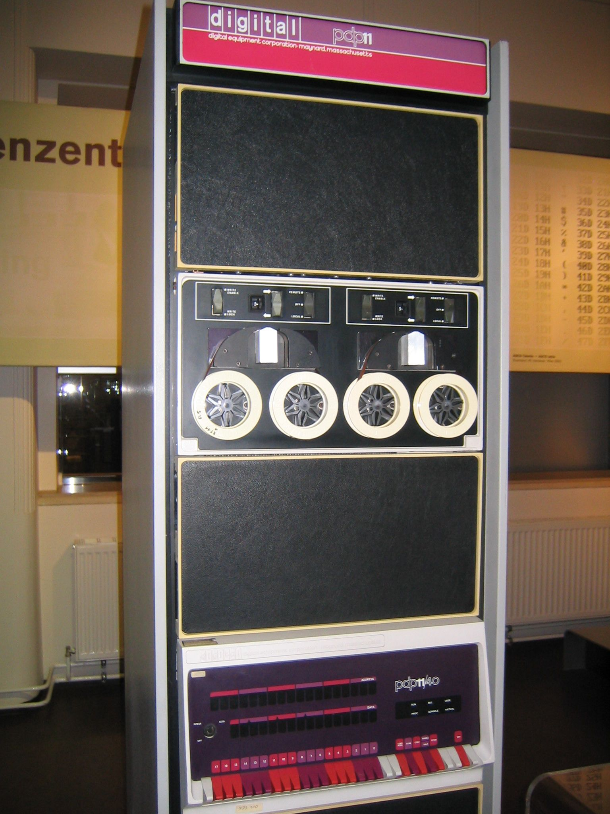

## [제 5장 Part-1-1](https://www.youtube.com/watch?v=vSnpYzCuwVY&list=PLc8fQ-m7b1hCHTT7VH2oo0Ng7Et096dYc&index=10)

## 제 5장 기본 컴퓨터의 구조와 설계

### 기본 컴퓨터(Basic Computer)

- DEC. Corp 사의 중형 컴퓨터 PDP-11을 지 칭
  - 이후 VAX-11 등의 주요 minicomputer의 기본 (1970~1980년대)
- 컴퓨터 구조 설계의 가장 기본적인 부분
- 현대의 cpu들에도 동일하게 적용되는 설계 구조
- 
- 
- 

### 명령어 코드 (Instruction Codes)

- 컴퓨터의 동작
  - 레지스터 내에 저장된 데이터에 대한 마이크로 연산의 시퀀스에 의하여 정의
  - 범용 컴퓨터 시스템에서는 다양한 마이크로 연산 시퀀스를 정의

- 명령어 코드
  - 컴퓨터에게 어떤 특별한 동작을 수행할 것을 알리는 비트들의 집합
  - 연산 코드들로 구성

- 컴퓨터 명령어
  - 컴퓨터에 대한 일련의 마이크로 연산을 기술
  - 이진 코드로 구성
  - 데이터와 함께 메모리에 저장

- 프로그램
  - 사용자가 원하는 연산과 피연산자가 처리되는 순서를 기술한 컴퓨터 명령어의 집합
  - 명령어 처리 과정을 제어

- 내장 프로그램
  - 제어 신호에 의하여 명령어의 이진 코드를 해석하여 실행
  - 명령어를 저장하여 실행하는 컴퓨터 구동 방식

------------------------------------------------------------------------------------------------------------------------------------------------

- 저장(내장) 프로그램 구조
  - 명령어의 집합으로 구성
  - 각 명령어는 명령어 포맷(Instruction format)에 따라서 정의
  - 프로그램 실행부분에 따라서 메모리의 다른 부분(segment)에 저장
  - 명령어 실행 결과는 AC에 저장
  - address가 (0~11, 12비트) -> 4k(4096)개의 address 구별 가능
  - 32비트 -> 4gb
  - 
    - stack segment(임시 data, heap)
- 간접주소(Indirect Address) 시스템
  - 많은 경우, 직접주소를 사용하여 데이터 지정
  - 필요한 경우, 간접주소로 데이터 지정
  - 
    - I 비트 0 -> 직접 주소 / I 비트 1 -> 간접 주소

### 컴퓨터 레지스터 (Computer Registers)

- 기본 컴퓨터의 레지스터
  - 기본 컴퓨터란?
    - DEC PDP-11 Mini Computer
    - 가상의 컴퓨터가 아닌 실제 제품
    - 1980년대 주력 메인프레임급
    - 최신의 CPU도 기본적으로 동일한 구조
  - 기본 컴퓨터 레지스터 종류
  - 
  - 

- 버스 시스템의 종류
  - 내부 버스
    - CPU(컴퓨터) 내부 레지스터간 연결

  - 외부 버스
    - CPU 내부 레지스터 - 메모리간 연결

  - 입출력 버스
    - CPU <- -> 주변장치 (I/O) 연결

- 공통 버스 시스템
  - 내부 버스를 통칭
  - 내부 버스의 크기(Width)로 CPU 워드 크기 결정
    - 16 bit 컴퓨터 - 내부 버스 / 레지스터 크기가 16bit
    - 32 bit 컴퓨터 - 내부 버스 / 레지스터 크기가 32bit

  - 전송 연결 통로
    - 레지스터 - 레지스터 데이터 전송 통로
    - 레지스터 - 메모리 데이터 전송 통로 (예외적 표현)
    - 한 순간에는 하나의 전송 신호만이 버스에 존개 가능
      - 2개 이상의 신호 발생시에는 버스 충돌(Collisions) 발생
      - 버스 제어기 (정확한 타이밍과 MUX 제어 수행)

  - 레지스터 출력은 버스의 MUX 입력에 연결
  - 각 레지스터에 MUX 입력번호 설정됨
  - 레지스터 입력은 버스에 직접 연결(LD로 제어)
  - S_2, S_1, S_0에 의하여 레지스터 출력 결정

- 버스의 동작
  - DR <- AC, AC <- DR
  - M[AR] <- DR
  - AR <- PC

- bus controller 가 사실상 mux랑 비슷함
- 들어갈 때는 load(LD)가 1인 레지스터에만 들어가게 해서 제어함
- 
  - MUX Inputs
    - 1: AR
    - 2: PC
    - 3: DR
    - 4: AC
    - 5: DR
    - 6: TR
    - 7: Memory

## [제 5장 Part-1-2](https://www.youtube.com/watch?v=T2oKxvinK84&list=PLc8fQ-m7b1hCHTT7VH2oo0Ng7Et096dYc&index=11)

### 컴퓨터 명령어 (Computer Instructions)

- 기본 컴퓨터 명령어의 종류
  - MRI 명령 7가지
  - RRI 명령 12가지
  - IO 명령 6가지

- 명령어 포맷
  - MRI (memory reference instruction) - 메인 메모리에 접근하는 명령
  - RRI (Register reference instruction) - 레지스터를 다루는 명령
  - IO (Input - output instruction) - 입력, 출력 동작을 수행하는 명령
  - 
  - 

### 타이밍과 제어 (Timing and Control)

- 명령어 실행 타이밍 예
  - D_3 T_4 : SC <- 0
  - T_4 : 타이밍 변수, sequence couter + decoder -> 16가지 타이밍 만들어냄
  - 
  - 
    - 타이밍 다이어그램

### 명령어 사이클 (Instruction Cycle)

- **명령어 사이클 단계**
  - 1. 메모리에서 명령어 가져오기(**Fetch**)
    2. 명령어 디코딩(**Decoding**)
    3. 유효주소(**Effective Address**) 계산(간접주소의 경우 주소필드에 있는 주소가 실제 주소가 아님
       그래서 주소필드로 갔을 때 들어있는 값이 실제 유효주소임)
    4. 명령어 실행(**Execution**)

- Fetch와 Decode
  - T_0 : AR <- PC (MUX 2 open, LD AR)
  - T_1 : IR <- M[AR], PC <- PC + 1 (Mux 7 open, LD IR)
  - T_2 : D_0 ... D_7 <- decode IR(12-14), 
    AR <- IR(0-11), I <- IR(15) (Mux 5 open, LD AR)
- 
- 
- 명령어의 종류 결정
  - MRI 명령어 여부
  - RRI 명령어 여부
  - IO 명령 결정

- 
- 레지스터 참조 명령어의 종류와 동작
  - 

### 메모리 참조 명령어 (Memory-Reference Instuctions)

- 메모리 참조 명령어의 종류와 동작
  - 
  - 
  - BSA
    - 함수, 서브루틴의 구현에 사용
    - 간접주소 사용의 전형적인 예
    - 
  - ISZ
    - Loop 제어문 구현에 사용(for, while...)
    - 
    - 첫 번째 AR은 비워져있음(135, 규칙임)
    - 
  - 제어 흐름
    - 
    - 명령어마다 필요한 타이밍 길이가 다름
