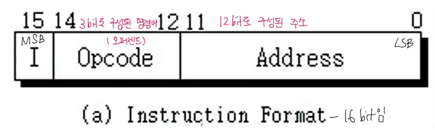
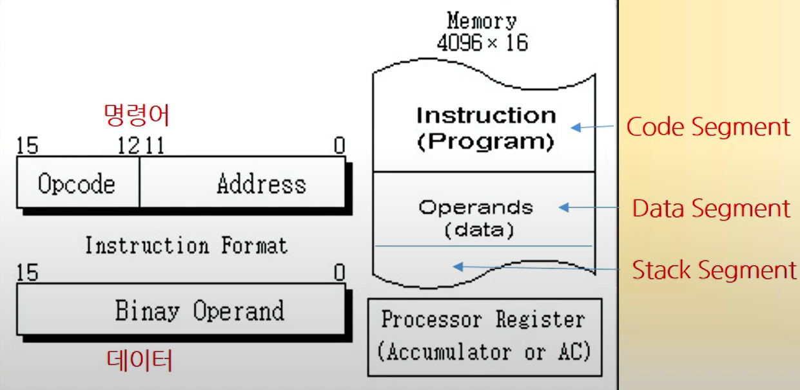
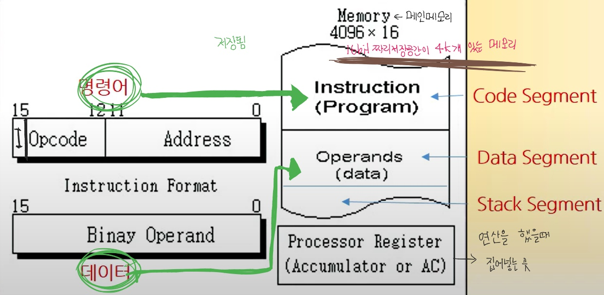
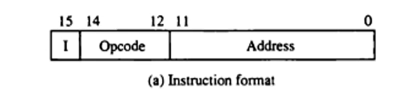
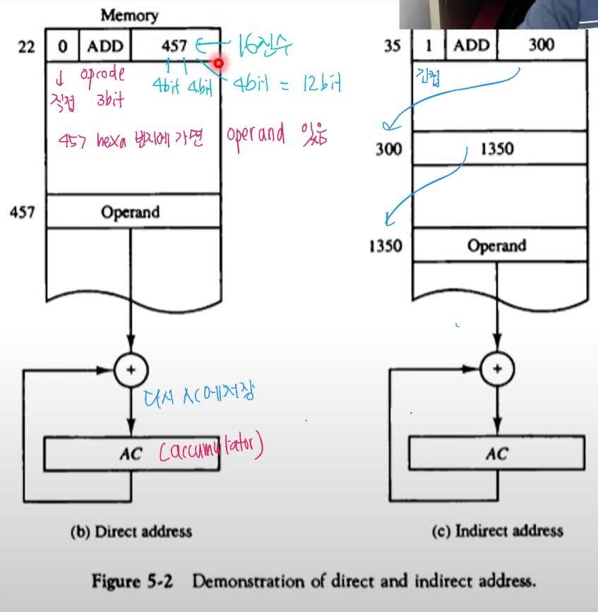
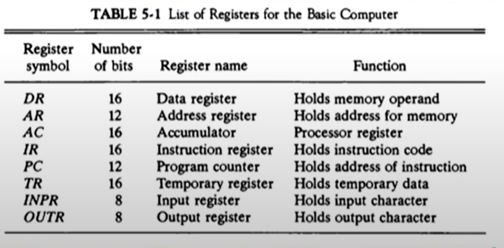
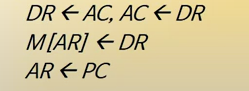
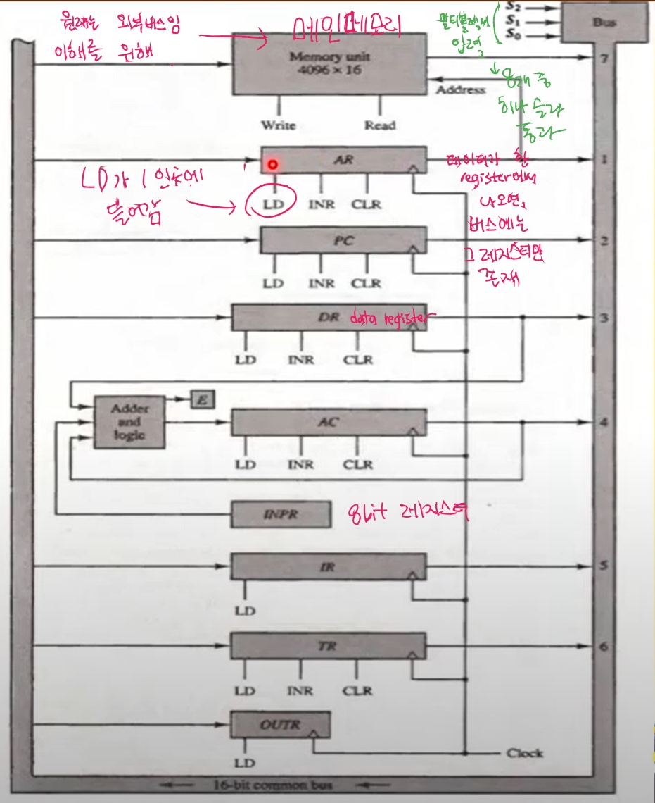
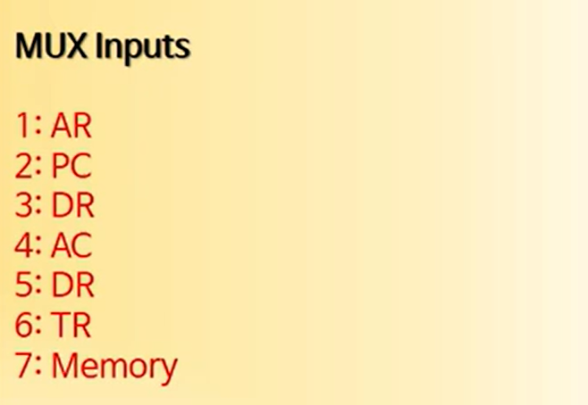

# 제5장 기본 컴퓨터의 구조와 설계

----

----

명령어 코드 

컴퓨터 레지스터

컴퓨터 명령어

타이밍과 제어 

명령어 사이클 

메모리 참조 명령어 

입출력과 인터럽트 

컴퓨터에 대한 완전한 기술 

기본 컴퓨터의 설계 

----

#### **기본 컴퓨터** 

DEC.Corp 사의 중형 컴퓨터 PDP-11을 지칭 

컴퓨터 구조 설계의 가장 기본적인 부분 

현대의 CPU들에게 동일하게 적용되는 설계구조 

----

#### 1. 명령어 코드 

----

- **컴퓨터의 동작** 

  - 컴퓨터는 **튜링머신**이다 
    - 튜링머신 : 프로그램을 항상 지역 장치에 저장한 다음에 프로그램의 명령어 하나 하나씩을 꺼내와서  실행시키는 구조 -> 여기서 말하는 저장 장치 == 레지스터(램 X)

  - 레지스터 내에 저장된 데이터에 대한 마이크로 연산의 시퀀스에 의하여 정의 

  - 범용 컴퓨터 시스템에서는 다양한 마이크로 연산 시퀀스를 정의

     

- **명령어 코드** 

  - 컴퓨터에게 어떤 특별한 동작을 수행할 것을 알리는 비트(0, 1)들의 집합

  - 연산 코드들로 구성 

    

- **컴퓨터 명령어** == 기계어

  - 컴퓨터에 대한 일련의 마이크로 연산을 기술 

  - 이진 코드로 구성 

  - 데이터와 함께 메모리 저장 

  -  마이크로 연산 시퀀스로 이루어짐

    

- **프로그램** 

  - 사용자가 원하는 연산과 피연산자가 처리되는 순서를 기술한 컴퓨터의 명령어의 집합 

  - 명령어 처리 과정을 제어 

    

- **내장 프로그램** 

  - 제어 신호에 의하여 명령어의 이진 코드를 해석하여 실행 
  - 명령어를 저장하여 실행하는 컴퓨터 구동 방식 
  - 명령어의 집합으로 구성 
  - 각 명령어는 명령어 포멧에 따라서 정의

  

#### **Address**

직접 주소 : address에 실제 값이 적혀 있다면 

간접 주소: address에 또 다시 주소가 적혀있다면 

직접 주소인지 간접 주소인지 확인하려면? 

- 맨앞을 보면됨 : I - indirect D - direct

#### Opcode 

- 데이터를 저장해라, 분기해라 등 명령어를 갖고 있음(3bit) -> 8가지밖에 없는 것 처럼 보임

format이 모여 프로그램이 됨 -> 프로그램은 튜링 머신이기 때문에 메인 메모리에 저장됨 

- 프로그램 실행부분에 따라서 메모리의 다른 부분에 저장 

- 명령어 실행 결과는 AC에 저장 

하나의 프로그램이 메인 메모리에 들어가서 실행될 때에는 최소한 세개의 segment로 구성된 데이터 공간을 차지한다

- code Segment
- Data Segment
- Stack Segment 

Segment : 컴퓨터에서 프로그램이 돌아가는데 메모리를 할당하는 가장 기본적인 단위 

Address : 

1k - 10bit 

1메가 - 20bit 

1기가 - 30bit

4기가 : 32bit

인텔 cpu는 32bit를 기본으로 해서 주소를 48bit까지 늘일 수 있음 

----

#### 간접 주소 시스템 

- 많은 경우 직접 주소를 사용하여 데이터 지정 
- 필요한 경우 간접 주소로 데이터 지정 

**I 비트**

0 : 직접 주소

1 : 간접 주소

**왜 굳이 간접주소를 쓰나 ?**

- 필요해서 씁니다. 반드시 필요해요. 간접주소 방식이 아니면 안되는 컴퓨터의 구조가 있다. index addressing이 그 예다. 프로그래밍 언어들의 다양한 기능들을 제공할 수 없게된다.

----

### 2. 컴퓨터 레지스터

- 기본 컴퓨터의 레지스터 
  - 기본 컴퓨터란?
    - DEC PDP-11 mini computer 
    - 가상의 컴퓨터가 아닌 실제 제품 
    - 1980년대 주력 메인 프레임급 
    - 최신의 CPU도 기본적으로 동일한 구조 
  - 기본 컴퓨터 레지스터 종류 

**버스 시스템의 종류**

*버스란 - 레지스터와 레지스터 사이를 연결해주는 길 

- **내부 버스** 
  - CPU 내부 레지스터 간 연결 
- **외부 버스**
  - CPU 내부 레지스터 - 메모리 간 연결 
- **입출력 버스** 
  - CPU <-> 주변장치(I/O)연결 

#### 공통 버스 시스템 

- 내부 버스를 통칭 

- **내부 버스의 크기(width)로 CPU 워드 크기 결정** 

  - 16bit컴퓨터 - 내부 버스 / 레지스터 크기가 16bit 

  - 32bit 컴퓨터 - 내부 버스 / 레지스터 크기가 32bit 

    

- **전송 연결 통로** 

  - 레지스터 - 레지스터 데이터 전송 통로 
  - 레지스터 - 메모리 데이터 전송 통로(예외적 표현)
  - 한 순간에는 하나의 전송 신호만이 버스에 존재 가능 
    - **2개 이상의 신호 발생시에는 버스 충돌(collision)이 발생** 
    - **버스 제어기(정확한 타이밍과 MUX 제어 수행)**

- 레지스터 출력은 버스의 MUX 입력에 연결
- 각 레지스터에 MUX 입력번호가 설정됨 
- 레지스터 입력은 버스에 직접 연결(LD로 제어)
- S2, S1, S0에 의하여 레지스터 출력 결정 

- 버스의 동작 

