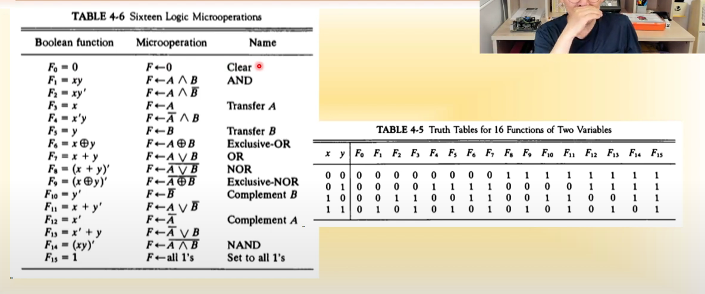
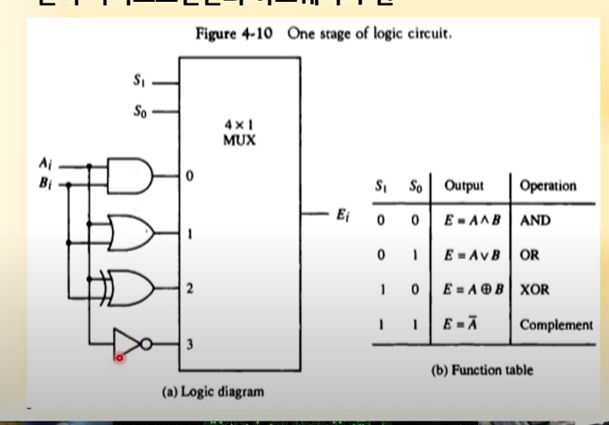
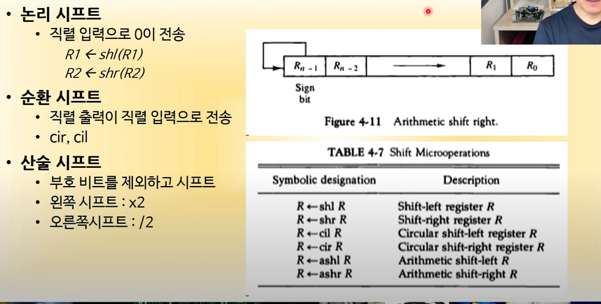
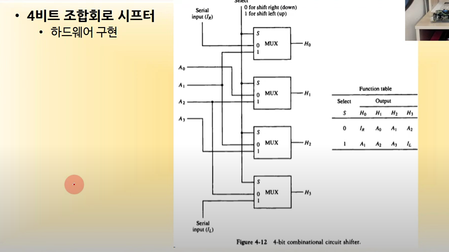
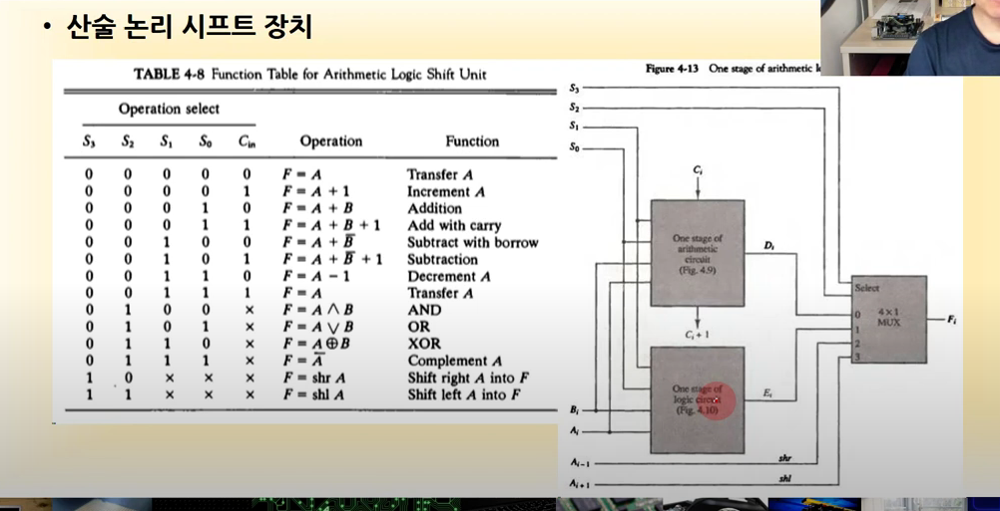

# 논리 마이크로 연산

- 16가지라 하드웨어 구현이 복잡하지 않을까 싶지만 복잡하지 않음

  

- AND, OR, XOR, NOT 4개의 게이트를 조합하여 만들 수 있음

# 시프트 마이크로 연산

- 논리 시프트 : 오른쪽으로 시프트 하면 제일 오른쪽 비트는 사라지고 왼쪽에 0 비트가 들어감
- 순환 시프트 : 오른쪽으로 시프트 하면 제일 오른쪽 비트가 제일 왼쪽으로 들어감
- 산술 시프트 : 부호 비트를 제외하여 시프트함

## 산술 논리 시프트 장치

