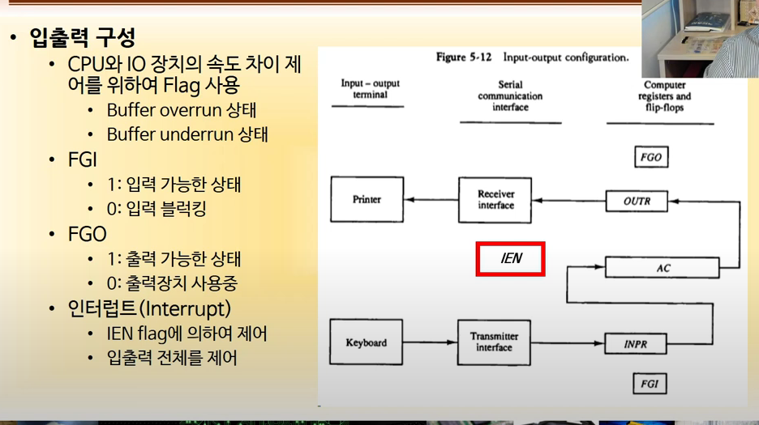
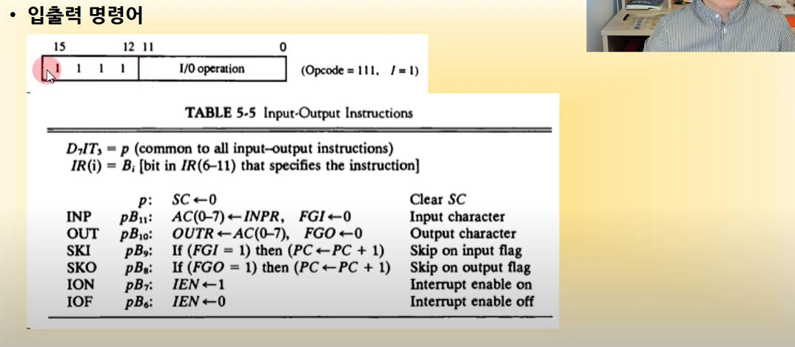
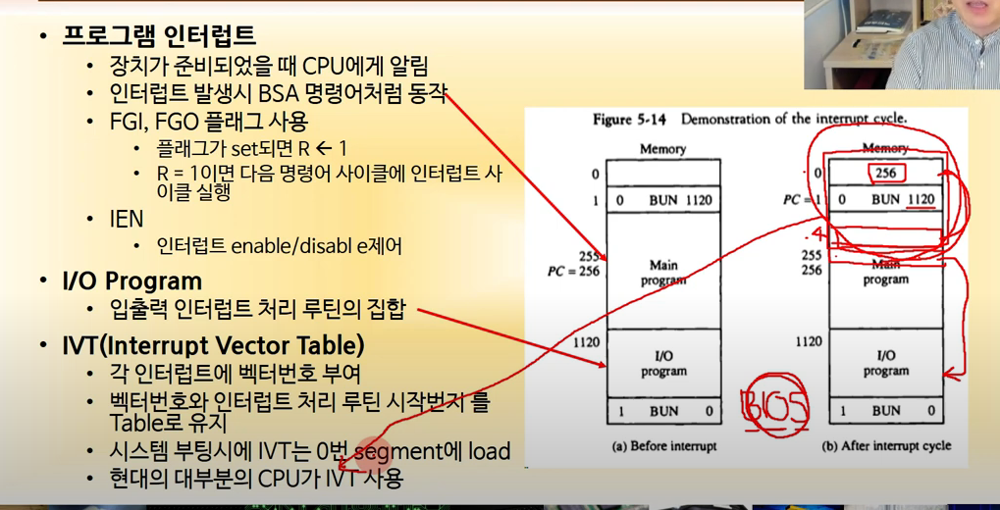
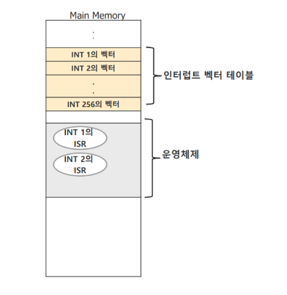
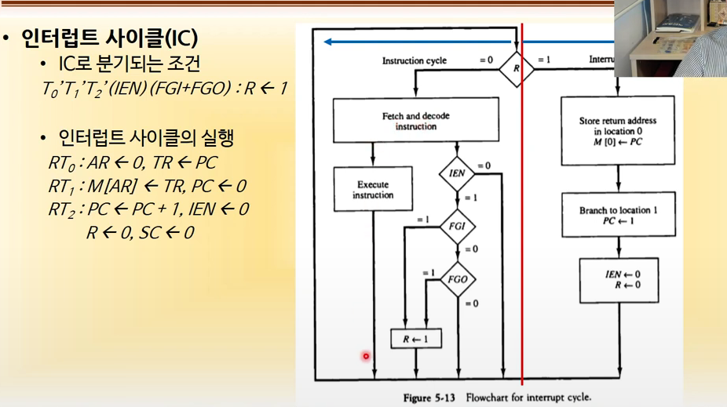
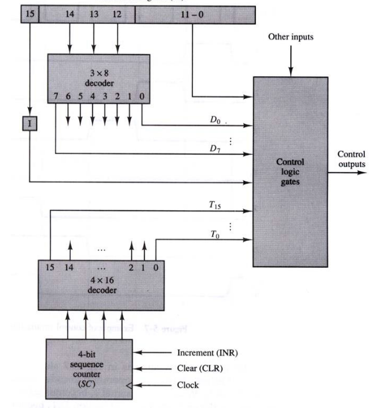

# 기본 컴퓨터의 구조와 설계

- 사실상 CPU 설계 쌉가능

## 입출력과 인터럽트

- 입출력 장치에 비해 CPU가 너무 빠르기 때문에 플래그를 두어 입출력 장치의 상태를 체크해야 함

  

- CPU가 입출력을 할건지 결정하기 위한 플래그 : IEN
- 입출력 => 인터럽트

### 입출력 명령어

- OP 코드가 1(I) 111(D7)일 때 입출력 명령어 T3 일 때 매크로
- B11이 1이라면 INP (데이터 전달하고 FGI에 0 넣음)
- SKI : FGI가 1이면 다음 명령어로(PC + 1) 스킵
- ION : 입출력을 받겠다

### 프로그램 인터럽트

- 입출력 발생했을 때 어케 동작?

- 서브루틴 : 소프트웨어적 프로그램 명령 과정

- 인터럽트 : 하드웨어적 내 외부 신호에 의해 발생

- 보통 서브루틴의 시작 주소에 복귀 주소를 리턴

- 인터럽트의 경우 메모리의 0번지에 저장 > PC + 1 해서 1120번지로 점프 > 바이오스 프로그램(입출력을 처리) 수행하고 > 0번지로 점프(간접주소) > 다음 PC값으로 이동(돌아옴)

- R 이 1이 되면 오른쪽의 인터럽트 사이클로 이동(인터럽트 사이클 도중 또 실행되면 안되므로 IEN R 둘다 0)

  (현대 CPU들은 인터럽트가 또 발생하면 큐에 넣음)

- IVT 

  

### 인터럽트 사이클(IC)

- T0, T1, T2가 아니고 IEN이 1이고 FGI or FGO 일때 R을 1로

- RT0 : AR(주소 레지스터)에 0, TR(Temporary Register)에 PC

- RT1 : M[AR]에 TR, PC에 0

- RT2 : PC에 PC + 1(1), IEN에 0, R에 0, SC(순차 카운터)를 0으로(T를 0으로 만들어줌)

  