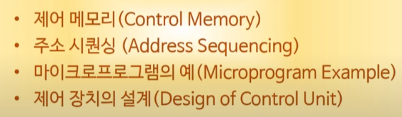
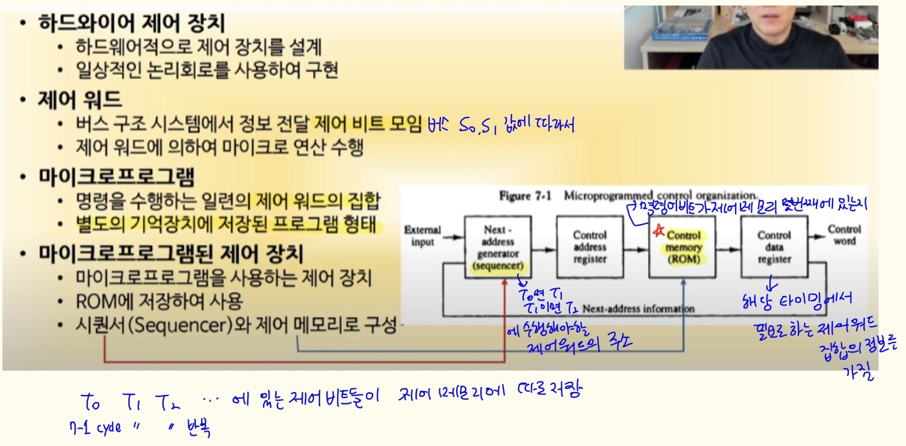
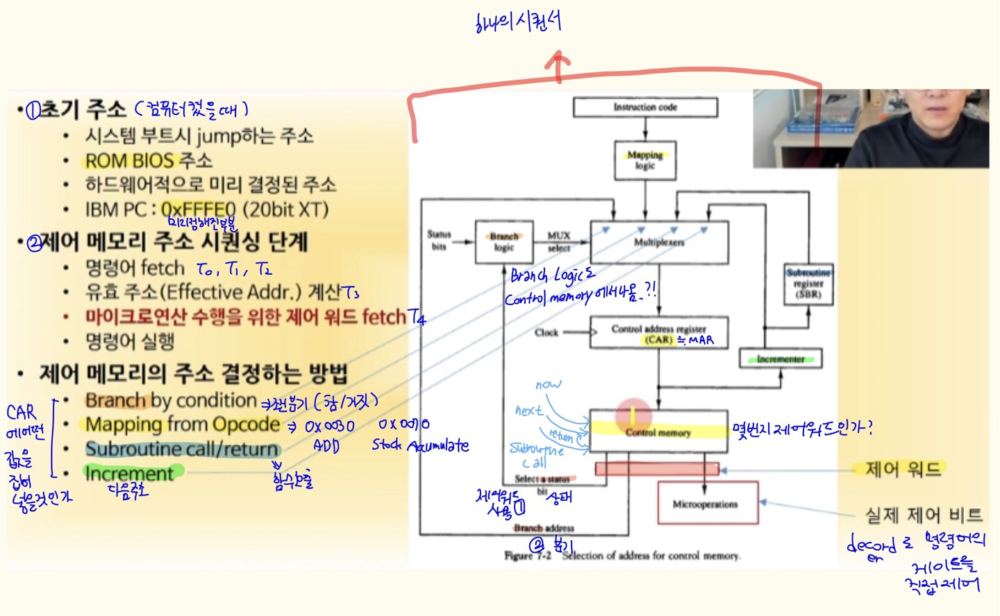
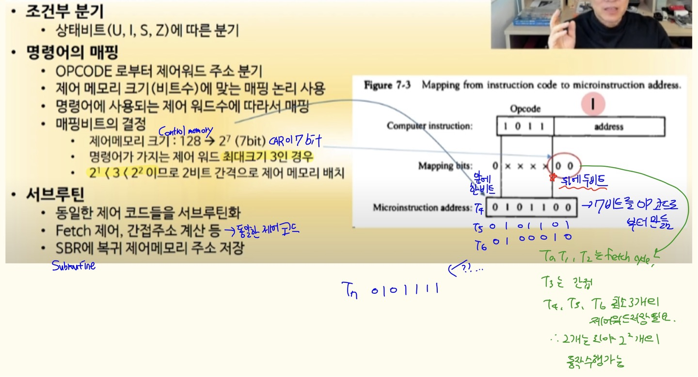
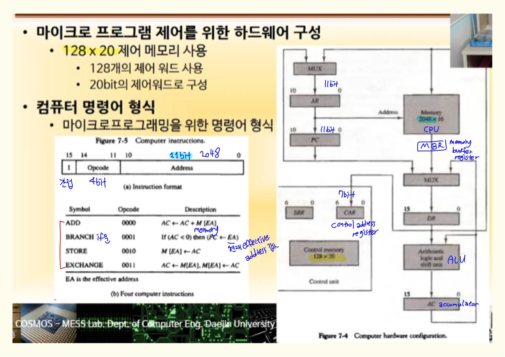
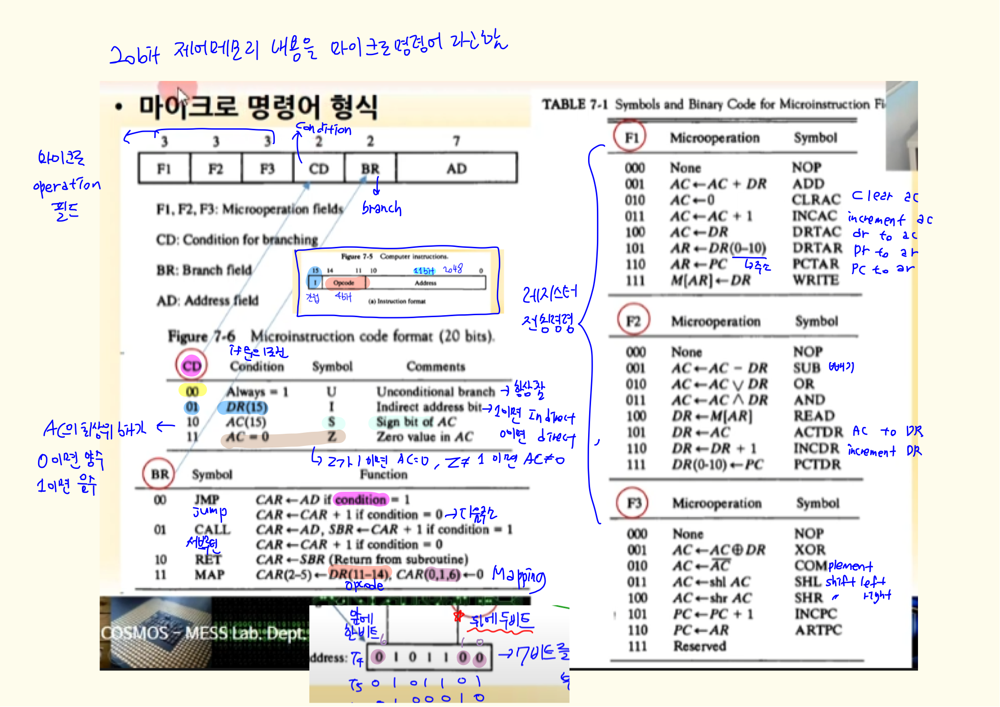
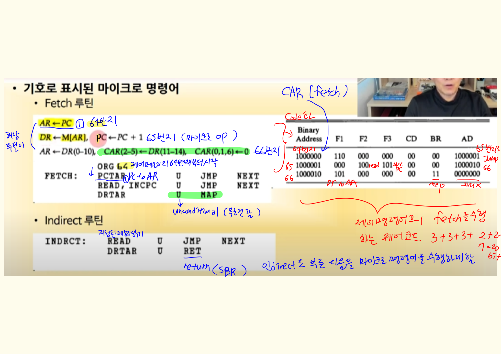
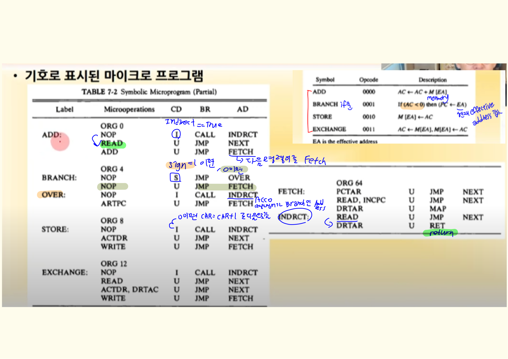

# 7장 마이크로 프로그램

### 1. 제어 메모리

- 마이크로프로그램된 제어 방식

  - 특정 명령에서 쓰이는 특정 비트들을 모아놨다가 각 컴포넌트에 분산시키는 방식
- 마이크로프로그램된 제어 장치

  - 제어 메모리(Control memory , ROM; 부품)
  - 시퀀서(Sequencer; 만들어야 함)

### 2. 주소 시퀀싱

 

- 몇번지에 내가 원하는 제어 워드가 있는지 결정을 해서 CAR에 넣어줘야함

- CAR은 MAR과 유사하며, 어떤 주소값이 들어가면 control memory에 접근되거 결과값이 나옴

- 매핑 → 제어 메모리의 주소를 opcode로부터 직접 만듦 
- 기본컴퓨터 20비트의 제어워드를 128개까지 만들 수 있음
- 뒤에 두비트를 추가하는 이유 : 한 명령어의 마이크로동작(타이밍)마다, 최대 4개까지의 동작을 수행할 수 있도록 하기 위해서 (4개씩 공간을 띄워서 제어워드를 저장할 공간을 주는 것)
- 다음 제어 메모리 주소를 결정할 때 서브루틴콜 내부로 들어간다면, 서브루틴 값을 가져다가 제어메모리를 씀

 ### 3. 마이크로 프로그램 예

- AR에 주소가 들어가면 Main Memory에 접근되서 결과가 MUX로 전달 

-----------

- 마이크로 연산 : 하나의 명령어가 수행될 때 각 타이밍 마다 수행되는 레지스터 전송 명령

- 20비트 제어메모리에서 F1~F3를 동시에 수행할 수 있음, 따라서 서로 충돌이 날만한 마이크로 연산은 같은 그룹에 포함시켜 놓는 것이 좋음 → 충돌이 발생하지 않도록 분류를 잘해서 설계하는 것이 설계자한테 달려있음

--------

#### 여기까지 배운걸 다 합쳐서 기호로 표시된 마이크로 명령어를 해석 해보자!

