## [제 5장 Part-2-1](https://www.youtube.com/watch?v=eoswnrO_v9g&list=PLc8fQ-m7b1hCHTT7VH2oo0Ng7Et096dYc&index=12)

https://upscfever.com/upsc-fever/en/gatecse/en-gatecse-chp157.html

https://poojavaishnav.files.wordpress.com/2015/05/mano-m-m-computer-system-architecture.pdf

### 입출력과 인터럽트 (Input-Output and Interrupt)

- 입출력 구성
  - 입출력 장치는 CPU에 비해 매우 느림
  - CPU는 그래서 입출력 장치가 현재 사용가능한지 체크할 수 있어야함 -> flag 사용
  - CPU와 IO장치의 속도 차이 제어를 위하여 Flag 사용
    - Buffer overrun 상태
    - Buffer underrrun 상태
  - FGI
    - 1: 입력 가능한 상태
    - 0: 입력 블럭킹
  - FGO
    - 1: 출력 가능한 상태
    - 0: 출력장치 사용중
  - 인터럽트(Interrupt)
    - CPU가 입출력을 할 건지 말 건지 결정(IEN flag)
    - IEN flag에 의하여 제어
    - 입출력 전체를 제어
    - 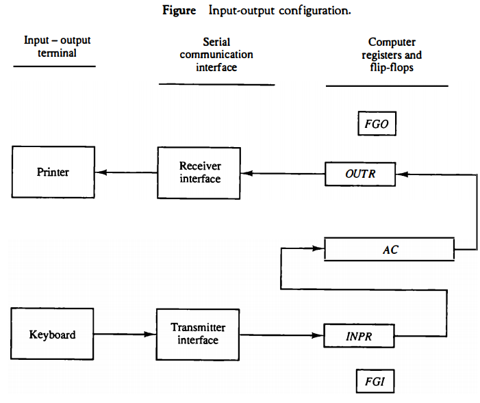
    - 키보드에서의 informationdms 8비트로 옴 -> 이 serial data는 input reg.(INPR)로 이동함
    - 프린터를 위한 serial data는 output reg.(OUTR)에 저장됨
    - 이 두 레지스터는 통신인터페이스와는 serially하게, AC(accumulator)와는 parallel하게 통신함
    - input flag(FGI)는 control FF임. 입력가능할 때 1로 set됨
      - 이 플래그는 인풋디바이스와 컴퓨터사이를 동기화하기 위해 필요함(서로 timing rate가 다름)
    - INPR ->AC로 전달되고, FGI는 0됨
  - 입출력과 인터럽트의 관계
    - 인터럽트와 입출력은 같다고 본다
    - 데이터를 가져오는(input) 그리고 연산 후 데이터를 내보내거나 전달(output)을 위해서는 cpu가 잠시 자기 할 일을 멈춤 -> 인터럽트(입출력 장치가 인터럽트를 발생시킨다. 인터럽트가 일어난다는 것은 입출력 장치를 쓰겠다)
- 입출력 명령어
  - 1111(15~12) + I/O operation(11~0)
    - 1111 -> input output instructions
    - 12-14자리를 -> decode  -> 1000000(111을 디코드하면) -> **d7 = 1,** **I(15) -> 1**
    - D_7 I T_3 = p로 편안하게 표현한뿐임
    - 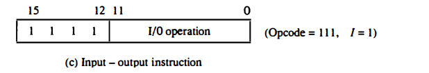
    - 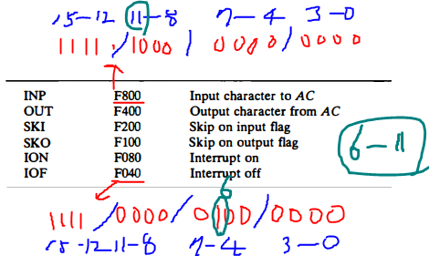
  - 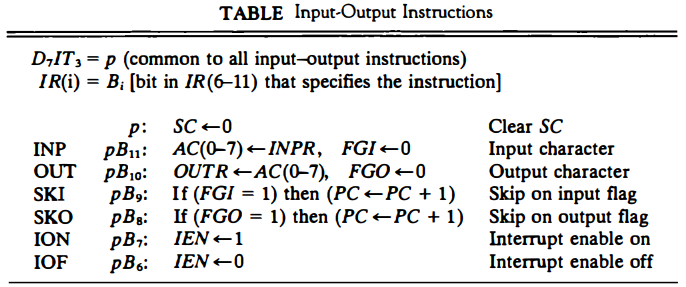
  - IEN = 1이면 현재 컴퓨터가 인터럽트가 발생할 수 있는 상태임
  - IEN = 0 이면 flag = 1이라도 인터럽트 발생 안함
- 프로그램 인터럽트
  - 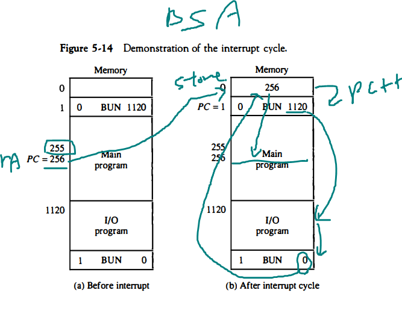
    - 인터럽트의 경우 return address(I/O 프로그램 끝난후)를 0번지에 저장함 / 함수의 경우는 함수의 시작번지에 보통 들어감 return address가
    - BUN - unconditional Branch
    - 1120 (I/O program, BIOS)
  - 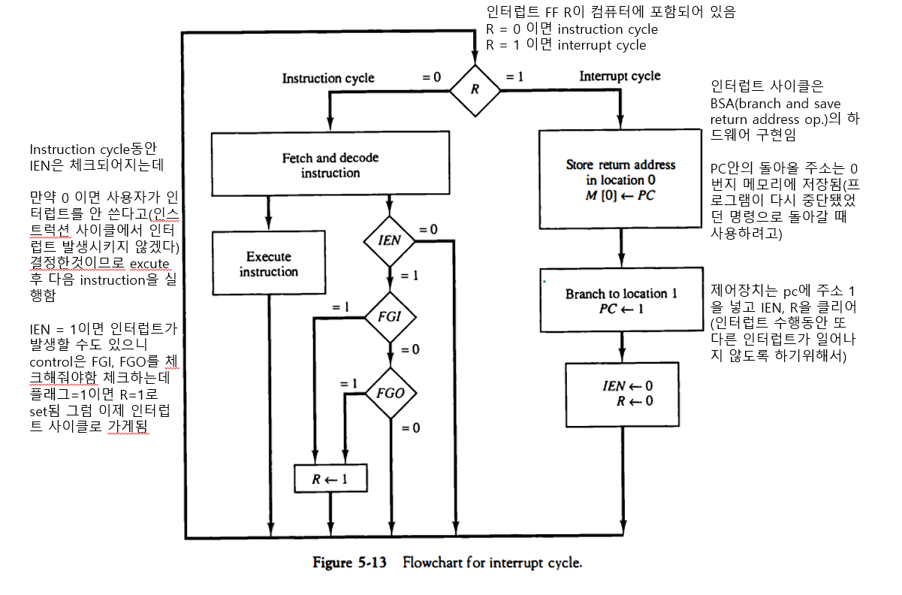
    - r=1이면 -> 입력이나 출력 flag가 1 -> interrupt cycle 실행(IEN=0, R=0으로 해놈 다른 인터럽트가 않일어나게, 기본 컴퓨터는 한 번에 한 개의 인터럽트만 수행)
- 프로그램 인터럽트
  - 장치가 준비되었을 때 CPU에게 알림
  - 인터럽트 발생시 BSA 명령어처럼 동작
  - FGI, FGO 플래그 사용
    - 플래그가 set되면 R<-1
    - R=1이면 다음 명령어 사이클에 인터럽트 사이클 실행
  - IEN
    - 인터럽트 enable/disable 제어
- I/O Program
  - 입출력 인터럽트 처리 루틴의 집합
- **IVT(Interrupt Vector Table)**
  - 각 인터럽트에 벡터번호 부여
  - **벡터번호**와 **인터럽트 처리 루틴 시작번지를 Table**로 유지
    - return address, I/O program의 갈 위치
  - 시스템 부팅시에 IVT는 0번 segment에 load
  - 현대의 대부분의 CPU가 IVT 사용
- 인터럽트 사이클(IC)
  - IC로 분기되는 조건
    - T0'T1'T2'(IEN)(FGI+FGO): R<-1
  - 인터럽트 사이클의 실행
    - RT_0: AR<-0, TR<-PC
    - RT_1: M[AR] <- TR, PC <- 0
    - RT_2: PC <- PC + 1, IEN <- 0, R <- 0, SC <-0

## [제 5장 Part-2-1](https://www.youtube.com/watch?v=zQuOYWLbCI4&list=PLc8fQ-m7b1hCHTT7VH2oo0Ng7Et096dYc&index=13)

### 컴퓨터에 대한 완전한 기술 (Complete Computer Description)

- 기본 컴퓨터 (PDP-11)의 전체 명령어 set
- 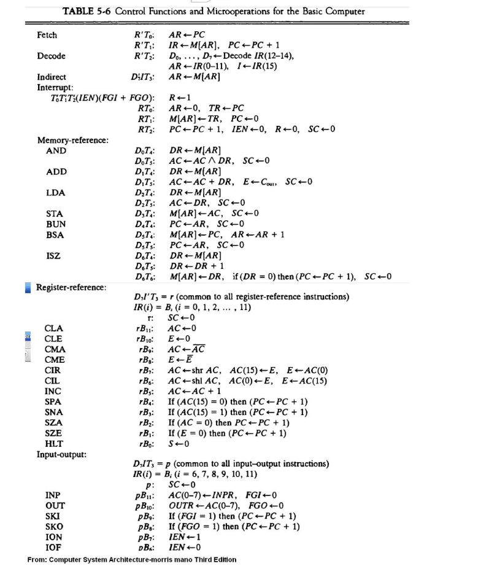

### 기본 컴퓨터의 설계 (Design of Basic Computer)

- 하드웨어 구성요소
  - **16bit 4096워드 메모리**
  - 9개의 레지스터
    - **AR, PC, DR, AC, IR, TR**, OUTR, **INPR**, SC

  - 7개의 플립플롭
    - I, S, E, R, IEN, FGI, FGO

  - 2개의 디코더
    - 3 * 8(Opcode), 4 * 16 (타이밍)

  - 16bit 공통버스
  - **제어 논리 게이트**(이번 시간에 설계함)
  - AC 입력 연결 논리회로(ALU)
- 컴퓨터의 동작 흐름
  - MRI, RRI, IO명령 사이클 구현
  - 인터럽트 사이클 구현
- 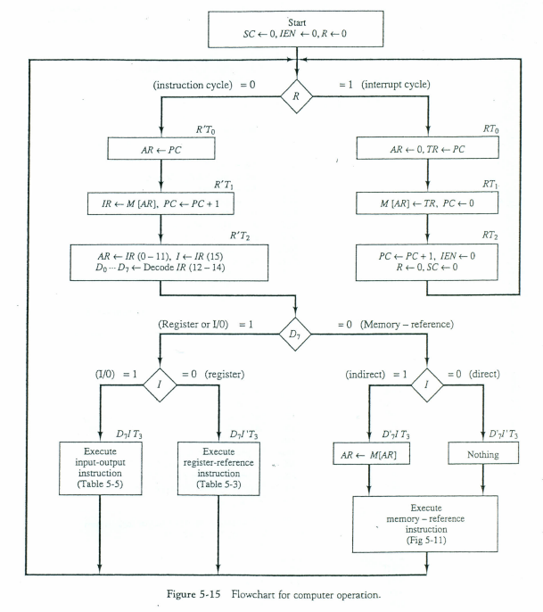
  - 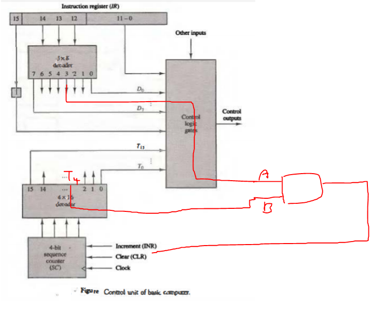

- The outputs of the **control logic circuit** are:
  - 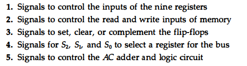
- **레지스터와 메모리에 대한 제어**
  - **AR 제어 논리 게이트의 예**
    - 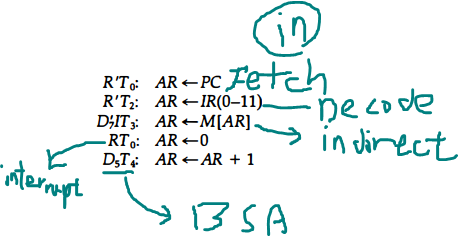

  - 설계 순서
    - AR에 대한 **LD(**load), **CLR**(clear), **INR**(increasement) 동작의 경우 수집
    - 각 동작들을 OR로 연결
    - 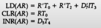

  - 메모리 READ제어 게이트의 예(register <- M[AR])
  - 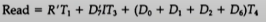
  - 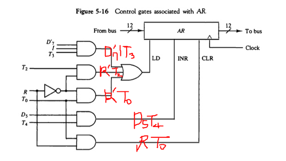
- **단일 플립플롭에 대한 제어**
  - **IEN**에 대한 제어 게이트 예
  - 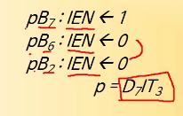
  - 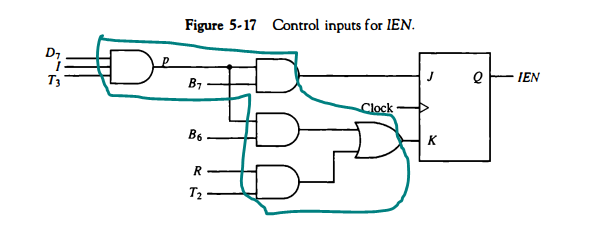
  - 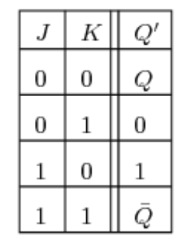
- **공통 버스에 대한 제어**
  - 인코더에 대한 부울식
  - S0 = x1 + x3 + x5 + x7
  - S1 = x2 + x3 + x6 + x7
  - S2 = x4 + x5 + x6 + x7
  - 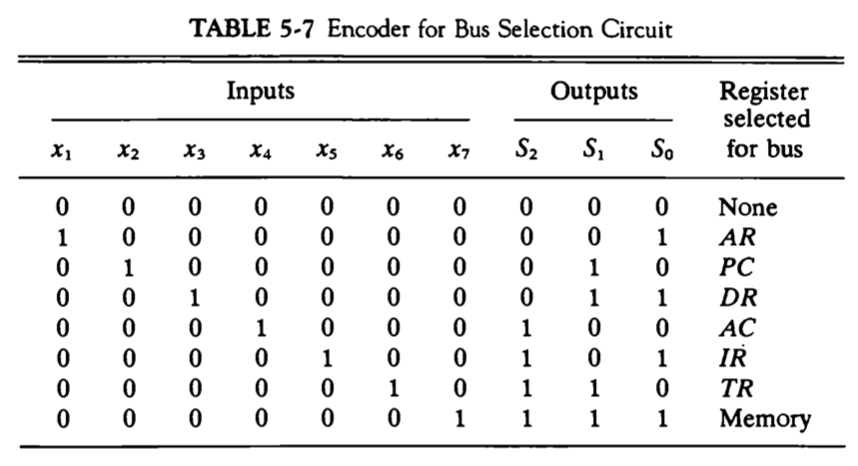
  - 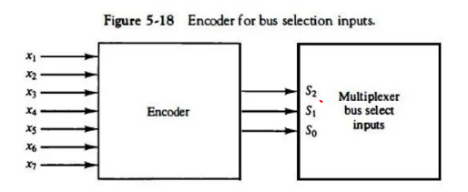
  - 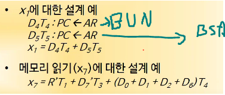

### 누산기 논리의 설계 (Design of Accumulator Logic)

- **AC 레지스터 관련 회로**
  - AC를 변경하는 경우 수집
  - LD, CLR, INC
  - 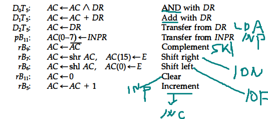
  - 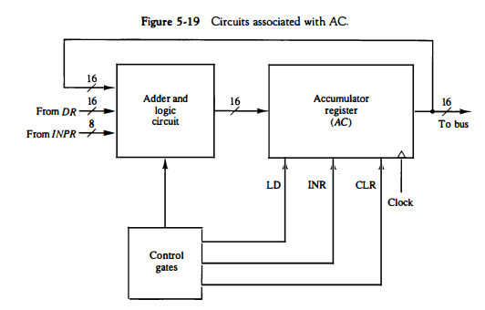
  - 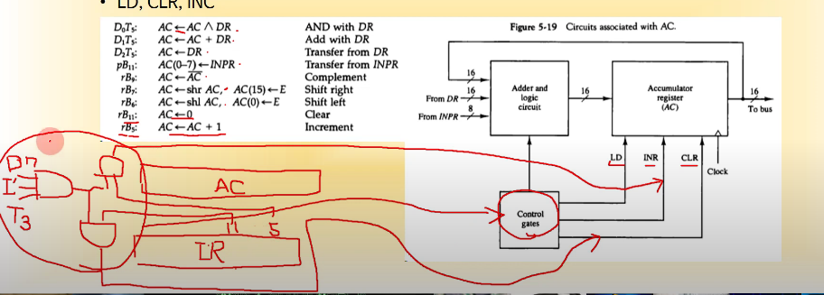
- AC 레지스터에 대한 제어
  - 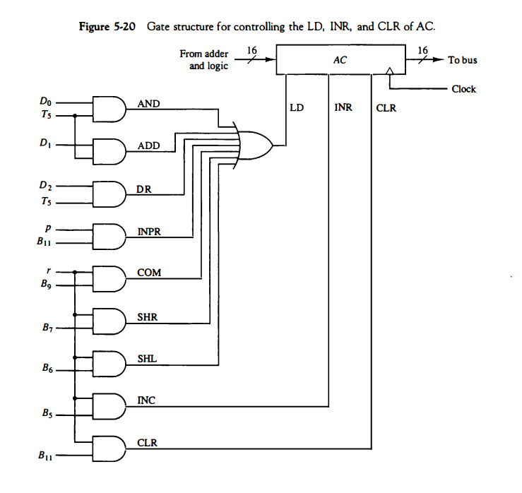
    - **LD 신호제어**
      - MRI 명령 : AND, ADD, LDA
      - RRI 명령 : COM, SHR, SHL
      - IO 명령 : INPR

    - **INR 신호 제어**
      - MRI 명령: none
      - RRI 명령 : INC
      - IO 명령 : none

    - **CLR 신호 제어**
      - MRI 명령 : none
      - RRI 명령 : CLR
      - IO 명령 : none
- **가산 논리 회로**(8장에서 따로 다룸) **위의 Adder and logic circuit**
  - ac(16), dr(16), inpr(8) -> output(16)
  - 회로요소 - and, fa, inverter, shifter, INPR/OUTR
  - 밑에꺼가 16개 있음
  - 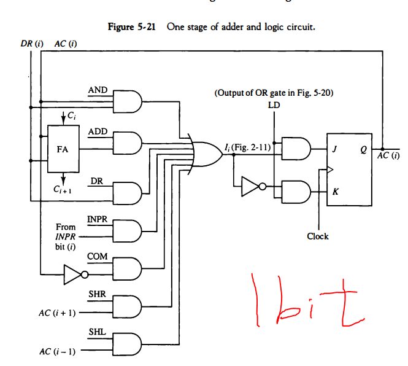
  

### 수행 과제

- 