## [제 6장 Part-1](https://www.youtube.com/watch?v=bx3qZQb0LL8&list=PLc8fQ-m7b1hCHTT7VH2oo0Ng7Et096dYc&index=14)

### 기본 컴퓨터 명령어

- 명령어 Symbol <- -> Hexa code 관계

- 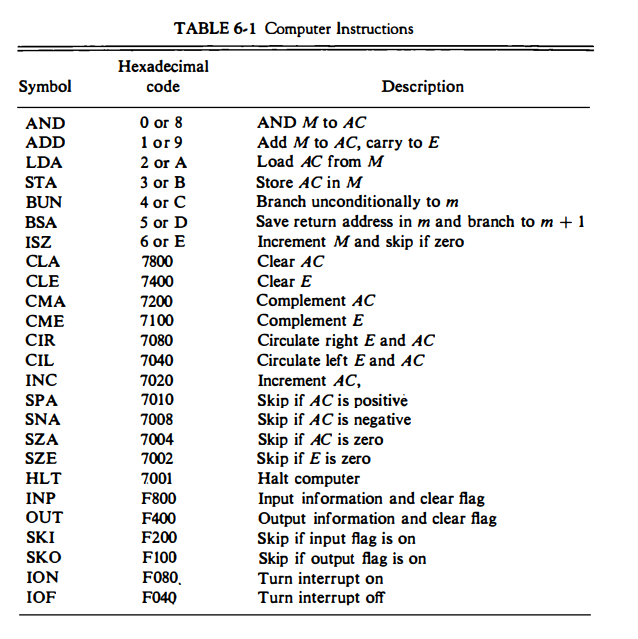

### 기계어 (Machine Language)

- 프로그램의 종류
  - 이진 코드(Binary code)
    - 기계어 프로그램(코드)
    - 메모리상에 실제 나타나는 형태의 명령어 집합
    - 이진 명령어와 피연산자의 시퀀스로 구성

  - 8진/16진 코드(Octal/Hexa code)
    - 이진 기계어 코드를 8진수, 16진수로 표현

  - 기호 코드 (Symbolic code)
    - 이진 기계어 코드에 대하여 문자로 된 심볼로 표현
    - 어셈블리어

  - 고급 프로그래밍 언어
    - 하드웨어 구조와 관계없이 문제 해결 논리가 고려된 언어
    - 문제 위주의 기호와 형식 사용
    - 인터프리터, 컴파일러 사용
    - Fortran, pascal, c, c++, basic, java, cobol, prolog, sketch

  - 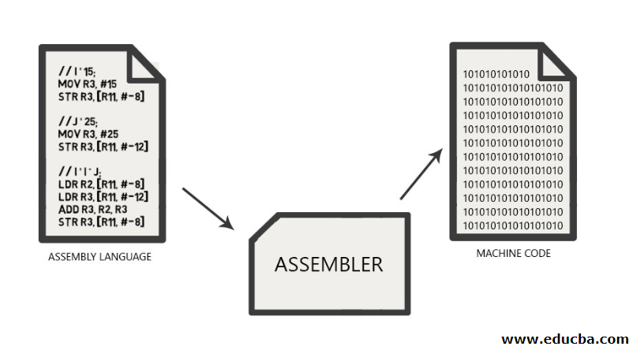

- 기계어 -> 16진 코드 -> 기호 코드 -> 어셈블리 코드
  - location - 메인 메모리의 주소
  - 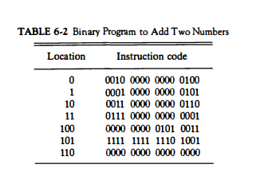
  - 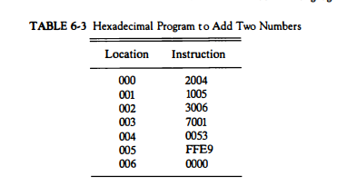
  - 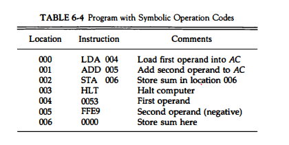
  - 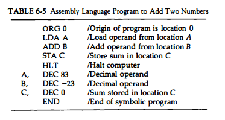
  - 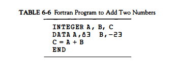

### 어셈블리 언어 (Assembley Language)

- 언어 규칙
  - 라벨 필드 (Label) : 기호 주소, 또는 공란
  - 명령어 필드 : 기계 명령어, 슈도 명령어
  - 코멘트 필드 : 명령어에 대한 주석
  - 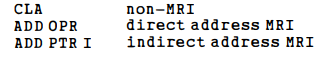

- 명령어 필드 항목
  - **메모리 참조** 명령어
  - **레지스터 참조** 명령어, **입출력** 명령어
  - **슈도 명령어**

- 슈도 명령어(Pseudo Instruction)
  - 실제 op코드는 아니나, 어셈블리어를 쉽게 보기위한 명령어
  - 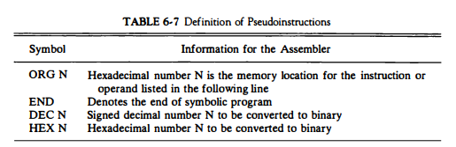

- 어셈블리 프로그램 예
  - 83 - (-23) = 106 [0x0053 - 0xFFe9 = 0x006A]
  - 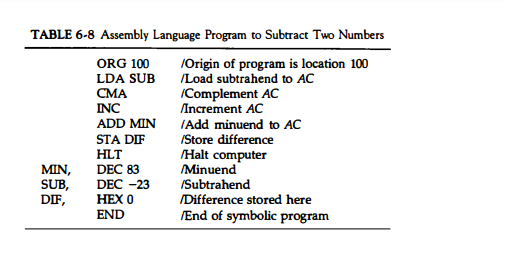
  - 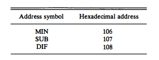
    - 주소 - 기호 테이블
    - 심볼 테이블

  - 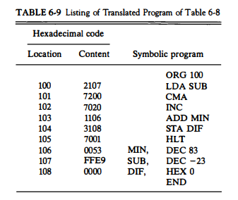

### 어셈블러 (The Assembler)

- 기호-언어 프로그램을 이진 프로그램으로 번역하는 프로ㅓ그램
  - MS Macro Assembler, Turbo Assembler 등
  - Two pass 어셈블러
    - First pass, Second pass

- 메모리 내에서 기호 프로그램의 표현
  - 프로그램 예 (PL3, LDA SUB 1)

- 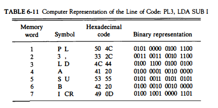
- 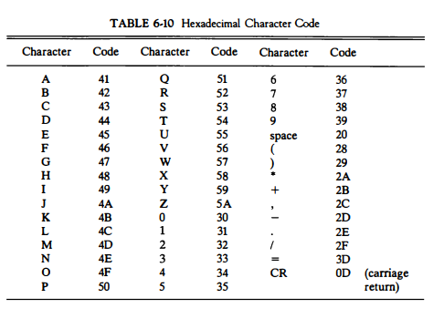
- First Pass
  - 주소 기호-이진수값의 관계표 작성
  - Symbol Table을 출력(Address-Symbol Table)
  - Location Counter(LC)를 사용해 프로그램 주소 카운트
  - 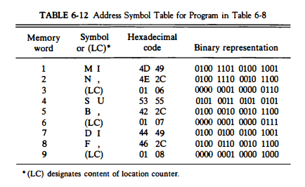
  - 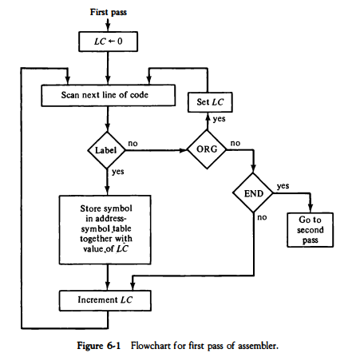
  - 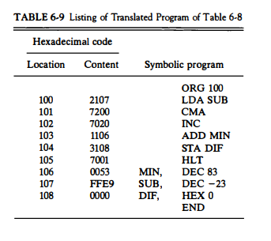3

- Second pass
  - 이진수로 번역 수행
  - 4개 테이블 참조
    - MRI 명령어 Table
    - NON-MRI 명령어 Table
    - 슈도 명령어 Table
    - Symbol Table

  - 출력
    - 기계어 코드

  - 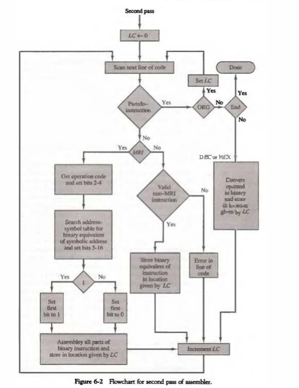

## [제 6장 Part-2](https://www.youtube.com/watch?v=hXKSCzaYCXk&list=PLc8fQ-m7b1hCHTT7VH2oo0Ng7Et096dYc&index=15)

### 프로그램 루프 (Program Loops)

- 루프를 가지는 프로그램
  - fortran 프로그램 예
    - 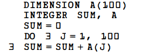

  - 어셈블리어로의 표현
    - 루프 부분
    - 카운터 부분
    - 데이터 array 부분
    - 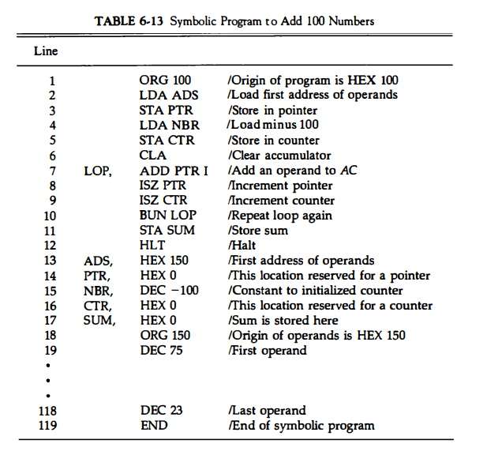

### 산술 및 논리 연산의 프로그래밍 (Programming Arithmetic and Logic Operations)

- 곱셈 프로그램
  - 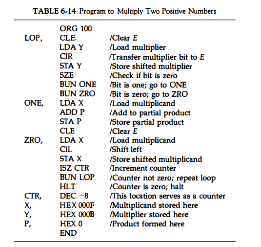
  - 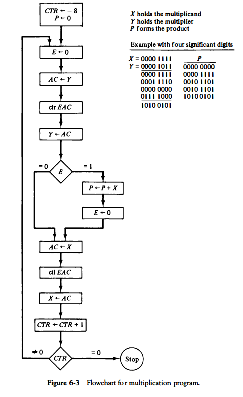

- 배정밀도 가산
  - high part와 low part를 따로 연산
  - low part의 캐리를 high part에 가산
  - 결과치도 high/low part 별도 저장
  - 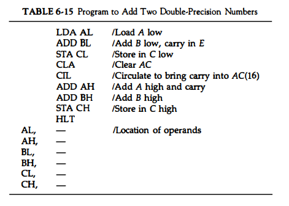
  - 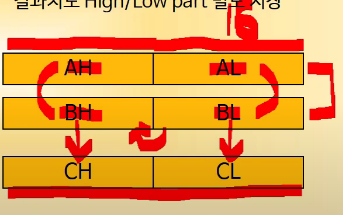

### 서브루틴 (Subroutines)

- 서브루틴 사용 예
  - 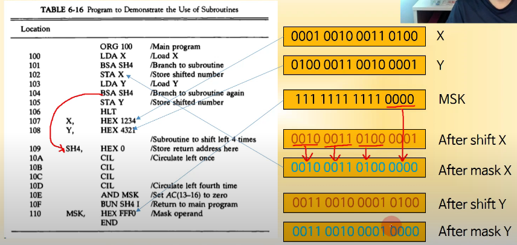

- 서브루틴 파라미터와 데이터 링키지 (X or Y 연산)
  - X or M[202]
  - A or b -> (A' AND B')'
  - 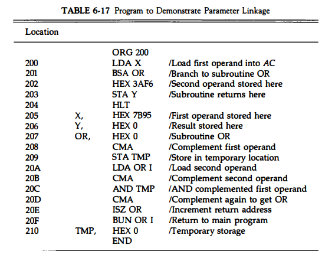

- 16bit 데이터 블록의 복사(memcpy() 함수)
  - memcpy(*src, *dst, size)
  - strcpy(*src, *dst, size)
  - 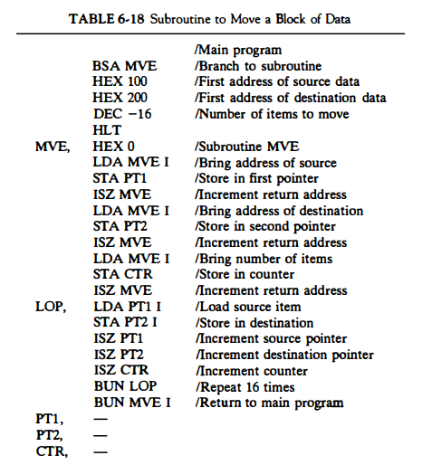

### 입출력 프로그래밍 (Input-Output Programming)

- 1개 문자의 입출력
  - 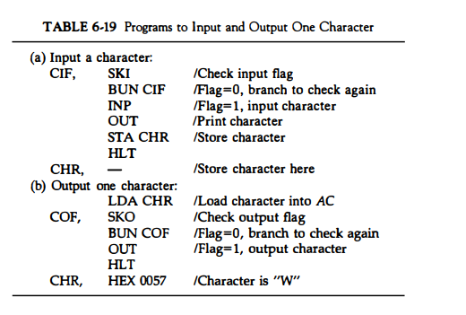
- 2개 문자의 패킹
  - 8bit ASCII -> 16bit UniCode
  - SH4 서브루틴 사용
  - 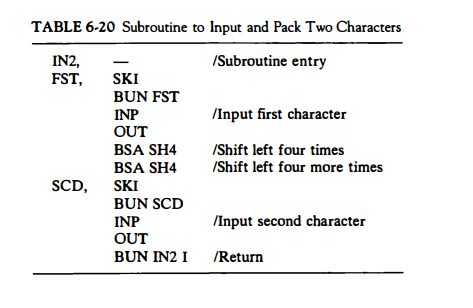
- 버퍼에 문자 저장
  - 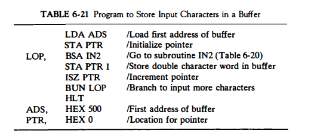

- 두 워드의 비교
  - 데이터 감산을 통한 비교
  - 결과가 0인 경우 두 워드를 비교
  - 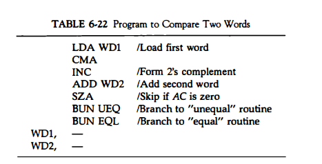
- 프로그램 인터럽트
  - 1. 레지스터들의 내용을 저장
       - M[xx] <- REGs
       - IEN <- 0 (by IOFF)
    2. FGI/FGO Flag들의 값 체크
    3. 인터럽트 서비스 루틴 수행
    4. 레지스터 내용 원상 복구
       - REGs <- M[xx]
    5. 인터럽트 기능 ON
       - IEN <-1 (by ION)
    6. 원래 프로그램으로 복귀
  - 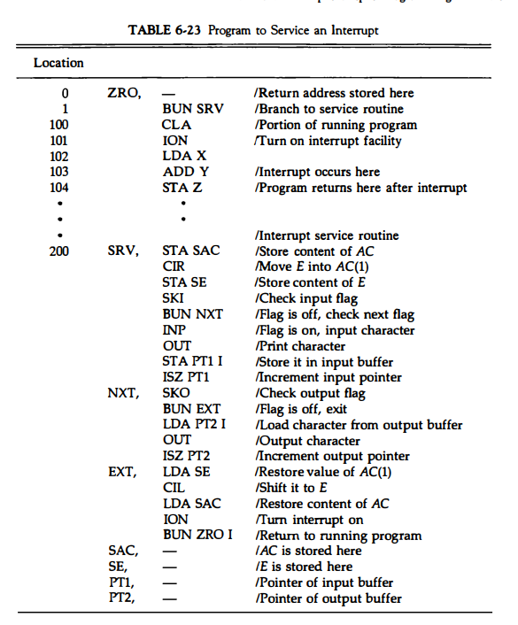

- 
