## 컴퓨터 시스템 구조 6장 part 2

---

**프로그램 루프**

- 루프를 가지는 프로그램
- FORTRAN의 예
- 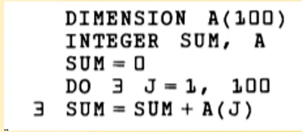
- 위의 예시를 어셈블리어로 표현해 볼 것
- 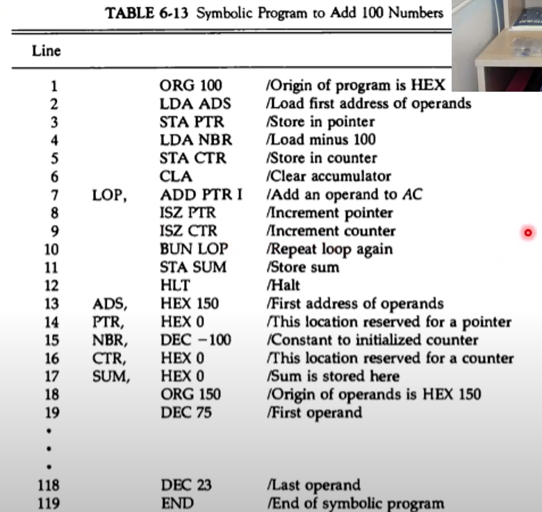
- (위의 테이블 참고)
- **루프 부분: Line 7 ~ 10**
- **카운터 부분: Line 15, 16**
- **데이터 array 부분: Line 18 ~ END 전까지**
- (테이블 명령어 확인)
  - ORG: 프로그램과 데이터의 시작 번지 설정 (100번지)
  - LDA: 로드 해오기
  - ADS: accumulater address를 (150번지)
  - STA PTR: accumulater에 저장된 ADS를 PTR에 복사 (이 과정에서 PTR은 0에서 150이 되는 것). ADS가 상수에 해당하는 것이고, PTR이 변수에 해당하는 것
  - LDA NBR: NBR(number) 로드
  - STA CTR: 로드했던 NBR 값을 CTR에 복사
  - CLA: Clear Accumulater
  - LOP: 루프
  - ADD PTR I: 더해라, PTR의 번지에(STA PTR 과정으로 인해 150으로 바뀐 그 번지에), -> 150번지에는 75라는 operand(피연산자)가 들어있게 됨. I는 간접 번지
  - ISZ PTR: 포인터를 인크리즈먼트 ㄱ. 150번지에서 151번지로 증가하는 부분
  - ISZ CTR: 카운터를 인크리즈먼트 ㄱ. NBR값이 복사된 상태이므로 -100에서 -99로 변경
  - BUN LOP: 루프 다시 반복 -> 계속 돌다보면 카운터(CTR)가 0이 되는 순간이 올 것. ISZ가 인크리즈먼트 / 스킵 / 이프제로 이므로 CTR이 0이 되는 순간 다음 명령어인 BUN LOP를 스킵하게 됨 -> STA SUM 작동 (루프 탈출 조건)
  - STA SUM: SUM에 지금까지 더한 값을 저장
  - HLT: CPU 정지
  - END: 어셈블리 작업의 종료를 나타냄. END문 이후의 어셈블리어 프로그램은 기계어로 변환되지 않음

---

**곱셈 프로그램**

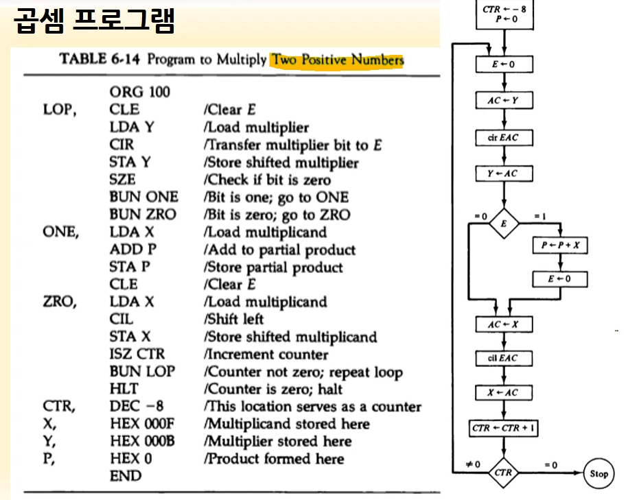

곱셈은 덧셈의 반복

1. LOP와 BUN LOP를 확인. 예시에선 Line 2와 Line 17에 있음. 2 ~ 17이 루프
2. 코드 해석
   - LDA Y: Y를 로드함
   - SZE: E 플립플롭이 0이면 스킵. -> BUN ONE 넘기고 BUN ZRO로 넘어가게 됨. E 플립플롭이 0이 아니면 그대로 내려가 BUN ONE 실행
   - BUN ZRO 실행하면 ZRO, 부분부터 실행됨
     - X 로드 -> shift left -> X를 저장 -> 카운터(CTR) 증가시킴 -> 다시 루프(카운터 증가시킬 때 ISZ에 걸리면 루프 탈출)
   - BUN ONE 실행하면 ONE, 부분부터 실행됨
     - X 로드 -> P(partial product)에 더함 -> P를 저장 -> E 플립플롭 클리어
   - P 에 결과가 들어가게 됨(add p를 계속 했기 때문)

---

**배정밀도 가산**

**배정밀도**: 16비트짜리 컴퓨터의 경우 데이터사이즈 32비트

32비트짜리를 어떻게 계산할 것인가? -> Low와 High로 16비트씩 나눔

High part와 Low part를 따로 연산하고 Low part의 캐리를 High part에 가산함 (캐리: 최상위 비트에서 그 위의 비트로 자리올림이 발생하는 것)

결과치도 High / Low part에 별도 저장함

**어셈블리**

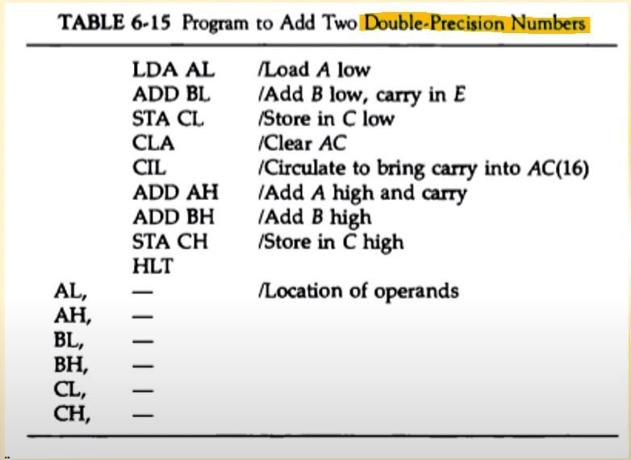

1. low쪽 로드
2. low쪽에 add
3. low쪽에 저장
4. clear
5. 캐리 비트를 하나 올림
6. 캐리를 포함해서 A와 B쪽을 서로 더함
7. C high쪽에 저장

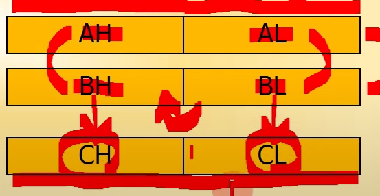

간단히 말하면 **low부터 16비트 더함 -> 캐리보냄 -> 캐리 포함해서 high part 더함**

---

**서브루틴**

서브루틴이란? -> **반복되어 사용하는 것을 메모리에 한번 적재하여 여러번 사용 가능하게 하는 방법**

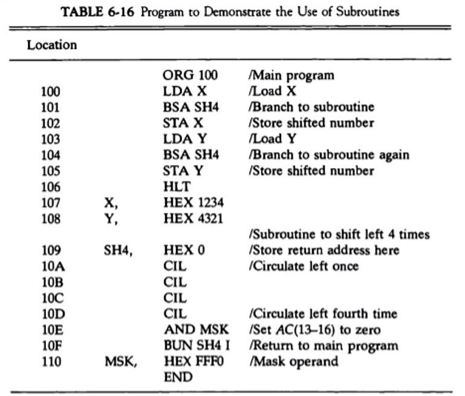

**BSA**: 서브루틴 콜

**BSA SH4** -> location 109의 **SH4로 이동**. 이게 실행되는 순간 program count의 값은 102가 되어있을 것.

이 **102의 명령어를 SH4의 시작주소에 저장**하게 됨. HEX 0 에 102라고 적혀들어가는 것

**location 109로 이동했으므로, 10A부터 실행**. CIL(왼쪽 쉬프트 4회 연속 ㄱ)

AND MSK: MSK를 AND. (MSK는 HEX FFF0라고 나와있음)

BUN SH4 I -> SH4의 간접 번지(I)로 이동 (102번지로 다시 이동하게 됨)

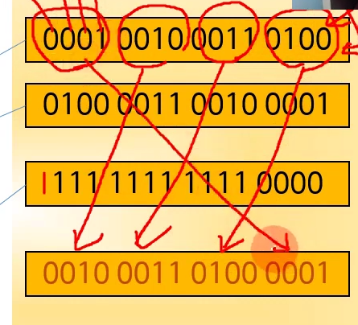

위는 4번 쉬프트 한 결과

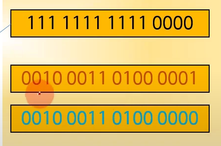

위는 MSK와 AND를 한 결과 (MSK는 1111 1111 1111 0000, 쉬프트 후는 0010 0011 0100 0001. 둘 다 1인 부분은 1, 그 외는 0 ㄱ)

---

여기까지 30분

---

**서브루틴 파라미터와 데이터 링키지(X or Y 연산)**

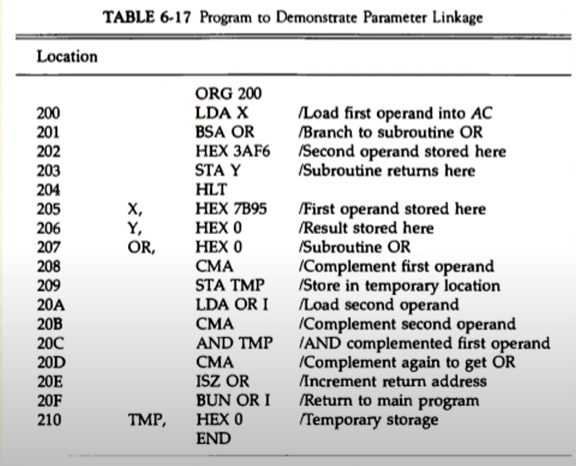

location 207의 or에서 시작하는 서브루틴 (20F의 BUN OR I 까지. 207~20F가 함수)

**동작**

LDA X: 로드 X

BSA OR: OR로 감 (207)

**A OR B -> (A' AND B')' (OR를 AND로 표현)**

위의 A에 해당하는 부분이 table 6-17에선 X 이므로, 우선 complement(보수) 해줌 -> CMA

STA TMP: TMP라는 곳에 저장

그 다음 두번째 값(메모리 202번지의 HEX 3AF6) 가져옴.

LDA OR I: OR값을 로드. 202번지의 값을 I(간접)로 가져옴. 위의 예시에서는 3AF6

현재 상황: accumulater에는 7B95가 있음. 그 값이 TMP로 저장이 되었음(보수처리 후, A'). 그 후 accumulater에는 3AF6 값이 들어옴. 

그 후 CMA를 통해 3AF6값을 보수처리(B')

AND TMP를 이용, A'와 B'를 AND 처리

그 값을 다시 보수처리(CMA) -> A OR B

BUN OR I: 다시 돌아감(203번지로 이동, ISZ OR를 통해 return되는 번지수가 1 증가해서 202가 아닌 203이 된 것)

STA Y: A OR B한 값이 Y에 저장되고 끝남

HLT: CPU 멈춤

---

**16bit 데이터 블록의 복사** (여러개의 파라미터를 복사)

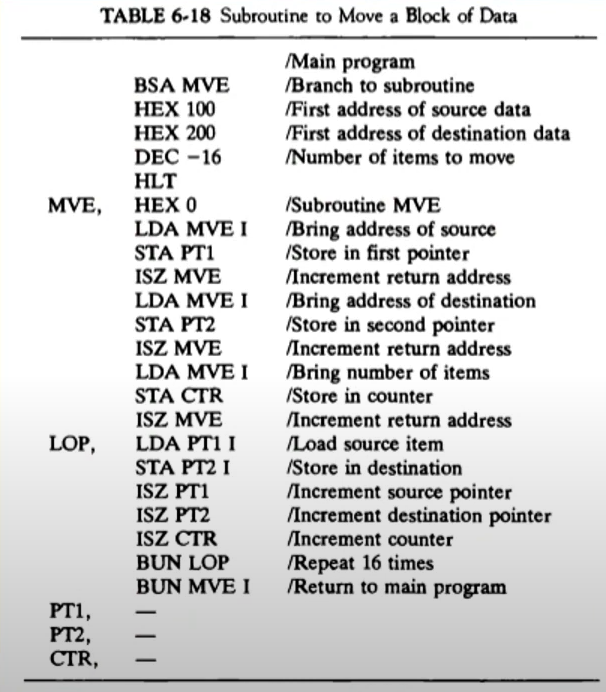

위에거랑 똑같음

---

## 입출력 프로그래밍

**1개 문자의 입출력**

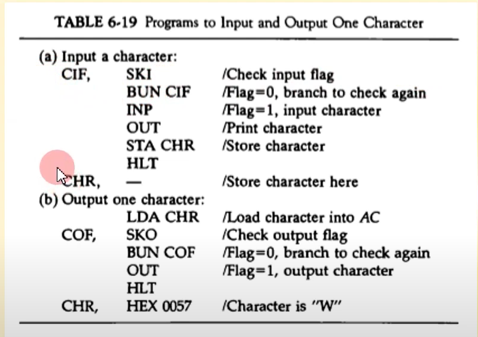

(5장의 입출력 구조 참고)

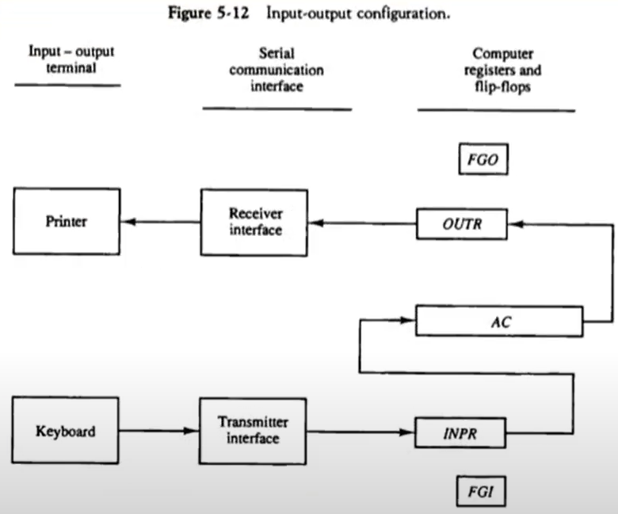

SKI: 인풋 플래그 체크

(FGI가) 1이면? -> BUN CIF 스킵하고 INP

(FGI가) 0이면? -> BUN CIF 갔다가 다시 SKI 갔다가 ... 계속 뱅뱅 돌게 됨

OUT: 값 짝어봄(뭐가 들어있는지 확인하는 용도인 듯. 확실ㄴ)

STA CHR: CHR에 저장

-> 키보트로부터 어떤 문자가 들어왔을 때, CHR이라는 메모리 번지(어셈블러가 알아서 정함)로 저장을 하는 것

LDA CHR: CHR 로드

(FGO가) 0이면? -> 아직 출력장치 사용 못하는 상황임. 입력때처럼 계속 돔

(FGO가) 1이면? -> OUT으로 넘어감

---

**2개 문자의 패킹**

8bit ASCII -> 16bit UniCode

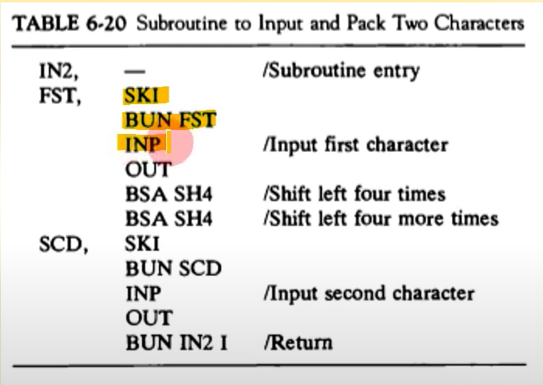

BSA SH4: 4비트 왼쪽으로 밀어

두 번 했으니 8비트임

쉬프트 돼서 high 쪽엔 이미 값이 들어가 있음. INP의 경우 low쪽 8비트에 들어가게 됨

-> 총 16비트의 문자가 auumulater에 저장되게 됨

---

**버퍼에 문자 저장**

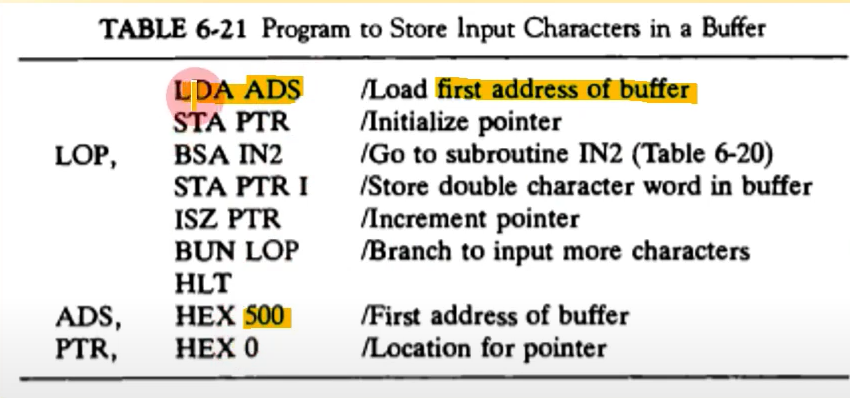

ADS 상수, PTR 변수

ADS 로드해서 PTR에 저장함

BSA IN2: BSA는 서브루틴 콜, IN2는 위에 만들어둔 2개 문자 패킹 서브루틴

STA PTR I: PTR 간접번지에 저장

ISZ PTR: PTR 증가

---

**두 워드의 비교**

데이터 감산을 통한 비교

결과가 0인 경우 두 워드는 동일함

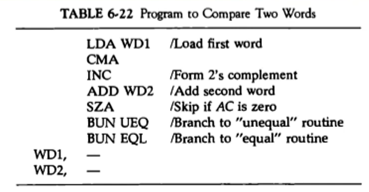

WD1을 로드한 후 2의 보수로 만들어 주자

거기에 WD2를 더하면? 결과적으로 빼기

SZA: accumulater의 값이 0이면 skip 하자 -> BUN EQL 작동

0이 아니면? -> BUN UEQ 작동

---

**프로그램 인터럽트**

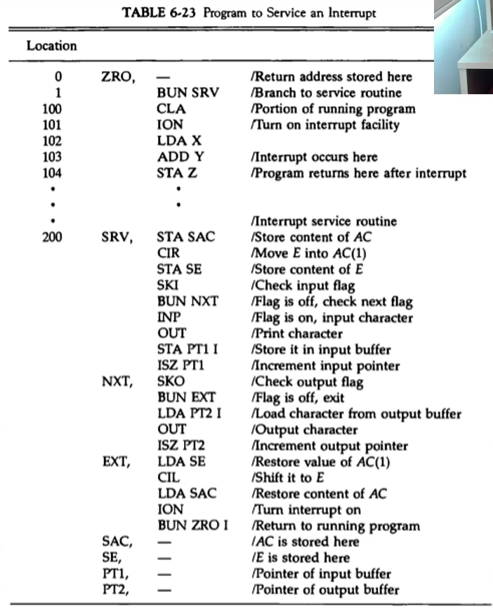

**인터럽트**: CPU가 프로그램을 실행중일 때, 입출력 하드웨어 등의 장치에 예외상황이 발생하여 처리가 필요할 경우 CPU에 알려 처리할 수 있도록 하는 것을 말함

ADD Y(103번지)가 수행중일 때 인터럽트 발생(FGI, FGO 등이 1로 바뀜)

-> 103번지 다음은 104번지. 그러나 인터럽트가 걸렸기 떄문에 104번지로 가기 전에 BUN SRV로 가게 됨

0번지로 가서 104번지를 저장, ZRO, 104 이런식으로 됨

그 후 1번지로 넘어가 BUN SRV(200번지로 이동)

200번지에서 BUN ZRO I까지 인터럽트 서비스 루틴 수행 -> BUN ZRO I 수행해서 ZRO에 저장된 104번지로 이동하게 됨

---

